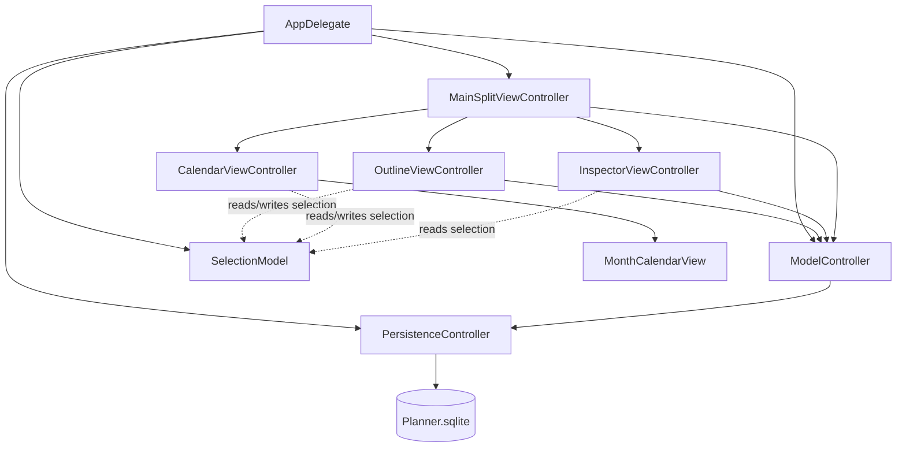
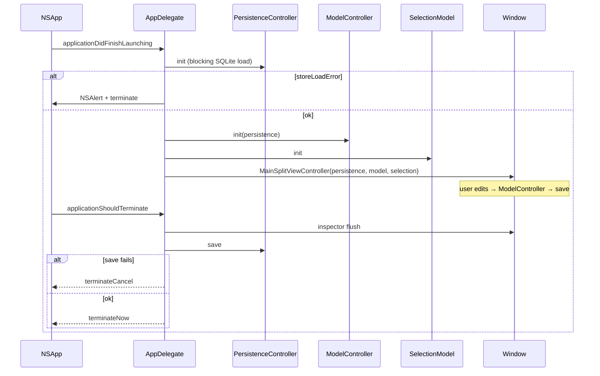

# Planner: Native macOS Task Manager

| Field | Value |
| --- | --- |
| **Author** | TBD |
| **Date** | 2026-08-13 |
| **Status** | Ready for Implementation |
| **Platform** | macOS AppKit (Swift) |
| **Workspace** | `/Users/ray/Programs/Planner` (greenfield) |

---

## Overview

Planner is a small, native macOS task manager: a source-list outline of projects and nested tasks on the left, and a monthly deadline calendar on the right. Tasks can be marked complete (a flag, no rollup). v1 persists locally with Core Data (`NSPersistentContainer`). The model, identifiers, object-lifecycle hooks, and store configuration are chosen so enabling CloudKit later is a container/entitlement/history-consumer change, not a remodel.

The app is AppKit-first (not SwiftUI-hosted, not Catalyst). The outline is a **view-based** `NSOutlineView`; Finder-style rename uses `editColumn(_:row:with:select:)` plus a title-field `acceptsFirstResponder` gate (not the cell-based `shouldEdit` API). The calendar is a small custom `NSView` month grid that fetches the visible 42-day range. There is no existing Xcode project; this document specifies the project, object graph, model, UI architecture, and an incremental PR plan.

---

## Background & Motivation

`/Users/ray/Programs/Planner` has no Xcode project or application source (greenfield). This design document is the implementation spec. The product need is a personal, hierarchical task list with a calendar of deadlines — the kind of tool that should feel like a Mac app (outline view, inline rename, main menu, window frame autosave), not a ported iOS split view.

Pain points a naïve implementation would hit, and that this design exists to avoid:

- Treating Project and Task as one type without deciding identity, or as two types without a legal Core Data parent relationship (a relationship has one destination entity; entity inheritance is CloudKit-hostile).
- Using ordered Core Data relationships or uniqueness constraints that `NSPersistentCloudKitContainer` rejects.
- Assigning UUIDs/timestamps in `awakeFromInsert`/`willSave`, which clobbers CloudKit imports.
- Fighting a view-based `NSOutlineView` with `shouldEdit` or a custom rename overlay.
- Embedding EventKit or a SwiftUI `Calendar` in an AppKit window for what is simply “tasks with a date.”
- Enabling CloudKit in v1, or conversely setting up the store in a way that makes CloudKit a rewrite.

---

## Goals & Non-Goals

### Goals (v1)

- Native AppKit app with one main window: outline + month calendar + a small task inspector (note + deadline).
- Projects at the root of the outline; tasks nest under projects or other tasks.
- Create projects from a blank store (menu bar, toolbar, empty-area context menu).
- Create tasks and subtasks from the outline context menu (and matching main-menu items).
- Finder-style inline rename on the outline (delayed click on the already-selected row, plus Return).
- Optional deadline on tasks only; month grid shows those deadlines (including spillover days); user can set and clear them.
- Optional `isCompleted` flag on tasks (not projects). Outline checkbox is the primary control; no parent/child rollup. Completed tasks stay on the calendar, dimmed.
- Local Core Data store that is CloudKit-ready but does **not** use `NSPersistentCloudKitContainer`.
- Cascade delete with a confirmation alert.
- Unit tests for model invariants and month/grid deadline fetches, using an ephemeral SQLite store (`NSSQLiteStoreType` at `/dev/null`), not `NSInMemoryStoreType`.

### Non-Goals (v1)

- CloudKit / iCloud sync, sharing, or multi-device merge UX.
- Drag-and-drop reordering or reparenting (sibling `sortIndex` is still stored; new items append; duplicate indices are legal).
- Recurring tasks, reminders, notifications, or EventKit integration.
- Tags, priorities, projects-on-the-calendar, or project deadlines. Completion is **in** v1 (task flag only; no rollup).
- Multiple windows, tabs, or a document-based architecture.
- SwiftUI or SwiftData as the primary stack; Catalyst; iOS/iPad companion.
- Third-party dependencies (calendar kits, reactive frameworks, Sparkle).
- App Store submission, iCloud entitlements, or analytics.
- Rich text notes, attachments, or file references.
- Sandboxed file import/export (CSV/OPML) — optional later; UUIDs make it possible.

---

## Key Decisions

| Decision | Choice | Rationale |
| --- | --- | --- |
| UI toolkit | AppKit, programmatic views + `MainMenu.xib` | Required product; storyboards merge poorly; menus are the one place IB earns its keep (standard Edit/Undo). |
| Entry point | `@main AppDelegate`; File’s Owner of `MainMenu.xib` is `NSApplication`; **no** AppDelegate object in the xib | Avoids dual-instantiation. `@main` is the sole `NSApplication.delegate`. Menu items target First Responder. |
| Object graph | `AppDelegate` creates `PersistenceController`, `ModelController`, and `SelectionModel`; injects all three into `MainSplitViewController` | One owner. View controllers never look up singletons and never retain each other. |
| Menu/toolbar actions | Implemented on `MainSplitViewController` | Always in the window responder chain. Not on `AppDelegate`, not only on the outline VC. |
| Entities | **Two entities**: `Project` and `Task` | Domain differs (only Task has note/deadline; only Project is a root). Entity inheritance is rejected (CloudKit). A single `Item` entity is the main alternative; see [Alternatives](#alternatives-considered). SwiftData is rejected (same section). |
| Task parent | Two optional to-one relations: `project` **xor** `parentTask` | Core Data cannot point one relationship at two destinations. `ModelController` + tests enforce exactly one. **No** `validateForInsert/Update` throws (CloudKit import would abort). |
| Ordering | Explicit `sortIndex: Int64`, unordered relationships | Ordered relationships are incompatible with CloudKit. Duplicate `sortIndex` values are **legal**; siblings sort by `(sortIndex, uuid)`. |
| Identity | `uuid: UUID` assigned in `ModelController` create paths, not in `awakeFromInsert` | App-stable ID for expansion, chips, reveal, import/export. Not `NSManagedObjectID` (changes on first save). Not `CKRecord.recordName`. No uniqueness constraint. |
| Timestamps / notes | Set `createdAt`/`updatedAt` at the insert/update site; coerce empty notes in `setNote`. No `willSave` mutations | `awakeFromInsert`/`willSave` stamping is a CloudKit re-export loop. |
| Store | `NSPersistentContainer` + history tracking + remote-change notifications | History is cheap to enable at first store creation. Still **not** `NSPersistentCloudKitContainer`. |
| Store load | `shouldAddStoreAsynchronously = false`; `init` does not return until load finishes or fails | Tests and `AppDelegate` must not use an unloaded context. Failure → `NSAlert` + terminate, never `fatalError`. |
| Test store | `NSSQLiteStoreType` with `url = /dev/null` | History tracking is a SQLite feature. Do **not** set `NSInMemoryStoreType`. |
| Outline data | Manual `NSOutlineViewDataSource` + `NSManagedObjectContextDidSave` | Mixed types fight `NSTreeController`. FRC-per-parent is overkill. Did-save (not did-change) so outline items have permanent IDs. |
| Outline items | Registered `Project`/`TaskItem` objects **after** first save (permanent `objectID`) | Never insert a row for a temporary ID. Restore selection/expansion by UUID after any `reloadData`. |
| Rename | View-based `NSTableCellView` + `TitleTextField.acceptsFirstResponder` gate + `editColumn` | `shouldEdit` is cell-based and does not stop click-to-focus. No overlay field. `objectValueFor` / `setObjectValue` unused. |
| Delayed click | Snapshot `clickedRow == selectedRow` in `mouseDown` **before** `super.mouseDown` | `selectionDidChange` runs before `action`, so a UUID-after-change test starts rename on the first click. |
| Calendar | Custom `NSView` 7×6 month grid | No first-party AppKit month view; EventKit is the wrong domain; no third-party kit. |
| Calendar fetch | Closed-open range over the **42 grid days**, not the civil month | Spillover cells show real chips. Clicking spillover navigates month without chips popping in. |
| Calendar month source of truth | `SelectionModel.visibleMonth` only. Gestures call the view delegate; they do not mutate `MonthCalendarView.visibleMonth`. Programmatic `visibleMonth` set does **not** fire the delegate. | Prevents a gesture → SelectionModel → view → delegate loop. |
| Bundle ID | `com.rihscb.Planner` | User decision. Use this in the target, log subsystem, container path, and any future iCloud container. |
| App name | Planner (display name and product name) | User decision. App icon still TBD; that is assets, not architecture. |
| Deadline | Optional `Date` on `Task` only, stored as start-of-day in `Calendar.current`. No `timeZone` attribute in v1. | Calendar requirement implies it. Multi-device day identity deferred. |
| Completion | `isCompleted: Bool` on `Task` only, default `false`. Outline checkbox is primary; inspector mirrors it. No child/parent rollup. | User decision: in v1. Complete is a flag; delete remains the destructive path. |
| Notes UI | Inspector under the calendar: has-deadline checkbox + date picker (no Clear button) + plain `NSTextView` (`String`, not rich text) | Attribute must not be dead. Unchecked ⇔ `deadline = nil`. Notes stay plain `String`. |
| Inspector undo | `windowWillReturnUndoManager` returns `viewContext.undoManager`. Notes view gets a dedicated `UndoManager` via `textView(_:undoManagerFor:)`. Do **not** assign `window.undoManager` (it is get-only). Title field editor may share the Core Data manager; one `Rename` group on commit. | `NSTextView.undoManager` walks to the window by default; a private manager is required to keep keystrokes off the Core Data stack. |
| Drag-and-drop | Deferred | Not cheap enough with the manual data source to justify v1 scope. |
| Delete | Confirm sheet; cascade children; ⌘⌫ disabled while a field editor / `NSTextView` is first responder | Prevents silent tree wipes and deleting a task while editing a note. |
| Deployment | macOS 15.0 Sequoia | See [Xcode project](#1-xcode-project--target-layout). |
| Save | `viewContext` save after each meaningful edit; debounce notes 0.4s. Create/delete **throw** after rollback; they never return a rolled-back object. | Typical Core Data Mac app. A failed save leaves the tree unchanged. |
| Sidebar collapse | `canCollapse = false` on the sidebar `NSSplitViewItem` | v1 has no Show Sidebar command; a dragged divider must not hide the only create surface. |
| Sync | Not in v1 | Model + lifecycle are prepared; container subclass, entitlements, and history consumer wait. |

**Deadline as a first-class Task attribute.** The product brief did not list a deadline field, but the calendar is defined to show deadlines. v1 stores an optional `Date` on `Task` only. Projects stay title-only. Revisit only if a later product decision needs project-level milestones.

---

## Proposed Design

### 1. Xcode project / target layout

| Item | Value |
| --- | --- |
| Display name | Planner |
| Product name / target | Planner |
| Test target | PlannerTests |
| Bundle ID | `com.rihscb.Planner` |
| Deployment target | **macOS 15.0** |
| SDK | Latest stable Xcode macOS SDK (macOS 26 as of this writing) |
| Language | Swift |
| Swift language mode | Swift 6, with `@MainActor` on all AppKit types |
| UI | AppKit. Programmatic window and view controllers. `MainMenu.xib` only. |
| Lifecycle | `NSApplicationDelegate` via `@main`, not SwiftUI `@main` |
| Sandbox | On (Xcode default for new Mac apps). No extra entitlements in v1. |
| Hardened Runtime | On (notarization-ready). |
| Document type | None (single local store, not NSDocument). |

**Why macOS 15, not 14 or 26-only.** APIs used here (`NSSplitViewController`, `NSOutlineView`, `NSPersistentHistoryTrackingKey`, `UUID` attributes, `NSSplitViewItem(sidebarWithViewController:)`) exist well before Sequoia. Targeting 15 (roughly current-minus-one as of August 2026) covers machines that still receive OS updates without forcing Tahoe-only APIs. Drop to 14.0 if Sonoma support is a hard requirement; nothing in this design depends on 15-only symbols. Do not target 26-only.

**Why programmatic UI + MainMenu.xib.** The interesting views (outline host, custom calendar, inspector) are easier to review and diff as Swift. Storyboards are a non-goal. The menu bar is the exception: `MainMenu.xib` gives a correct Edit menu (Undo/Redo/Cut/Copy/Paste wired to First Responder) without reimplementing the responder chain. Window content is **not** in the xib.

**Create the project as:** Xcode → New Project → macOS → App → Interface: XIB, language Swift, uncheck Core Data in the template and add the model by hand so we control the container class. Alternatively create with Core Data checked and immediately replace `NSPersistentCloudKitContainer` if Xcode emits one, and delete `Persistence.swift` in favor of the types below. Delete any storyboard.

After cleanup, the on-disk layout:

```
/Users/ray/Programs/Planner/
├── Planner.xcodeproj/
└── Planner/
    ├── App/
    │   ├── AppDelegate.swift
    │   ├── MainMenu.xib
    │   └── Assets.xcassets/
    ├── Controllers/
    │   ├── MainSplitViewController.swift
    │   ├── OutlineViewController.swift
    │   ├── CalendarViewController.swift
    │   └── InspectorViewController.swift
    ├── Views/
    │   ├── PlannerOutlineView.swift
    │   ├── TitleTextField.swift
    │   └── MonthCalendarView.swift
    ├── Model/
    │   ├── Planner.xcdatamodeld/
    │   │   └── Planner.xcdatamodel/   # model version 1
    │   ├── PersistenceController.swift
    │   ├── SelectionModel.swift
    │   ├── OutlineNode.swift
    │   ├── Project+CoreData.swift
    │   ├── TaskItem+CoreData.swift    # class name TaskItem; entity name Task
    │   └── ModelController.swift
    ├── Support/
    │   ├── Calendar+Month.swift
    │   └── Logger+Planner.swift
    └── Planner.entitlements           # App Sandbox only
└── PlannerTests/
    ├── PersistenceTestCase.swift
    ├── ModelConstraintTests.swift
    └── DeadlineFetchTests.swift
```

Info.plist can remain the generated “generate Info.plist” file. Required keys:

- `NSPrincipalClass` = `NSApplication`
- `NSMainNibFile` = `MainMenu`
- `LSMinimumSystemVersion` = `15.0`
- `NSHumanReadableCopyright` = placeholder
- Do **not** set `NSMainStoryboardFile`

Application is **not** an agent (`LSUIElement` unset). Closing the last window terminates (`applicationShouldTerminateAfterLastWindowClosed` → `true`).

#### 1.1 MainMenu.xib connections (mandatory)

Xcode’s Mac App + XIB template puts an `AppDelegate` object in the xib and binds `File’s Owner.delegate` to it. Combined with `@main AppDelegate`, that yields **two** delegate instances and a menu bar whose actions miss the live window. After creating the project:

| Object / connection | Required setting |
| --- | --- |
| File’s Owner | Class = `NSApplication` |
| `AppDelegate` object in the xib | **Delete it.** Do not instantiate `AppDelegate` in the xib. |
| File’s Owner → `delegate` | Leave unconnected. `@main` is the sole delegate. |
| File’s Owner → `mainMenu` | Connected to the `NSMenu` (the menu bar). |
| Every custom menu item (New Project, New Task, …) | Target = **First Responder**; action = the selector in §6.3 |
| Standard Edit menu items | Target = First Responder (Xcode default) |
| Window | **None.** The window is created in code. |

`@main final class AppDelegate` is the only `NSApplicationDelegate`. The Swift entry point assigns `NSApplication.shared.delegate` and then `NSApplicationMain` loads `MainMenu.xib`.

---

### 2. Application architecture



**Ownership (created once in `applicationDidFinishLaunching`, after a successful store load):**

```swift
let persistence = PersistenceController()          // not a process-wide singleton
if let error = persistence.storeLoadError {
    presentStoreLoadFailure(error)                 // NSAlert, then NSApp.terminate
    return
}
let model = ModelController(persistence: persistence)
let selection = SelectionModel()
let split = MainSplitViewController(
    persistence: persistence,
    model: model,
    selection: selection
)
// window.contentViewController = split
```

Rules:

- `PersistenceController` owns the `NSPersistentContainer`, exposes `viewContext`, and performs saves with error presentation. There is **no** `PersistenceController.shared` in shipping code. Tests construct their own.
- `ModelController` is the **only** writer: insert, delete, `setTitle`, `setNote`, `setDeadline`, parent xor. View controllers do not assign attributes or relationships.
- `SelectionModel` is the only shared UI state: selected node UUID, selected calendar day, visible month. Outline, inspector, and calendar **observe** it and **never retain each other**.
- Menu and toolbar actions live on `MainSplitViewController` (window `contentViewController`, always in the responder chain). The outline VC implements reveal/edit helpers that the split calls; it does not own File-menu selectors.

#### 2.1 SelectionModel

```swift
enum SelectionField: String {
    case node, day, visibleMonth
}

extension Notification.Name {
    static let plannerSelectionDidChange = Notification.Name("plannerSelectionDidChange")
}

enum SelectionUserInfoKey {
    /// `Set<SelectionField>` (boxed as `Set<String>` of raw values) of fields that actually changed.
    static let changedFields = "changedFields"
}

@MainActor
final class SelectionModel {
    private(set) var selectedNodeUUID: UUID?
    private(set) var selectedDay: Date?          // start-of-day, or nil
    private(set) var visibleMonth: Date          // start-of-month

    init(now: Date = Date(), calendar: Calendar = .current) {
        visibleMonth = calendar.startOfMonth(for: now)
    }

    func selectNode(uuid: UUID?) { /* post only if changed; userInfo[.changedFields] = ["node"] */ }
    func selectDay(_ date: Date?) { /* startOfDay; post only if changed */ }
    func setVisibleMonth(_ date: Date) { /* startOfMonth; post only if changed */ }
}
```

Observers: `NotificationCenter.default` on the main queue, name `.plannerSelectionDidChange`. Keep it NotificationCenter (no Combine requirement). **Every observer must inspect `userInfo[SelectionUserInfoKey.changedFields]` and no-op unless a field it cares about changed.** Month paging must not look like a node change (that would flush notes / rebind the inspector). Snapshotting the previous value is an acceptable alternative if an observer does not want to parse userInfo, but it must still no-op when its field is unchanged.

Lookups go through `ModelController`, not ad-hoc fetch requests in the VCs:

- Outline reveal: `model.node(uuid:)`
- Inspector bind: `model.task(uuid:)` / `model.project(uuid:)`
- Calendar accent chip already has the UUID from the chip; it does not need a fetch.

| Publisher | Writes |
| --- | --- |
| Outline user click / keyboard selection | `selectNode(uuid:)` |
| Calendar chip click | `selectNode(uuid:)` and `selectDay` for that chip’s day. Does **not** change `visibleMonth`. |
| Calendar day / `+K more` click | `selectDay` only. Does **not** clear `selectedNodeUUID`. |
| Calendar prev/next / Today / spillover-day navigation | `setVisibleMonth`; spillover also `selectDay` |
| Create item | `selectNode` of the new UUID (after save) |
| Delete selected | `selectNode` of previous sibling, else parent, else `nil` |
| Inspector | **read-only** on `SelectionModel` |

Chip click → reveal path (no VC-to-VC call):

1. `CalendarViewController` writes `selection.selectNode(uuid:)`.
2. `OutlineViewController` observes (only if `.node` changed), calls `model.node(uuid:)`, expands ancestors, selects the row, scrolls it visible, makes the outline first responder.
3. `InspectorViewController` observes (only if `.node` changed), looks up via `model.task(uuid:)` / `model.project(uuid:)`, rebinds.
4. `CalendarViewController` observes, sets `monthView.selectedTaskID` for the accent chip.

#### 2.2 Window chrome

`AppDelegate` creates one `NSWindow`:

- Style: `[.titled, .closable, .miniaturizable, .resizable]`
- Title: `Planner`
- `contentViewController` = `MainSplitViewController`
- `setFrameAutosaveName("MainWindow")`
- `setContentSize(NSSize(width: 1040, height: 660))`
- `contentMinSize` ≈ `800×500`
- Tabbing mode: `.disallowed` (single-window v1)

`MainSplitViewController` is a vertical-then-horizontal split:

```
+----------------------+----------------------------------+
|                      |  CalendarViewController          |
|  OutlineViewController|  (MonthCalendarView)            |
|  min 200, default 280|                                  |
|                      +----------------------------------+
|                      |  InspectorViewController         |
|                      |  height ~168, min 120            |
+----------------------+----------------------------------+
```

Implementation:

- Outer `NSSplitViewController` (horizontal).
- **Left item:** `NSSplitViewItem(sidebarWithViewController: outlineVC)` — source-list vibrancy and sidebar metrics. Set `minimumThickness = 200`, `preferredThicknessFraction` such that the initial width is ~280, holding priority **low**. **`canCollapse = false`.** v1 has no View → Show Sidebar item and no toolbar toggle; a dragged divider must not hide the outline (the only create surface) for the rest of the session. A Show Sidebar command is a later polish PR if we want collapse.
- **Right item:** a nested vertical `NSSplitViewController` (calendar above, inspector below), holding priority **high** on the calendar item, **low** on the inspector (`minimumThickness = 120`, initial ~168).
- Autosave names: `MainHorizontalSplit`, `RightVerticalSplit`.

A thin `NSToolbar` on the window (icon-only, `.unifiedCompact` if available, else default). Toolbar items have the same selectors as the File menu; validation is `MainSplitViewController.validateToolbarItem`.

| Item | Action |
| --- | --- |
| Add Project | `newProject:` |
| Add Task | `newTask:` |
| Add Subtask | `newSubtask:` |
| Flexible space | |
| Today | `revealToday:` (split forwards to the calendar VC / `selection.setVisibleMonth(Date())`) |

Toolbar is how a first-run empty store is obviously usable, in addition to File menu and the outline background menu.

---

### 3. Core Data model (CloudKit-ready, not CloudKit-enabled)

#### 3.1 Entity choice

**Rejected: entity inheritance** (`Node` abstract, `Project`/`Task` subentities). `NSPersistentCloudKitContainer` does not support entity inheritance. Using it in v1 would force a remodel at sync time.

**Rejected for v1: single `Item` entity** with a `kind` enum. See [Alternatives](#alternatives-considered). Simpler outline and one CloudKit record type, but it allows illegal states (root task, nested project, project with a deadline) unless every write path re-implements the domain.

**Rejected: SwiftData.** See alternative J.

**Chosen: two entities, `Project` and `Task`.** A task is a child of a project **or** of another task via two optional to-one relationships. Calendar fetches are `Task` where `deadline` is in range. The outline sees a small `OutlineNode` protocol, not a single managed-object class.

#### 3.2 Entities and attributes

Core Data entity **Task** cannot use the Swift class name `Task` (conflicts with `Swift.Task`). Entity name: `Task`. Codegen class: `TaskItem` (`@objc(TaskItem)`).

**xcdatamodel inspector fields (both entities):**

| Field | Project | Task |
| --- | --- | --- |
| Entity name | `Project` | `Task` |
| Class | `Project` | `TaskItem` |
| Module | Current Product Module | Current Product Module |
| Codegen | **Manual/None** | **Manual/None** |

Configuration: Default (the unnamed default configuration; do not create extra configurations in v1).

**Entity `Project`**

| Attribute | Type | Optional | Model default | Assigned by |
| --- | --- | --- | --- | --- |
| `uuid` | UUID | NO | none | `ModelController.createProject` |
| `title` | String | NO | `Untitled Project` | create / `setTitle` |
| `sortIndex` | Integer 64 | NO | `0` | create (`nextSortIndex`) |
| `createdAt` | Date | NO | none | create |
| `updatedAt` | Date | NO | none | create and every `set*` |

| Relationship | Destination | Cardinality | Inverse | Delete rule | Ordered |
| --- | --- | --- | --- | --- | --- |
| `tasks` | Task | to-many | `project` | **Cascade** | **NO** |

**Entity `Task`** (class `TaskItem`)

| Attribute | Type | Optional | Model default | Assigned by |
| --- | --- | --- | --- | --- |
| `uuid` | UUID | NO | none | `ModelController` create paths |
| `title` | String | NO | `Untitled Task` | create / `setTitle` |
| `note` | String | YES | none (`nil`) | `setNote` (empty → `nil`) |
| `deadline` | Date | YES | none (`nil`) | `setDeadline` (start-of-day) |
| `isCompleted` | Boolean | NO | `NO` | create (`false`); `setCompleted` |
| `sortIndex` | Integer 64 | NO | `0` | create (`nextSortIndex`) |
| `createdAt` | Date | NO | none | create |
| `updatedAt` | Date | NO | none | create and every `set*` |

| Relationship | Destination | Cardinality | Inverse | Delete rule | Ordered |
| --- | --- | --- | --- | --- | --- |
| `project` | Project | to-one, **optional** | `tasks` | Nullify | n/a |
| `parentTask` | Task | to-one, **optional** | `subtasks` | Nullify | n/a |
| `subtasks` | Task | to-many | `parentTask` | **Cascade** | **NO** |

No other entities in v1. No fetched properties. Add a **non-unique** index on `Task.deadline` (SQLite index, not a uniqueness constraint).

**Do not add:**

- Unique constraints on `uuid` or `title` (CloudKit + uniqueness constraints are incompatible).
- Ordered relationships.
- Transient identity.
- Binary attributes / external data references.
- A second store or a named extra configuration. One SQLite store, default configuration, file name `Planner.sqlite`.
- Default values or `awakeFromInsert` generators for `uuid` / timestamps.

Manual fetch helpers — the entity name is `Task`, not `TaskItem`. Without this, `NSFetchRequest<TaskItem>(entityName: "TaskItem")` fails at runtime, and `TaskItem.fetchRequest()` does not exist (Manual/None codegen):

```swift
extension Project {
    @nonobjc class func fetchRequest() -> NSFetchRequest<Project> {
        NSFetchRequest<Project>(entityName: "Project")
    }
}

extension TaskItem {
    @nonobjc class func fetchRequest() -> NSFetchRequest<TaskItem> {
        NSFetchRequest<TaskItem>(entityName: "Task")
    }
}
```

#### 3.3 Invariants (enforced only in `ModelController` + XCTest)

1. **Exactly one parent:** (`project != nil`) XOR (`parentTask != nil`). Never both, never neither.
2. **Projects are roots:** `Project` has no parent relationship.
3. **No cycles:** walking `parentTask` must terminate; `parentTask` must not be `self` and must not appear in the ancestor chain.
4. **Titles** are non-empty after trimming. `setTitle` throws / rejects; the rename field editor reverts (see §5.4).
5. **`deadline`**, when set, is `Calendar.current.startOfDay(for:)` at write time.

**Do not implement `validateForInsert` / `validateForUpdate` throws.** Those run on every context that saves, including a future `NSPersistentCloudKitContainer` import context. A dual-parent or empty-title record from a sync race would abort materialization and stall the import queue. v1 keeps the predicates as `ModelController` guards + tests.

Cycle check used by `createSubtask` / any future reparent (v1 has no reparent UI, so this is defensive):

```swift
func wouldIntroduceCycle(child: TaskItem, parent: TaskItem) -> Bool {
    var cursor: TaskItem? = parent
    var seen = Set<NSManagedObjectID>()
    while let node = cursor {
        if node.objectID == child.objectID { return true }
        if !seen.insert(node.objectID).inserted { return true }
        cursor = node.parentTask
    }
    return false
}
```

**Future CloudKit import repair** (history consumer, not validation; not implemented in v1):

- If both `project` and `parentTask` are set → keep `parentTask`, set `project = nil`.
- If neither is set → delete the orphan (or attach to a well-known “Recovered” project; decide in the CloudKit PR).
- If a cycle exists → break by nil-ing `parentTask` on the child that points back and attaching it to the nearest project ancestor if any.
- Empty title → `"Untitled Task"` / `"Untitled Project"`.

#### 3.4 Sibling order

```swift
static func nextSortIndex<T: OutlineNode>(in siblings: [T]) -> Int64 {
    (siblings.map(\.sortIndex).max() ?? -1) + 1
}
```

New items always append. **Duplicate `sortIndex` values are legal.** All sibling arrays and fetch sort descriptors use `(sortIndex ascending, uuid ascending)`. Two devices that later both insert under CloudKit can both compute `max+1`; the UUID tie-break keeps the outline stable. Drag-and-drop (later) reindexes a contiguous sibling slice; it does not require uniqueness.

#### 3.5 Managed object subclasses

Use **Manual/None** codegen. Hand-written subclasses own the `@NSManaged` properties only. **No `awakeFromInsert`. No `willSave`.**

```swift
// Project+CoreData.swift
@objc(Project)
final class Project: NSManagedObject, OutlineNode {
    @NSManaged var uuid: UUID
    @NSManaged var title: String
    @NSManaged var sortIndex: Int64
    @NSManaged var createdAt: Date
    @NSManaged var updatedAt: Date
    @NSManaged var tasks: Set<TaskItem>
}

// TaskItem+CoreData.swift
@objc(TaskItem)
final class TaskItem: NSManagedObject, OutlineNode {
    @NSManaged var uuid: UUID
    @NSManaged var title: String
    @NSManaged var note: String?
    @NSManaged var deadline: Date?
    @NSManaged var isCompleted: Bool
    @NSManaged var sortIndex: Int64
    @NSManaged var createdAt: Date
    @NSManaged var updatedAt: Date
    @NSManaged var project: Project?
    @NSManaged var parentTask: TaskItem?
    @NSManaged var subtasks: Set<TaskItem>
}
```

`ModelController` create skeleton (all create methods **throw**; they never return an object that has been rolled back):

```swift
func createProject() throws -> Project {
    let now = Date()
    let project = Project(context: ctx)
    project.uuid = UUID()
    project.title = "Untitled Project"
    project.sortIndex = Self.nextSortIndex(in: fetchedProjects()) // non-throwing; [] on fetch failure
    project.createdAt = now
    project.updatedAt = now
    ctx.processPendingChanges()
    guard persistence.saveViewContext(presentingWindow: presentingWindow) else {
        // saveViewContext already rolled back; `project` is unregistered.
        throw ModelError.saveFailed
    }
    // project.objectID is now permanent; outline may insert the row
    return project
}
```

`fetchedProjects()` / `fetchedSiblings(of:)` are internal non-throwing fetches used only for `nextSortIndex`. `allProjects()` remains the throwing public API for tests/UI.

`setTitle` / `setNote` / `setDeadline` / `setCompleted` assign the attribute, set `updatedAt = Date()`, then save. `setNote("")` stores `nil`. `setTitle` still throws on empty title **before** mutating. On save failure they throw `ModelError.saveFailed` after rollback (the previous value is restored).

`setCompleted(_ completed: Bool, on task: TaskItem)` sets `task.isCompleted` and `updatedAt` at the call site (no `willSave`). It does **not** touch `subtasks` or the parent. Completing a task is a flag only: children and ancestors keep their own `isCompleted` values.

Create-task paths set `isCompleted = false`.

`delete(_:)` throws on save failure. `saveViewContext` rolls back, so the cascade does **not** persist and the tree is unchanged. The confirmation sheet has already been dismissed; the alert from `saveViewContext` is the failure UI. The outline did-save observer does not run, so no rows disappear.

If someone later adds a generic `willSave`, it must no-op when `managedObjectContext?.transactionAuthor` is the CloudKit importer (`"NSCloudKitMirroringDelegate.import"` or whatever the container sets). v1 does not add that hook.

`OutlineNode` (not a Core Data entity):

```swift
@MainActor
protocol OutlineNode: AnyObject {
    var uuid: UUID { get }
    var title: String { get set }
    var sortIndex: Int64 { get set }
    var outlineChildren: [OutlineNode] { get }   // sorted by (sortIndex, uuid)
    var outlineParent: OutlineNode? { get }      // Project: nil; Task: parentTask ?? project
}
```

Children accessors sort in memory. v1 scale is a personal outline (hundreds to low thousands of nodes).

#### 3.6 Store setup

```swift
final class PersistenceController {
    let container: NSPersistentContainer   // NOT NSPersistentCloudKitContainer
    let storeLoadError: Error?

    var viewContext: NSManagedObjectContext { container.viewContext }

    /// - Parameter inMemory: When true, keep NSSQLiteStoreType and point
    ///   the file at /dev/null so history tracking still works.
    init(inMemory: Bool = false) {
        container = NSPersistentContainer(name: "Planner")
        guard let description = container.persistentStoreDescriptions.first else {
            storeLoadError = PersistenceError.missingStoreDescription
            return
        }

        if inMemory {
            description.url = URL(fileURLWithPath: "/dev/null")
            // Do NOT set description.type = NSInMemoryStoreType.
            // History tracking is SQLite-only.
        }

        description.shouldAddStoreAsynchronously = false
        description.setOption(true as NSNumber, forKey: NSPersistentHistoryTrackingKey)
        description.setOption(true as NSNumber, forKey: NSPersistentStoreRemoteChangeNotificationPostOptionKey)
        description.shouldMigrateStoreAutomatically = true
        description.shouldInferMappingModelAutomatically = true
        description.setOption(["journal_mode": "WAL"] as NSDictionary, forKey: NSSQLitePragmasOption)

        var loadError: Error?
        container.loadPersistentStores { _, error in
            loadError = error
        }
        // shouldAddStoreAsynchronously == false: the store is attached
        // (or has failed) before loadPersistentStores returns. Do not
        // DispatchGroup.wait() on the main queue — that deadlocks if the
        // completion is bounced back to main.
        storeLoadError = loadError

        guard storeLoadError == nil else { return }

        viewContext.automaticallyMergesChangesFromParent = true
        viewContext.mergePolicy = NSMergeByPropertyObjectTrumpMergePolicy
        viewContext.undoManager = UndoManager()
        viewContext.name = "viewContext"
        viewContext.transactionAuthor = "planner.user"
    }
}
```

**No `static let shared`.** `AppDelegate` holds the production instance.

**History tracking: enable now.** The first store creation writes history tables into the SQLite file. Turning this on later requires metadata/store surgery. v1 does **not** consume the history queue. Growth is negligible for a single-user local app; prune when a history consumer exists.

**Remote-change notifications: enable now.** Harmless locally. v1 may ignore `NSPersistentStoreRemoteChange`.

**Background context: not required in v1.** All writes are user-driven and tiny; they run on `viewContext` (main queue).

**Launch failure.** If `storeLoadError != nil` after `init`, `AppDelegate` presents an `NSAlert` (message: “Planner couldn’t open its library.”, informative text = `error.localizedDescription`) and terminates. Tests use `PersistenceController(inMemory: true)` and `XCTAssertNil(persistence.storeLoadError)` before inserting.

#### 3.7 Saves and errors

| Event | Save? |
| --- | --- |
| Insert project/task | Yes, immediately after insert and `processPendingChanges()`, **before** the outline inserts a row and **before** rename starts |
| Commit rename | Yes, via `ModelController.setTitle` |
| Delete | Yes, after the alert, via `ModelController.delete` |
| Deadline set/clear | Yes, via `setDeadline` |
| Complete / incomplete | Yes, via `setCompleted` |
| Note edits | Debounced 0.4s after last `textDidChange`; also on inspector resign / selection change / app terminate. Flush the **previous** task, never the newly selected one. |
| Expansion state | UserDefaults only, not Core Data |

```swift
@discardableResult
func saveViewContext(presentingWindow: NSWindow?) -> Bool {
    let ctx = viewContext
    guard ctx.hasChanges else { return true }
    do {
        try ctx.save()
        return true
    } catch {
        ctx.rollback()
        let alert = NSAlert(error: error)
        if let presentingWindow { alert.beginSheetModal(for: presentingWindow) }
        else { alert.runModal() }
        return false
    }
}
```

`applicationShouldTerminate`: inspector flushes the in-flight note; if `hasChanges`, save; on failure, present the alert and return `.terminateCancel`.

**Undo groupings** (`ModelController` sets these in PR 3, not as polish):

| Action | `undoManager.setActionName` |
| --- | --- |
| createProject | `New Project` |
| createTask / createSibling | `New Task` |
| createSubtask | `New Subtask` |
| delete | `Delete` |
| setTitle | `Rename` |
| setDeadline | `Set Deadline` / `Clear Deadline` |
| setCompleted(true) | `Complete` |
| setCompleted(false) | `Mark Incomplete` |
| setNote (each flush) | `Edit Note` |

Note-typing vs Core Data undo is specified in §7.

#### 3.8 Lightweight migration

- Model name: `Planner`. Version v1 is the only version.
- Future additive changes → new model version `Planner 2`, inferred mapping stays on.
- **Never** change `uuid`’s type or make it transient.
- **Never** convert `sortIndex` into an ordered relationship.

#### 3.9 Scale assumptions

Single user, local SSD. Expected working set: tens of projects, hundreds of tasks, tens of deadlines in a visible 42-day grid. Outline reload-on-save is O(visible rows). Grid fetch is one indexed predicate. No paging.

---

### 4. Outline view architecture

#### 4.1 Hierarchy in the UI

```
Project A
  Task 1
    Subtask 1.1
    Subtask 1.2
  Task 2
Project B
```

Root items are all `Project` objects, sorted by `(sortIndex, uuid)`. A project’s children are `project.tasks`. A task’s children are `task.subtasks`. Projects never nest.

#### 4.2 Why not NSTreeController or FRC-per-parent

| Approach | Verdict |
| --- | --- |
| `NSTreeController` + Cocoa bindings | Classic for a homogeneous tree. Mixed `Project`/`Task` arranged objects, custom delayed rename, and “insert then immediately edit” fight bindings. Rejected. |
| `NSFetchedResultsController` per expanded parent | Correct live updates, but N FRCs, painful for mixed entity types. Overkill for v1 scale. |
| **Manual data source + `NSManagedObjectContextDidSave`** | Chosen. Permanent IDs, full control of selection after insert, works with `editColumn`. |

`OutlineViewController` holds:

- `outlineView: PlannerOutlineView` as the document view of an `NSScrollView`.
- Cached `projects: [Project]` sorted by `(sortIndex, uuid)`.
- The outline’s `item` objects **are the managed objects** (`Project` / `TaskItem`), not wrappers — **only after their `objectID` is permanent**.

The outline is **view-based**. Do **not** implement `outlineView(_:objectValueFor:byItem:)` or `outlineView(_:setObjectValue:for:byItem:)`. Titles are pushed in `viewFor` onto `TitleTextField.stringValue`.

```swift
func outlineView(_ ov: NSOutlineView, numberOfChildrenOfItem item: Any?) -> Int {
    if item == nil { return projects.count }
    return (item as! OutlineNode).outlineChildren.count
}

func outlineView(_ ov: NSOutlineView, isItemExpandable item: Any) -> Bool {
    // Projects are expandable even with zero tasks so the disclosure triangle is stable.
    return item is Project || !(item as! TaskItem).subtasks.isEmpty
}

func outlineView(_ ov: NSOutlineView, child index: Int, ofItem item: Any?) -> Any {
    if item == nil { return projects[index] }
    return (item as! OutlineNode).outlineChildren[index]
}
```

`isItemExpandable` for empty tasks: `false` (no triangle until a subtask exists). For empty projects: `true`. After adding the first subtask, `reloadItem(task, reloadChildren: true)` so the triangle appears. After deleting the last subtask, **the same `reloadItem`** so the triangle disappears.

#### 4.3 Live updates and item identity

Observe **`NSManagedObjectContextDidSave`** on `viewContext` (main queue), not `ObjectsDidChange`, for structural inserts/deletes.

`save()` processes pending changes (temporary IDs, `ObjectsDidChange`) **then** promotes IDs **then** posts `DidSave`. An observer of `ObjectsDidChange` that calls `insertItems` will hand the outline a temporary ID; after save the outline’s item cache no longer matches `row(forItem:)`.

Rules:

1. `ModelController` create/delete: `processPendingChanges()` → `save()`. The outline reacts in the did-save observer.
2. **Never** insert a row for `object.objectID.isTemporaryID == true`.
3. Re-sort the `projects` cache from the did-save payload (inserted/deleted/updated `Project`s).
4. Surgical `insertItems` / `removeItems` / `reloadItem` when a single parent is dirty; otherwise `reloadData()` + restore selection and expansion **by UUID**.
5. If `userInfo[NSInvalidatedAllObjectsKey] != nil` on `ObjectsDidChange` **or** a did-save that we cannot map: refetch all projects, `reloadData()`, restore by UUID.
6. Ignore changes that are only `note`, `deadline`, or `updatedAt` for outline structure. If `title` or `isCompleted` changed and we are not the active field editor, `reloadItem` that row (checkbox + struck title).
7. After create, the split/outline selects by UUID (object is registered and permanent) and, once PR 7 lands, starts rename on the next run-loop turn.

Test (PR 3 + PR 5): `createProject()` → save → `outline.row(forItem: project) >= 0` and still valid after a further `processPendingChanges()`.

#### 4.4 Cell view

One `NSTableColumn` identifier `"Title"`, no header (`headerView = nil`). **Assign it to `outlineView.outlineTableColumn`.** Without that assignment the disclosure triangles are missing or attach to the wrong column.

`outlineView(_:viewFor:item:)` dequeues `NSTableCellView` identifier `"TitleCell"`:

- Leading **complete control** (tasks only): `NSButton` checkbox (`buttonType = .switch`, no title, or a small image checkbox). Hidden / removed for `Project` rows so projects have no complete affordance. This is the **primary** complete control.
- `textField` is a `TitleTextField` (see §5.3): `isEditable = true`, `isSelectable = true`, `lineBreakMode = .byTruncatingTail`, `cell?.sendsActionOnEndEditing = true`, delegate = the outline controller.
- Set `textField.stringValue = node.title` in `viewFor`. If the item is a completed `TaskItem`, apply a secondary label color and strikethrough on the title (`NSAttributedString` on the field, or `attributedStringValue`).
- Bind the checkbox to `task.isCompleted` in `viewFor` (`isUpdatingUI` / `cell.isUpdatingCompleteControl` so the action does not re-enter). Action: `try? model.setCompleted(sender.state == .on, on: task)`.
- **Always** set `(textField as? TitleTextField)?.allowsFirstResponder = false` on dequeue. A reused cell must not inherit a previous edit’s flag.
- Delayed-click rename already requires the click to be **inside the title `textField` frame**, so a checkbox click never starts rename.

Complete vs delete: checking the box is non-destructive. Delete remains the cascade-confirm path (§4.8). There is no “complete and hide” and no auto-complete of children or parent.

Row height: `22`. `outlineView.style = .sourceList`. `selectionHighlightStyle = .sourceList`. The sidebar split item (§2.2) supplies vibrancy; do not also paint an opaque `controlBackgroundColor` that kills it.

`usesAlternatingRowBackgroundColors = false`. `indentationPerLevel = 16`. `autosaveExpandedItems` is **not** used. Expansion is persisted by UUID in UserDefaults.

#### 4.5 Selection

- Single selection (`allowsMultipleSelection = false`).
- `allowsEmptySelection = true` (clicking empty outline background can clear; a context-click on a row selects that row first).
- **Clicking the calendar does not clear outline selection.** A chip retargets it; a day / `+K more` click leaves the outline selection alone and only updates `SelectionModel.selectedDay`.
- On outline selection change: `selection.selectNode(uuid:)`.
- Double-click: toggle expand/collapse (not rename). Rename is delayed-single-click or Return.

#### 4.6 Expansion state persistence

`UserDefaults` key `outline.expandedUUIDs: [String]`.

- On expand/collapse delegate callbacks, write the set of expanded nodes’ `uuid.uuidString`.
- On load (after the first fetch of permanent objects), expand those UUIDs that still exist; drop missing IDs.
- Not synced, not in Core Data.

#### 4.7 Context menu

`PlannerOutlineView.menu(for:)` converts the event to a row. If the row is valid, select it. Then return a menu built for the item type. If the click is below the last row, return the background menu.

| Target | Items |
| --- | --- |
| Project | New Task, Rename, Delete… |
| Task | New Subtask, Rename, Delete… |
| Background / empty outline | New Project |

“Delete…” uses an ellipsis because it confirms. Rename invokes `beginEditingTitle` (PR 7). Until PR 7, the Rename item is omitted or disabled.

`validateMenuItem` is implemented on `MainSplitViewController` (see §6.3).

#### 4.8 Delete semantics

1. User chooses Delete (menu, context menu, or ⌘⌫) **and** first responder is not a text view / field editor.
2. Sheet on the main window:

   - Project: **Delete “{title}” and all of its tasks?**
   - Task with descendants: **Delete “{title}” and all of its subtasks?**
   - Leaf task: **Delete “{title}”?**

   Buttons: **Cancel** (default), **Delete** (`NSAlert.Style.warning`, delete button `.destructive` if available).

3. On confirm: `try ModelController.delete(node)` → cascade → save → did-save observer updates rows (and `reloadItem` on a task whose `subtasks` became empty) → `SelectionModel.selectNode` of previous sibling, else parent, else `nil`. If `delete` throws, `saveViewContext` has already rolled back and presented the alert: the tree is unchanged, no selection change, no row removal.

No recycle bin. Undo (Edit → Undo Delete) is the recovery path for the current session.

#### 4.9 Drag-and-drop

**Non-goal for v1.** Do not implement `pasteboardWriterForItem` or validate-drop. `sortIndex` is still assigned so enabling DnD later is a drop-delegate PR, not a model PR.

---

### 5. Inline rename (Finder-style)

This is the AppKit footgun. Use the outline’s own cell editor. Do **not** add a floating `NSTextField`. The outline is **view-based**; cell-based APIs do not apply.

#### 5.1 Begin-edit paths

1. **Return** (`\r`) **or keypad Enter** (`\u{3}`) when a row is selected, the outline is first responder, and no field editor is active → `beginEditingTitle(of: selectedItem)`.
2. **Context menu → Rename** and **File → Rename**. No main-menu key equivalent (do not steal ⌘R). Return / keypad Enter is the shortcut.
3. **Delayed click** on the already-selected row’s title cell.

#### 5.2 Delayed-click algorithm

`NSOutlineView` updates selection and posts `outlineViewSelectionDidChange` **before** sending `action`. Comparing UUIDs *after* that point is true for the newly selected row, so a 0.5s timer would start on the **first** click of every row. That is not Finder behavior.

Snapshot “already selected” in `mouseDown` **before** `super.mouseDown`:

```
PlannerOutlineView:
  var pendingRenameRow: Int = -1

  mouseDown(with event):
    cancel renameTimer (via delegate)
    let row = row(at: convert(event.locationInWindow, from: nil))
    pendingRenameRow =
        (row >= 0 && row == selectedRow && event.clickCount == 1
         && event.modifierFlags ∩ {.command,.shift,.option} is empty)
        ? row : -1
    super.mouseDown(with: event)   // selection may change here

  mouseDragged:
    pendingRenameRow = -1
    cancel renameTimer
    super.mouseDragged(...)

OutlineViewController (outline.action, clickCount == 1):
  if outline.pendingRenameRow == outline.clickedRow
     && outline.clickedRow >= 0
     && click is inside the title textField.frame
     && outline.currentEditor() == nil:
        renameTimer = scheduled delay → beginEditingTitle(of: item(at: clickedRow))
  outline.pendingRenameRow = -1

doubleAction:
  cancel renameTimer
  pendingRenameRow = -1
  toggle expand/collapse of clicked item

selectionDidChange (user or programmatic):
  cancel renameTimer
  // do not use this callback to decide “already selected”
```

`delay = max(0.5, NSEvent.doubleClickInterval + 0.05)` so a double-click never both toggles and starts an edit.

Do **not** key this off a `lastSelectionUUID` updated in `selectionDidChange`.

#### 5.3 Starting the field editor (view-based gate)

`outlineView(_:shouldEdit:item:)` is a **cell-based** API and is **not valid** for view-based tables. An editable `NSTextField` inside `NSTableCellView` becomes first responder on click by itself. `editColumn` starts a programmatic edit; it does not stop a raw click from focusing the field.

Gate with a tiny subclass:

```swift
final class TitleTextField: NSTextField {
    var allowsFirstResponder = false
    override var acceptsFirstResponder: Bool {
        allowsFirstResponder && super.acceptsFirstResponder
    }
}
```

```swift
private weak var editingField: TitleTextField?

func beginEditingTitle(of node: OutlineNode) {
    if let parent = node.outlineParent { outline.expandItem(parent) }
    let row = outline.row(forItem: node)
    guard row >= 0 else { return }
    outline.selectRowIndexes(IndexSet(integer: row), byExtendingSelection: false)
    outline.scrollRowToVisible(row)
    guard let field = titleField(atRow: row) else { return }
    field.allowsFirstResponder = true
    editingField = field
    outline.editColumn(0, row: row, with: nil, select: true)
    if outline.currentEditor() == nil {
        // editColumn failed to take first responder; do not leave the flag hot.
        endTitleEditing()
    }
}

func endTitleEditing() {
    editingField?.allowsFirstResponder = false
    editingField = nil
    // Belt: clear every on-screen TitleTextField. editedRow is often -1
    // by the time textDidEndEditing runs, so do not key off it.
    for row in 0..<outline.numberOfRows {
        titleField(atRow: row)?.allowsFirstResponder = false
    }
}
```

Keep `allowsFirstResponder == true` for the **duration** of a successful edit (until `textDidEndEditing` / `abortEditing()`), not only across the `editColumn` call. `viewFor` resets the flag on every dequeue so a reused `TitleCell` cannot accept a raw click. `shouldEdit` is unimplemented / unused.

`PlannerOutlineView.keyDown`:

```swift
override func keyDown(with event: NSEvent) {
    let chars = event.charactersIgnoringModifiers
    let isReturn = chars == "\r" || chars == "\u{3}"   // Return or keypad Enter
    if currentEditor() == nil, selectedRow >= 0, isReturn {
        (delegate as? OutlineViewController)?.beginEditingSelectedTitle()
        return
    }
    super.keyDown(with: event)
}
```

While editing, Return is handled by the field editor (commits). Escape is `cancelOperation:`.

After creating a new item (PR 7), call `beginEditingTitle` on the next run loop (`DispatchQueue.main.async`) so did-save insert/expand has landed and `row(forItem:)` is valid for the **permanent** object.

#### 5.4 Commit and cancel

`NSTextFieldDelegate` / `NSControlTextEditingDelegate` on the cell’s `TitleTextField`:

| User action | Result |
| --- | --- |
| Return / Tab / click elsewhere (`textDidEndEditing`) | If trimmed title non-empty: `ModelController.setTitle` (throws on empty; save + undo name “Rename”). If empty: beep, `return false` from `textShouldEndEditing` so the editor stays open. |
| Escape (`doCommandBy: #selector(cancelOperation(_:))`) | `abortEditing()`, restore `field.stringValue = node.title`, `endTitleEditing()`, do not save. Return `true`. |

```swift
func control(_ control: NSControl, textShouldEndEditing fieldEditor: NSText) -> Bool {
    let trimmed = fieldEditor.string.trimmingCharacters(in: .whitespacesAndNewlines)
    if trimmed.isEmpty {
        NSSound.beep()
        return false
    }
    return true
}

func controlTextDidEndEditing(_ note: Notification) {
    defer { endTitleEditing() }
    guard let field = note.object as? TitleTextField,
          let node = node(for: field) else { return }
    let trimmed = field.stringValue.trimmingCharacters(in: .whitespacesAndNewlines)
    guard !trimmed.isEmpty, trimmed != node.title else { return }
    try? model.setTitle(node, trimmed)   // saves; never PersistenceController.shared
}
```

---

### 6. Creating items

`ModelController` methods (all on the main context):

```swift
@discardableResult func createProject() throws -> Project
@discardableResult func createTask(in project: Project) throws -> TaskItem
@discardableResult func createSubtask(under task: TaskItem) throws -> TaskItem
@discardableResult func createSibling(of task: TaskItem) throws -> TaskItem
@discardableResult func createTask(under parent: OutlineNode) throws -> TaskItem
func delete(_ node: OutlineNode) throws

func project(uuid: UUID) throws -> Project?
func task(uuid: UUID) throws -> TaskItem?
func node(uuid: UUID) throws -> OutlineNode?
```

Create/delete **throw** `ModelError.saveFailed` after `saveViewContext` rolls back. They never return (or continue as if they had deleted) an unregistered object. Callers (`MainSplitViewController`) ignore the thrown error if the alert was already presented; they must **not** `selectNode` or `beginEditingTitle` on a failed create.

`createSibling(of:)` is what **New Task (⌘T)** uses when a task is selected. It implements the xor in one place:

```swift
func createSibling(of task: TaskItem) throws -> TaskItem {
    if let project = task.project {
        return try createTask(in: project)
    }
    if let parent = task.parentTask {
        return try createSubtask(under: parent)
    }
    preconditionFailure("TaskItem missing parent; ModelController invariant violated")
}

func createTask(under parent: OutlineNode) throws -> TaskItem {
    switch parent {
    case let project as Project: return try createTask(in: project)
    case let task as TaskItem:   return try createSubtask(under: task)
    default: preconditionFailure("unknown OutlineNode")
    }
}
```

Keep `createTask(in:)` and `createSubtask(under:)` as the low-level methods tests call directly.

Lookup helpers (`project`/`task`/`node`) issue a single `NSFetchRequest` with `uuid == %@` and `fetchLimit = 1`. `node(uuid:)` tries `Project` then `Task`. View controllers must not invent their own fetch with entity name `"TaskItem"`.

Defaults: title `Untitled Project` / `Untitled Task`; `uuid = UUID()`; `createdAt = updatedAt = Date()`; `sortIndex = next` among siblings; parent relationships set so the xor invariant holds; `processPendingChanges()`; `saveViewContext`. After a **successful** return, `objectID` is permanent. After a thrown `saveFailed`, the insert was rolled back and no row appears.

**After insert (once PR 6–7 have landed):**

1. Did-save observer inserts the row (permanent ID).
2. Expand the parent and ancestors; persist expansion.
3. `selection.selectNode(uuid: new.uuid)`.
4. Outline observer selects and scrolls the row.
5. PR 7 only: `beginEditingTitle` on the next run-loop turn.

PR 6 (create/delete) does **not** call `editColumn`. New rows stay “Untitled …” until PR 7.

#### 6.1 How a new project is created (blank store)

All of the following call `createProject()`:

- File → New Project (**⌘N**)
- Outline background context menu → New Project
- Toolbar “Add Project”
- Empty-state label in the outline when `projects.isEmpty`: “No Projects — ⌘N to add one.”

#### 6.2 Task / subtask creation rules

| Selection | New Task (⌘T) | New Subtask (⌘⇧T) |
| --- | --- | --- |
| Nothing | Disabled | Disabled |
| Project | `createTask(in: thatProject)` | Disabled |
| Task | `createSibling(of: thatTask)` | `createSubtask(under: thatTask)` |
| Multiple (n/a v1) | — | — |

Context menu does **not** offer “New Task” on a task (it offers “New Subtask”). The main menu still creates a sibling with ⌘T.

A nested task has `project == nil` and `parentTask != nil`. Callers must not write `createTask(in: task.project!)` — that is the bug `createSibling` exists to prevent.

#### 6.3 Main menu and action owner

`MainSplitViewController` implements the actions and `validateMenuItem(_:)`. It is the window’s `contentViewController`, so it sits in the responder chain regardless of whether the outline, calendar, or inspector has focus.

| Title | Action | Key | Enabled when |
| --- | --- | --- | --- |
| New Project | `newProject:` | ⌘N | Always |
| New Task | `newTask:` | ⌘T | A project or task is selected **and** first responder is not a text input |
| New Subtask | `newSubtask:` | ⌘⇧T | A task is selected **and** first responder is not a text input |
| Rename | `renameSelected:` | (none) | An outline node is selected **and** first responder is not a text input |
| Delete… | `deleteSelected:` | ⌘⌫ | An outline node is selected **and** first responder is not a text input |
| Today | `revealToday:` | (toolbar) | Always |

“Text input” means `window.firstResponder` is an `NSTextView`, an `NSText` field editor, or an `NSTextField` that is editing (including `TitleTextField` and the inspector notes view). This is what stops ⌘⌫ from presenting a cascade-delete sheet while the user is deleting a character in the note.

Standard Edit menu remains targeted at First Responder. Undo routing is specified in §7 and §9. **Do not assign `window.undoManager`** — it is get-only and will not compile.

---

### 7. Inspector / notes / deadline editing

Notes and deadlines are not visible in the outline. Without an inspector they are dead schema. v1 includes a **small inspector**, not a third column and not a popover.

`InspectorViewController` stack (top to bottom, edge insets 12):

1. Title label (non-editable; outline is the rename surface) — `NSTextField` label, truncating.
2. **Completed** checkbox (mirror of the outline control; same `setCompleted` API). Hidden for projects / empty selection.
3. Deadline row: checkbox **“Has deadline”** + `NSDatePicker` (`.textFieldAndStepper`, `.singleDateMode`, elements `.yearMonthDay`). **No Clear button.**
4. “Notes” label.
5. `NSScrollView` wrapping `NSTextView` (`isRichText = false`, `usesFontPanel = false`, system body font, `delegate = inspector` so `textView(_:undoManagerFor:)` can return `noteUndoManager`). Plain `String` only — not rich text.

| Selection | Inspector |
| --- | --- |
| None | Disabled, placeholder “Select a task” |
| Project | Title shown; completed + deadline + notes hidden; caption “N tasks” |
| Task | Title, Completed checkbox, has-deadline checkbox, picker, notes |

The outline checkbox is **primary**. The inspector checkbox is a **mirror**: both call `ModelController.setCompleted`; `isUpdatingUI` pushes `task.isCompleted` into the inspector control on `.node` change and on did-save when the selected task’s `isCompleted` changes. Do not keep a second boolean in the inspector.

**Deadline behavior:**

- Unchecked ⇔ `deadline = nil` ⇔ picker disabled (picker may show today as a dummy value; that value is not written).
- Checking the box → `setDeadline(task, date: picker.date)` (normalized to start-of-day). Picker enabled.
- Changing the picker while checked → `setDeadline(task, date: picker.date)`.
- Unchecking → `setDeadline(task, date: nil)`. Calendar drops the chip on the next FRC update.

No context-menu “Set Deadline…”. The inspector is the only deadline UI.

**`isUpdatingUI`:** every path that pushes model → controls (selection change, FRC-driven refresh) sets `isUpdatingUI = true` around the assignments. Checkbox / picker / text-view actions no-op when `isUpdatingUI` is true, so populating the inspector never saves.

**Notes + selection change (order is mandatory):**

1. Cancel the debounce timer.
2. Flush the **previous** `TaskItem` (the one the buffer was bound to), if any: `setNote(previous, textView.string)`.
3. Bind to the new selection (or clear). Reset the debounce timer state.
4. A timer that fires after a selection change must not run against the new task with the old buffer. Capture `TaskItem.objectID` in the timer; ignore the fire if it does not match the currently bound task.

Debounce: 0.4s after last `textDidChange`. Also flush on inspector resign, window resign, and `applicationShouldTerminate`. Empty string → `nil`.

**Undo:**

`NSWindow.undoManager` is **get-only**. `NSTextView.undoManager` walks the responder chain to the window by default — it does **not** own a private manager. Specifying “assign `window.undoManager`” will not compile; relying on the AppKit default puts every note keystroke on the Core Data stack next to the 0.4s `Edit Note` group.

Required wiring:

1. `AppDelegate` is `NSWindowDelegate`. Implement `windowWillReturnUndoManager(_:)` and return `persistence.viewContext.undoManager`. (Equivalent: override `undoManager` on `MainSplitViewController`. Pick **one**; prefer the window delegate so the outline field editor also sees the Core Data manager.)
2. `InspectorViewController` implements `NSTextViewDelegate.textView(_:undoManagerFor:)` and returns a dedicated `UndoManager` stored on the inspector (`noteUndoManager`). Character-level Undo/Redo while the notes view is first responder hit that manager only.
3. On selection change (`.node` in `changedFields`), replace `noteUndoManager` with a fresh `UndoManager` so the previous task’s typing stack cannot redo onto the new task.
4. The title field editor **may share** the window / Core Data manager during an open rename. Do not give `TitleTextField` its own manager. `setTitle` registers one `Rename` undo group on commit; keystrokes during the edit are discarded when the field editor ends (standard AppKit field-editor behavior) or sit as transient groups that `setTitle` then follows — implementers should call `viewContext.processPendingChanges()` and open a single undo group around `setTitle` so one Undo reverts the whole rename.
5. Core Data `viewContext.undoManager` covers insert, delete, rename, deadline, and each **committed** note flush (one group, action name `Edit Note`).
6. Never assign `window.undoManager`. Never point the notes view at `viewContext.undoManager`.

---

### 8. Monthly calendar view

#### 8.1 Why a custom NSView

There is no AppKit month grid. EventKit’s calendar UI is for calendar events, not Planner tasks. Third-party calendars are a dependency we do not need. A SwiftUI `Calendar` in `NSHostingView` would split the UI toolkit; rejected for v1.

`MonthCalendarView: NSView` draws:

- Header: `[ < ]  August 2026  [ > ]` and a “Today” button (Today also lives in the toolbar).
- Weekday row: `Calendar.current.veryShortWeekdaySymbols` rotated so `firstWeekday` is respected.
- Grid: 7 columns × 6 rows = **42 cells, always**, so the view does not jump height between months.
- Each cell: day number (dim if the day is outside the civil month) and up to **3** title chips. If more, a `+K more` label.
- **Spillover cells show chips.** They are not day-number-only. The fetch covers the 42-day range (§8.3).

Layout is manual. Each day is a `DayCellView: NSView` (hit-testing and accessibility). No Auto Layout inside the 42 cells; frames come from `bounds`.

#### 8.2 Date storage and comparison

- Store `Task.deadline` as `Date` (absolute instant).
- On write: `Calendar.current.startOfDay(for: userFacingDate)`.
- On display: a task belongs to day `D` iff `calendar.isDate(deadline, inSameDayAs: D)`.
- **Do not** store timezone-naive strings (`"2026-08-13"`).

**Timezone limitation (accepted):** a deadline written in America/Los_Angeles as `startOfDay` can fall on the previous calendar day after a flight to Asia. v1 does not store a time-zone identifier. Open Question for multi-device sync, not a v1 blocker.

#### 8.3 Fetch

`CalendarViewController` owns an `NSFetchedResultsController<TaskItem>`. The predicate is the **42-day grid**, closed-open, not the civil month.

```swift
func request(for visibleMonth: Date, calendar: Calendar = .current) -> NSFetchRequest<TaskItem> {
    let days = calendar.daysInMonthGrid(for: visibleMonth)   // 42 start-of-day Dates
    let start = days[0]
    let end = calendar.date(byAdding: .day, value: 1, to: days[41])!
    let req = TaskItem.fetchRequest()   // entityName: "Task"
    req.predicate = NSPredicate(format: "deadline >= %@ AND deadline < %@", start as NSDate, end as NSDate)
    req.sortDescriptors = [
        NSSortDescriptor(key: "deadline", ascending: true),
        NSSortDescriptor(key: "sortIndex", ascending: true),
        NSSortDescriptor(key: "uuid", ascending: true),
    ]
    return req
}
```

Spillover chips are therefore real. Changing `visibleMonth` after a spillover click is only a navigation/FRC rebuild; chips do not “pop in.”

Rebuild the FRC when `SelectionModel.visibleMonth` changes (observer checks `.visibleMonth` in `changedFields`, then assigns `monthView.visibleMonth` — which must not re-enter the delegate — and recreates the FRC). FRC delegate (`controllerDidChangeContent`) maps fetched tasks to `TaskDeadlineChip` and assigns `monthView.deadlines`.

Projects never appear. Tasks with `deadline == nil` never appear. **Completed tasks with a deadline still appear** — do not add `isCompleted == false` to the predicate.

`TaskDeadlineChip` includes `isCompleted`. The day cell draws completed chips dimmed (`tertiaryLabelColor`) and struck through. Incomplete chips use the normal label / accent-when-selected appearance.

`ModelController.tasks(deadlineInMonthOf:calendar:)` used by tests should have a sibling `tasks(deadlineInGridOf:calendar:)` that uses the same 42-day range. Test both: civil-month edges *and* a deadline on a leading/trailing spillover day is returned by the grid fetch.

#### 8.4 Interaction

| Gesture | v1 behavior |
| --- | --- |
| Click a deadline chip | `selection.selectNode(uuid:)` + `selectDay` for that day. Outline reveals (expand ancestors, select, scroll, focus outline). Inspector rebinds. **Does not** clear selection. |
| Click a day number / empty cell | `selection.selectDay` only. Subtle day highlight. **Does not** create a task. **Does not** clear outline selection. |
| Click `+K more` | Same as clicking the day (select-day only). Does not pick a hidden task. |
| Double-click empty day | No-op in v1. |
| Prev/Next month | Gesture calls `delegate.monthCalendar(_:didChangeVisibleMonth:)` **only**. The view does **not** assign `self.visibleMonth`. |
| Today | Same: delegate only (or toolbar `revealToday:` writes `SelectionModel` directly). |
| Click a spillover day (leading/trailing) | Delegate `didSelectDay` + `didChangeVisibleMonth`. Chips were already visible. |

**`visibleMonth` source of truth and no-loop rule:**

- `SelectionModel.visibleMonth` is the only source of truth.
- User gestures on `MonthCalendarView` call the delegate; they do **not** mutate `visibleMonth` themselves.
- `CalendarViewController` writes `selection.setVisibleMonth(...)`.
- The selection observer (when `.visibleMonth` is in `changedFields`) assigns `monthView.visibleMonth` and rebuilds the FRC.
- The `visibleMonth` setter on the view must **not** invoke the delegate. Use a private `isApplyingSelection` flag or split “apply” vs “gesture” paths.
- `revealToday()` on the view is a convenience that only calls the delegate with `Date()`; it does not set the property.

Highlight: if `selection.selectedNodeUUID` matches a chip on screen, that chip uses `NSColor.controlAccentColor`. Today’s cell gets a filled circle on the day number. The calendar observer updates `selectedTaskID` / `selectedDay` only when `.node` / `.day` changed.

#### 8.5 Calendar helpers

`Calendar+Month.swift`:

```swift
func startOfMonth(for date: Date) -> Date
func endOfMonth(for date: Date) -> Date          // start of next month
func daysInMonthGrid(for date: Date) -> [Date]   // 42 start-of-day Dates
func monthYearString(for date: Date) -> String   // “August 2026”
```

Always `Calendar.current`. Do not cache a static `Calendar(identifier: .gregorian)` without the current timezone.

---

### 9. App lifecycle



- `@main final class AppDelegate: NSObject, NSApplicationDelegate, NSWindowDelegate` in `AppDelegate.swift`.
- `applicationSupportsSecureRestorableState` → `true`.
- `applicationShouldTerminateAfterLastWindowClosed` → `true`.
- `window.delegate = self`. Implement `windowWillReturnUndoManager(_:)` → `persistence.viewContext.undoManager`. **Do not assign `window.undoManager`.**
- No Sparkle, no login item, no status-bar mode.
- No `PersistenceController.shared`.

---

### 10. Testing

Target `PlannerTests` (XCTest). Each test case uses a fresh `PersistenceController(inMemory: true)` — meaning **SQLite at `/dev/null`**, store load completed, `storeLoadError == nil`.

**Worth testing in v1:**

| Area | Cases |
| --- | --- |
| Parent xor | `createTask`/`createSubtask` always set exactly one parent; `createSibling` of a nested task uses `parentTask`, not a nil `project` |
| Cycles | `wouldIntroduceCycle` is true for self and A→B→A; `createSubtask` refuses |
| Cascade | Deleting a project deletes its tasks and nested subtasks (fetch count 0) |
| Cascade task | Deleting a task deletes descendants; sibling and parent remain |
| sortIndex | Three tasks created in a project get 0,1,2; two with the same index still sort stably by uuid |
| Deadline civil month | Last day of month included; first day of next month excluded; `nil` excluded |
| Deadline 42-day grid | A deadline on a leading/trailing spillover day is returned by `tasks(deadlineInGridOf:)` |
| Completed still fetched | A completed task with a deadline in range is returned by both month and grid fetches |
| Completion flag | create defaults `isCompleted == false`; `setCompleted(true)` then `false` persists; does not change children’s or parent’s flags |
| Start-of-day | `setDeadline` stores `startOfDay` |
| UUID | create assigns a non-nil uuid distinct across inserts; not relying on `awakeFromInsert` |
| Identity after save | After successful `createProject()`, `objectID.isTemporaryID == false` |
| Create/save failure | Simulated save failure: `createProject()` throws, `allProjects()` count unchanged, no leaked registered insert |
| Delete/save failure | Simulated save failure: `delete` throws, the node and its children still fetch |
| UUID lookup | `task(uuid:)` / `project(uuid:)` / `node(uuid:)` return the created object; unknown UUID returns nil |
| Empty note | `setNote(task, "")` stores `nil` |

**Not worth automated UI tests in v1** unless XCUITest infra already exists. Highest-value later UI test: “⌘N creates a project and (after PR 7) starts editing.”

```swift
class PersistenceTestCase: XCTestCase {
    var persistence: PersistenceController!
    var model: ModelController!
    override func setUp() {
        persistence = PersistenceController(inMemory: true)
        XCTAssertNil(persistence.storeLoadError)
        model = ModelController(persistence: persistence)
    }
}
```

---

### 11. Security & Privacy

| Topic | v1 stance |
| --- | --- |
| Threat model | Single-user local app. No network in v1. Data is the user’s task titles/notes/deadlines on disk. |
| Sandbox | Enabled. No file, network, or Apple Events entitlements. Store lives in the container. |
| Auth | None. |
| Keychain | Unused. |
| Notes / titles | Not encrypted at rest beyond FileVault. Acceptable for v1. |
| CloudKit | Off. Do not request iCloud. Do not write a container identifier. |
| Pasteboard | Rename/notes use the system field editor (standard). |
| Logging | `os.Logger` only. **Never** log note bodies or titles at `.info` or above in shipping builds; log UUIDs and counts. |

---

### 12. Observability

No telemetry. Local logging only.

```swift
enum PlannerLog {
    static let persistence = Logger(subsystem: "com.rihscb.Planner", category: "persistence")
    static let outline = Logger(subsystem: "com.rihscb.Planner", category: "outline")
    static let calendar = Logger(subsystem: "com.rihscb.Planner", category: "calendar")
}
```

Log: store load success/failure, save failures (error object), FRC fetch failures. Do not log every insert at default level (`debug` is fine).

No metrics or alerts. If save fails, the user sees `NSAlert`.

---

### 13. Rollout Plan

Greenfield; there is no existing user base.

1. Ship locally (Debug/Release) from Xcode.
2. No feature flags. If a piece is incomplete, it is not merged (see PR plan).
3. **Rollback:** delete `~/Library/Containers/com.rihscb.Planner/`. Model v1 has no migration to roll back.
4. When CloudKit is enabled later, that is a new app version with entitlements + `NSPersistentCloudKitContainer` + a history consumer. Provide a backup reminder before the first sync-enabled launch (future spec).

---

### 14. Risks

| Risk | Severity | Mitigation |
| --- | --- | --- |
| Finder-style rename races with double-click / first-click | High | Snapshot already-selected in `mouseDown` before `super`; delay ≥ double-click interval; `TitleTextField.acceptsFirstResponder` gate; cancel timer on drag/double-click |
| Dual parent pointers allow illegal tasks | Medium | `ModelController` is the only writer; tests; no `validateForInsert` (CloudKit) |
| Parent-task cycles | Medium | `wouldIntroduceCycle` before linking; no reparent UI in v1 |
| Temporary `objectID` dropped by `NSOutlineView` | High | Save before insert-row; observe `DidSave`; never insert temp IDs; restore by UUID |
| History tables unused, store grows | Low | Enable now; prune when a consumer exists |
| Time zone shifts move a deadline to another day | Medium | Store `Date`; write `startOfDay`; accept v1 limitation |
| `Swift.Task` name clash | Low | Entity class `TaskItem`; `fetchRequest()` uses entity name `"Task"` |
| `reloadData()` blows expansion/selection | Medium | Restore by UUID; prefer surgical inserts |
| ⌘⌫ deletes a task while editing a note | High | `validateMenuItem` requires first responder is not a text input |
| Note debounce writes the old buffer onto the new task | High | Flush previous, then bind; timer captures `objectID`; ignore notifications whose `changedFields` lack `.node` |
| `window.undoManager` assignment / note keystrokes on the MOC stack | High | `windowWillReturnUndoManager`; `textView(_:undoManagerFor:)` returns a dedicated manager |
| `visibleMonth` gesture ↔ observer loop | Medium | Gestures call delegate only; programmatic setter does not |
| `TitleTextField` reuse accepts a raw click | High | `viewFor` clears flag; failed `editColumn` calls `endTitleEditing`; walk visible rows |
| Create returns a rolled-back object | High | Create/delete throw after rollback; callers do not select/edit the result |
| Sidebar dragged shut with no Show Sidebar | Medium | `canCollapse = false` |
| Swift 6 vs AppKit Sendable | Medium | `@MainActor` on UI and `ModelController`; do not hop contexts in v1 |
| Dual AppDelegate from MainMenu.xib | High | No AppDelegate object in the xib; `@main` only |
| Store-load race in tests | High | `shouldAddStoreAsynchronously = false`; assert `storeLoadError` |

---

## API / Interface Changes

Greenfield — there is no previous API. The types implementers should treat as the internal surface:

### PersistenceController

```swift
final class PersistenceController {
    let container: NSPersistentContainer
    let storeLoadError: Error?
    var viewContext: NSManagedObjectContext { get }
    init(inMemory: Bool = false)
    @discardableResult
    func saveViewContext(presentingWindow: NSWindow?) -> Bool
}
```

### ModelController

```swift
@MainActor
final class ModelController {
    init(persistence: PersistenceController)

    func createProject() throws -> Project
    func createTask(in project: Project) throws -> TaskItem
    func createSubtask(under parent: TaskItem) throws -> TaskItem
    func createSibling(of task: TaskItem) throws -> TaskItem
    func createTask(under parent: OutlineNode) throws -> TaskItem
    func delete(_ node: OutlineNode) throws

    func setTitle(_ node: OutlineNode, _ title: String) throws
    func setNote(_ task: TaskItem, _ note: String?) throws
    func setDeadline(_ task: TaskItem, date: Date?) throws
    func setCompleted(_ completed: Bool, on task: TaskItem) throws

    func project(uuid: UUID) throws -> Project?
    func task(uuid: UUID) throws -> TaskItem?
    func node(uuid: UUID) throws -> OutlineNode?

    func allProjects() throws -> [Project]
    func tasks(deadlineInMonthOf date: Date, calendar: Calendar) throws -> [TaskItem]
    func tasks(deadlineInGridOf date: Date, calendar: Calendar) throws -> [TaskItem]
}
```

### SelectionModel

See §2.1. Injected; observed via `.plannerSelectionDidChange`.

### MainSplitViewController actions (First Responder)

```swift
@objc func newProject(_ sender: Any?)
@objc func newTask(_ sender: Any?)
@objc func newSubtask(_ sender: Any?)
@objc func renameSelected(_ sender: Any?)
@objc func deleteSelected(_ sender: Any?)
@objc func revealToday(_ sender: Any?)
func validateMenuItem(_ item: NSMenuItem) -> Bool
func validateToolbarItem(_ item: NSToolbarItem) -> Bool
```

### MonthCalendarView

```swift
protocol MonthCalendarViewDelegate: AnyObject {
    func monthCalendar(_ view: MonthCalendarView, didSelectTaskID uuid: UUID)
    func monthCalendar(_ view: MonthCalendarView, didSelectDay date: Date)
    func monthCalendar(_ view: MonthCalendarView, didChangeVisibleMonth date: Date)
}

final class MonthCalendarView: NSView {
    weak var delegate: MonthCalendarViewDelegate?
    /// Displayed month. **Setter must not call the delegate.**
    /// Gestures call the delegate and leave this property alone;
    /// `CalendarViewController` applies `SelectionModel.visibleMonth` here.
    var visibleMonth: Date { get set }
    var deadlines: [TaskDeadlineChip] { get set }
    var selectedTaskID: UUID?
    var selectedDay: Date?
    /// Calls `didChangeVisibleMonth` with `Date()`; does not assign `visibleMonth`.
    func revealToday()
}

struct TaskDeadlineChip: Hashable {
    var uuid: UUID
    var title: String
    var day: Date
    var isCompleted: Bool
}
```

`CalendarViewController` is the `MonthCalendarViewDelegate`. It writes `SelectionModel` only; it does not call the outline VC. It is also the only type that assigns `monthView.visibleMonth`.

---

## Data Model Changes

Initial model only. Schema as in §3. Store URL is the container default + `Planner.sqlite`.

Migration strategy: lightweight inferred, versioned `.xcdatamodel` files. v1 ships as model version `Planner`.

No data to migrate from a previous app.

---

## Alternatives Considered

### A. Single `Item` entity with `kind` (project | task)

Uniform `NSOutlineView` / future CloudKit record type (`CD_Item`). One parent relationship (`parent: Item?`). Calendar predicate: `kind == task AND deadline in range`.

**Trade-off:** simpler tree and later drag-and-drop. **Cost:** every write path must forbid nested projects, root tasks, and project deadlines/notes. The product statement is “a project has nothing more than a title.” Two entities make that structural. CloudKit handles two record types without drama.

**Decision:** reject for v1. Revisit only if we add types that explode entity count.

### B. Abstract parent entity (`Node` ← `Project`/`Task`)

Cleaner than dual parent pointers: one `parent` relationship on `Node`. **Rejected** because `NSPersistentCloudKitContainer` does not support entity inheritance.

### C. `NSTreeController` + bindings

Less data-source code for a homogeneous Cocoa-Bindings app. **Rejected** because of mixed types, delayed rename (view-based field-editor gate vs bindings), and “insert + start editing” races.

### D. FRC per expanded node

Best live-update story at large scale. **Rejected** for v1 complexity. Did-save + surgical reload is enough.

### E. Storyboard-first Main.storyboard

**Rejected:** custom calendar, rename policy, and reviewability. `MainMenu.xib` is the only nib.

### F. SwiftUI month calendar in `NSHostingView`

**Rejected:** mixed responder chain, focus, and toolbar. A 42-cell `NSView` is smaller than the bridging cost.

### G. EventKit as the store or the calendar UI

**Rejected:** these are app tasks, not events; EventKit permissions and recurrence are out of scope.

### H. Enable `NSPersistentCloudKitContainer` in v1

**Rejected** by product: no iCloud account requirement, no entitlements, no conflict UX. History tracking + UUIDs + unordered relations + insert-site defaults capture the remodel risk without turning on sync.

### I. Drag-and-drop in v1

**Deferred.** Drop validation (no project under a task, no cycles, no drop onto self) plus outline animation is a full PR.

### J. SwiftData instead of Core Data

Obvious 2026 greenfield default. **Rejected.** We need a view-based `NSOutlineView` of mixed entities, custom validation that must *not* run on import, an explicit `NSPersistentContainer` (not CloudKit) with history tracking enabled now, and a later swap to `NSPersistentCloudKitContainer`. SwiftData’s `@Model` container, CloudKit integration, and undocumented store options do not give us those knobs. The model is small enough that Core Data subclasses are not a tax.

---

## Security & Privacy Considerations

See §11. Summary: sandboxed local store, no network, no CloudKit, no logging of note contents. Future CloudKit will upload titles, notes, and deadlines to iCloud under the user’s account — call that out in a later privacy nutrition label; v1 does not transmit data.

---

## Observability

See §12. `os.Logger` categories `persistence`, `outline`, `calendar`. Save failures surface via `NSAlert`. No crash reporter required in v1.

---

## Rollout Plan

See §13. Incremental PRs below. No flags. Store is disposable during development.

---

## CloudKit future-proofing appendix

### v1 choices that make enabling CloudKit a small change

- `NSPersistentContainer` (swap the class, keep the model name).
- `uuid` on every entity as **app-stable identity** (expansion, chips, reveal, import/export, pre-save identity). This is **not** `CKRecord.recordID.recordName`. The container assigns its own record-name UUID in store metadata. Do not add an `NSPersistentCloudKitContainer` record-name customization in v1.
- Identity and timestamps assigned at the **insert/update site** (`ModelController`), not in `awakeFromInsert` / `willSave`. Import will not be clobbered or marked dirty for re-export.
- Empty notes coerced in `setNote`, not in `willSave`.
- `viewContext.transactionAuthor = "planner.user"` so a later importer can be distinguished.
- **No** `validateForInsert/Update` throws (import cannot abort on xor/title).
- **No** ordered relationships.
- **No** uniqueness constraints.
- **No** entity inheritance.
- **No** transient-only identity.
- One default configuration; when CloudKit is added, attach `NSPersistentCloudKitContainerOptions(containerIdentifier:)` to that store description — or add a second “Cloud” configuration if we ever have unsynced metadata (expansion stays in UserDefaults).
- History tracking and remote-change notifications already on.
- `automaticallyMergesChangesFromParent = true` and `NSMergeByPropertyObjectTrumpMergePolicy` already set (starting point only).
- Attributes are CloudKit-legal: UUID, String, Date, Int64, Bool (`isCompleted`).
- `note` is a String, not an external blob.
- Delete rules are Cascade/Nullify. Avoid Deny later.
- Duplicate `sortIndex` is legal; `(sortIndex, uuid)` orders siblings after a two-device insert collision.

### What will still have to change later

1. Capabilities: iCloud + CloudKit entitlements; `com.apple.developer.icloud-container-identifiers`.
2. Subclass swap: `NSPersistentCloudKitContainer(name: "Planner")`.
3. `NSPersistentCloudKitContainerOptions` on the store description; `NSPersistentStoreRemoteChangeNotification` handling on a private history queue.
4. A history consumer that pinches `NSPersistentHistoryToken` in UserDefaults or a local-only entity (non-CloudKit configuration).
5. Merge policy revisit. Conflict UX.
6. Initialize schema (`initializeCloudKitSchema`) in a debug-only tool.
7. iCloud container identifier and entitlements (bundle id is already `com.rihscb.Planner`).
8. Background context for import; `viewContext` stays main-queue.
9. Import **repair** (not validation): if both parents set, keep `parentTask` and nil `project`; if neither, delete or attach to a recovery project; break cycles; fill empty titles. Dual-parent xor cannot be a CloudKit constraint.
10. If any `willSave` is added, skip when `transactionAuthor` is the CloudKit importer.
11. Testing against two devices / two stores.
12. Optional later: a `timeZone` attribute next to `deadline` if multi-device day-identity becomes a product issue.

Enabling CloudKit should **not** require changing `uuid`, `sortIndex`, relationship cardinality, or splitting Project/Task. It should **not** require rewriting create-path defaults if those stay in `ModelController`.

---

## Open Questions

None remain open. User decisions:

| Item | Resolution |
| --- | --- |
| **Bundle identifier** | `com.rihscb.Planner`. Signing team is the implementer’s Apple developer account; it is not a product question. |
| **App name** | **Planner** (display name and product name). App icon artwork is still TBD and is not architectural. |
| **Completion checkbox** | **In v1.** `isCompleted: Bool` on `Task` / `TaskItem` only, default `false`. Outline checkbox is primary; inspector mirrors it. No parent/child rollup. Calendar still shows completed tasks, dimmed/struck. Complete is non-destructive; delete stays cascade-confirm. |
| **Notes format** | Plain `String` / `NSTextView`. Not rich text. |
| **Deadline time zone** | Deferred. v1 stores `Date` at local start-of-day. No `timeZone` attribute. |

Architecture already locked above (not product questions): deadline on Task only; notes inspector with checkbox+picker and no Clear; how projects are created; custom month grid; 42-day fetch with spillover chips; no CloudKit in v1; no drag-and-drop in v1; cascade delete with confirmation; `SelectionModel` + split-owned actions; insert-site identity; view-based rename gate; blocking SQLite store load; no `validateForInsert` throws; inspector undo via `windowWillReturnUndoManager` + `undoManagerFor:`; create/delete throw after rollback; sidebar `canCollapse = false`.

---

## References

- [NSPersistentCloudKitContainer](https://developer.apple.com/documentation/coredata/nspersistentcloudkitcontainer) — inheritance, ordered relationships, unique constraints limitations.
- [Setting Up Core Data with CloudKit](https://developer.apple.com/documentation/coredata/mirroring_a_core_data_store_with_cloudkit/setting_up_core_data_with_cloudkit)
- [NSOutlineView](https://developer.apple.com/documentation/appkit/nsoutlineview) / `editColumn(_:row:with:select:)`
- [NSTableView.diffable / view-based tables](https://developer.apple.com/documentation/appkit/nstableview) — `shouldEdit` is not valid for view-based tables.
- [NSSplitViewItem](https://developer.apple.com/documentation/appkit/nssplitviewitem/sidebarwithviewcontroller:)
- [NSPersistentHistoryTrackingKey](https://developer.apple.com/documentation/coredata/nspersistenthistorytrackingkey)
- Apple Human Interface Guidelines: macOS outline views, contextual menus, destructive actions.

---

## PR Plan

Incremental, each PR reviewable and mergeable on its own. No feature-flag scaffolding. Later PRs compile against earlier ones; the app should launch after PR 1.

### PR 1 — Xcode project and empty window

- **Title:** Add Planner macOS AppKit target and empty window
- **Files/components:** `Planner.xcodeproj`, `Planner/App/AppDelegate.swift`, `Planner/App/MainMenu.xib`, `Planner/App/Assets.xcassets`, `Planner.entitlements`, test target stub
- **Depends on:** none
- **Description:** Create the macOS app target (Swift, AppKit, deployment macOS 15, bundle ID **`com.rihscb.Planner`**, product name Planner). `@main AppDelegate` builds a titled window, autosaves the frame, terminates on last-window-close. `MainMenu.xib`: File’s Owner = `NSApplication`, **no** AppDelegate object, menu items target First Responder. Standard Mac menu plus stub File items. No Core Data. App launches to a blank window.

### PR 2 — Core Data model and persistence stack

- **Title:** Add CloudKit-ready Core Data model (Project, Task)
- **Files/components:** `Planner/Model/Planner.xcdatamodeld`, `PersistenceController.swift`, `Project+CoreData.swift`, `TaskItem+CoreData.swift` (including `fetchRequest()` with entity name `"Task"`), `OutlineNode.swift`, `Logger+Planner.swift`
- **Depends on:** PR 1
- **Description:** Entities as specified, including `Task.isCompleted` (Boolean, non-optional, default `NO`). Class/Module/Codegen fields set; unordered relationships; no uniqueness; no `awakeFromInsert`/`willSave`. `NSPersistentContainer` with history tracking, remote-change option, WAL, `shouldAddStoreAsynchronously = false`, lightweight migration flags, viewContext merge policy + undo manager + `transactionAuthor`. `storeLoadError` surfaced to `AppDelegate` as alert + terminate. Test initializer keeps `NSSQLiteStoreType` at `/dev/null`. No `PersistenceController.shared`. Bundle / logger subsystem: `com.rihscb.Planner`.

### PR 3 — ModelController, SelectionModel, and tests

- **Title:** Add ModelController invariants, SelectionModel, and SQLite tests
- **Files/components:** `ModelController.swift`, `SelectionModel.swift`, `PlannerTests/PersistenceTestCase.swift`, `ModelConstraintTests.swift`, `DeadlineFetchTests.swift`
- **Depends on:** PR 2
- **Description:** All create/delete/`set*` methods including `createSibling(of:)`, `createTask(under:)`, and `setCompleted(_:on:)`. Create/delete **throw** after rollback; tests cover the failure path. `project(uuid:)` / `task(uuid:)` / `node(uuid:)`. Insert-site UUID/timestamps; create sets `isCompleted = false`. Undo action names set on every action (including Complete / Mark Incomplete). Parent xor, acyclic check, cascade delete, `nextSortIndex`, start-of-day, empty-note → nil, no completion rollup, permanent `objectID` after successful create. Grid + civil-month deadline fetches **include** completed tasks. `SelectionModel` type with `changedFields` userInfo (no UI observers yet). No UI.

### PR 4 — Split view shell and inspector chrome

- **Title:** Add main split view, sidebar item, toolbar, and inspector layout
- **Files/components:** `MainSplitViewController.swift`, placeholder `OutlineViewController` / `CalendarViewController` / `InspectorViewController`
- **Depends on:** **PR 1 only**
- **Description:** Horizontal split + `NSSplitViewItem(sidebarWithViewController:)` with **`canCollapse = false`**, right vertical split, autosave names, min thicknesses, toolbar buttons (disabled, no actions wired). Inspector layout: title, Completed checkbox (unwired), has-deadline checkbox, date picker, notes. **No data, no ModelController, no SelectionModel.** Window looks like the product. Can land in parallel with PR 2–3.

### PR 5 — Read-only outline + injection

- **Title:** Show the project/task tree and inject the object graph
- **Files/components:** `AppDelegate.swift` (construct + inject persistence/model/selection), `MainSplitViewController.swift` (store the three dependencies), `OutlineViewController.swift`, `PlannerOutlineView.swift` (no rename yet)
- **Depends on:** PR 3, PR 4
- **Description:** Wire injection. `AppDelegate` becomes `NSWindowDelegate` and implements `windowWillReturnUndoManager` → `viewContext.undoManager`. Manual data source, `outlineTableColumn`, source-list style, did-save observer, `NSInvalidatedAllObjectsKey` refetch, expansion UUIDs in UserDefaults, empty-state hint. Publish outline clicks to `SelectionModel`. Reveal/select from a UUID uses `model.node(uuid:)` and reacts only when `.node` is in `changedFields`. **Read-only:** no create, no delete, no menus, **no `editColumn`.** Cover `create → save → row(forItem:) still valid` with a focused test if practical.

### PR 6 — Create, delete, and menus

- **Title:** Add create/delete commands and outline context menus
- **Files/components:** `MainSplitViewController.swift` (actions + `validateMenuItem` / toolbar validation, including the text-input first-responder guard), `MainMenu.xib` actions, `OutlineViewController.swift` (context menu, empty-area New Project, post-insert expand/select via `SelectionModel`)
- **Depends on:** PR 5
- **Description:** ⌘N / ⌘T / ⌘⇧T / ⌘⌫, toolbar, context menus, delete confirmation, cascade, last-subtask `reloadItem`. **Task-row complete checkbox** (primary control) calling `setCompleted`; hidden on projects; no rollup. Create/delete use the throwing APIs; on `saveFailed` do not select or rename. Successful new rows stay “Untitled …” and are selected. **Do not call `editColumn` or `beginEditingTitle`.**

### PR 7 — Finder-style inline rename

- **Title:** Add delayed-click and Return-to-rename on the outline
- **Files/components:** `TitleTextField.swift`, `PlannerOutlineView.swift` (`mouseDown` snapshot, `keyDown` for `\r` and `\u{3}`), `OutlineViewController.swift` (`beginEditingTitle`, commit via `setTitle`)
- **Depends on:** PR 6
- **Description:** Implement §5 exactly. This PR owns **every** `editColumn` call, including the post-create “New Folder” begin-edit (next run loop). `viewFor` always clears `allowsFirstResponder`; failed `editColumn` calls `endTitleEditing`; `endTitleEditing` clears a weak `editingField` and every visible `TitleTextField`. Empty titles rejected. Escape cancels. No overlay field. No `shouldEdit`. The title field editor shares the window/Core Data undo manager; commit is one `Rename` group.

### PR 8 — Inspector writes notes and deadlines

- **Title:** Bind inspector to SelectionModel
- **Files/components:** `InspectorViewController.swift`
- **Depends on:** PR 5 (selection), PR 3 (`setNote`/`setDeadline`), can land parallel with PR 6–7 once PR 5 is in
- **Description:** Observe `SelectionModel` (react only when `.node` is in `changedFields`; look up via `model.task(uuid:)`). `isUpdatingUI` around all model→view pushes. **Completed checkbox mirrors the outline** via `setCompleted` (not a second source of truth). Has-deadline checkbox + picker, **no Clear button**. Debounced note save; on `.node` change cancel timer, flush **previous** task, then bind. Dedicated `noteUndoManager` via `textView(_:undoManagerFor:)`; reset that manager on node change. `AppDelegate.windowWillReturnUndoManager` already returns the viewContext manager (land the delegate method in this PR if PR 5 did not). Project selection hides task fields.

### PR 9 — Month calendar grid

- **Title:** Add custom month grid for task deadlines
- **Files/components:** `MonthCalendarView.swift`, `CalendarViewController.swift`, `Calendar+Month.swift`
- **Depends on:** PR 8 (deadlines can be set; otherwise the grid is always empty)
- **Description:** 7×6 grid, month navigation, Today, FRC over the **42-day** range (predicate does **not** exclude `isCompleted`). Chips (max 3 + overflow); completed chips are dimmed and struck. Gestures call the delegate only; `visibleMonth` setter does not. `CalendarViewController` writes `SelectionModel` then applies `visibleMonth` from the observer. Chip click writes `SelectionModel` (reveal happens because PR 5’s outline already observes). Day / `+K more` select-day only and do not clear outline selection. Spillover days show chips and navigate month. Projects never shown. `Calendar.current.firstWeekday`.

### PR 10 — Polish: reveal, highlight, empty calendar

- **Title:** Polish calendar highlight and empty states
- **Files/components:** outline reveal robustness, `MonthCalendarView` selected-task accent chip, empty-month copy
- **Depends on:** PR 9
- **Description:** Selected task’s chip uses accent color. Empty month: “No deadlines this month.” Toolbar validation already landed in PR 6; undo names already landed in PR 3. Last v1 PR.

**Explicitly not in the PR plan (non-goals):** CloudKit container swap, drag-and-drop, notifications, multi-select, Sparkle, App Store metadata. Completion is in v1 (attribute PR 2/3, outline checkbox PR 6, inspector mirror PR 8, calendar dimming PR 9).
