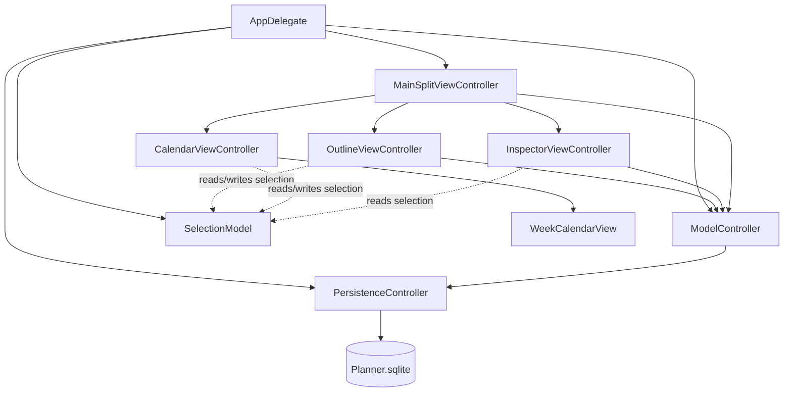
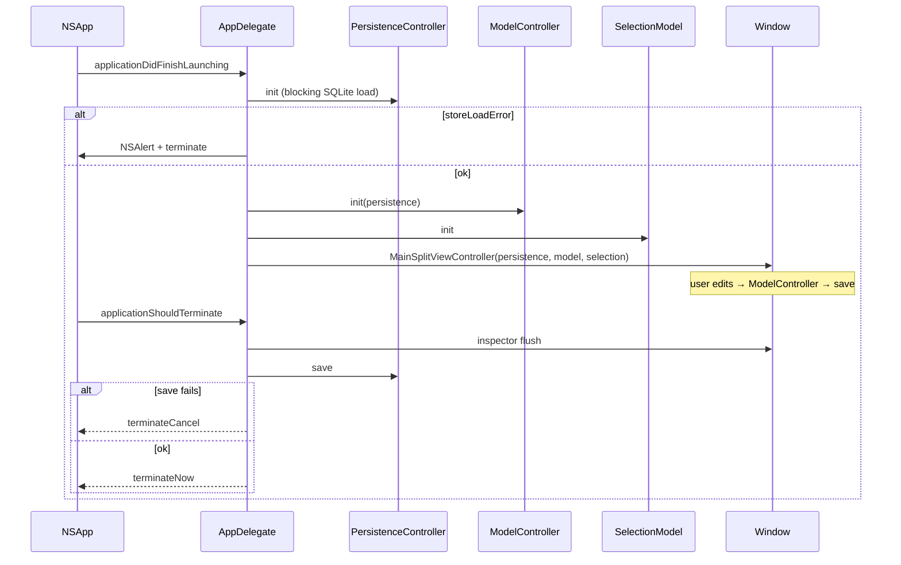

# Planner: Native macOS Task Manager

| Field | Value |
| --- | --- |
| **Author** | TBD |
| **Date** | 2026-08-13 |
| **Status** | Ready for Implementation |
| **Platform** | macOS AppKit (Swift) |
| **Workspace** | `/Users/ray/Programs/Planner` (greenfield) |

---

## Overview

Planner is a small, native macOS task manager: a source-list outline of projects and nested tasks on the left, and a week-column deadline calendar on the right. Tasks can be marked complete (a flag, no rollup). v1 persists locally with Core Data (`NSPersistentContainer`). The model, identifiers, object-lifecycle hooks, and store configuration are chosen so enabling CloudKit later is a container/entitlement/history-consumer change, not a remodel.

The app is AppKit-first (not SwiftUI-hosted, not Catalyst). The outline is a **view-based** `NSOutlineView`; Finder-style rename uses `editColumn(_:row:with:select:)` plus a title-field `acceptsFirstResponder` gate (not the cell-based `shouldEdit` API). The calendar is a small custom `NSView` week grid: each column is one week running Monday at the top to a collapsed Saturday/Sunday row at the bottom, and it fetches the visible span of whole weeks. There is no existing Xcode project; this document specifies the project, object graph, model, UI architecture, and an incremental PR plan.

---

## Background & Motivation

`/Users/ray/Programs/Planner` has no Xcode project or application source (greenfield). This design document is the implementation spec. The product need is a personal, hierarchical task list with a calendar of deadlines — the kind of tool that should feel like a Mac app (outline view, inline rename, main menu, window frame autosave), not a ported iOS split view.

Pain points a naïve implementation would hit, and that this design exists to avoid:

- Treating Project and Task as one type without deciding identity, or as two types without a legal Core Data parent relationship (a relationship has one destination entity; entity inheritance is CloudKit-hostile).
- Using ordered Core Data relationships or uniqueness constraints that `NSPersistentCloudKitContainer` rejects.
- Assigning UUIDs/timestamps in `awakeFromInsert`/`willSave`, which clobbers CloudKit imports.
- Fighting a view-based `NSOutlineView` with `shouldEdit` or a custom rename overlay.
- Embedding EventKit or a SwiftUI `Calendar` in an AppKit window for what is simply “tasks with a date.”
- Enabling CloudKit in v1, or conversely setting up the store in a way that makes CloudKit a rewrite.

---

## Goals & Non-Goals

### Goals (v1)

- Native AppKit app with one main window: outline + month calendar + a small task inspector (note + deadline).
- Projects at the root of the outline; tasks nest under projects or other tasks.
- Create projects from a blank store (menu bar, toolbar, empty-area context menu).
- Create tasks and subtasks from the outline context menu (and matching main-menu items).
- Finder-style inline rename on the outline (delayed click on the already-selected row, plus Return).
- Optional deadline on tasks only; the week grid shows those deadlines; user can set and clear them.
- Optional `isCompleted` flag on tasks (not projects). Outline checkbox is the primary control; no parent/child rollup. Completed tasks stay on the calendar, dimmed.
- **Read-only Outlook events** on the week grid, fetched asynchronously and rendered so they cannot be mistaken for tasks (§8.6).
- Local Core Data store that is CloudKit-ready but does **not** use `NSPersistentCloudKitContainer`. *(Superseded: mirroring shipped later; see the CloudKit appendix.)*
- Cascade delete with a confirmation alert.
- Unit tests for model invariants and month/grid deadline fetches, using an ephemeral SQLite store (`NSSQLiteStoreType` at `/dev/null`), not `NSInMemoryStoreType`.

### Non-Goals (v1)

- CloudKit / iCloud sync, sharing, or multi-device merge UX.
- Drag-and-drop reordering or reparenting (sibling `sortIndex` is still stored; new items append; duplicate indices are legal).
- Recurring **tasks**, reminders, or notifications. (Recurring *calendar events* are read and expanded — see §8.6. EventKit remains rejected as a store and as a UI; the external feed is Outlook over Apple events.)
- Tags, priorities, projects-on-the-calendar, or project deadlines. Completion is **in** v1 (task flag only; no rollup).
- Multiple windows, tabs, or a document-based architecture.
- SwiftUI or SwiftData as the primary stack; Catalyst; iOS/iPad companion.
- Third-party dependencies (calendar kits, reactive frameworks, Sparkle).
- App Store submission, iCloud entitlements, or analytics.
- Rich text notes, attachments, or file references.
- Sandboxed file import/export (CSV/OPML) — optional later; UUIDs make it possible.

---

## Key Decisions

| Decision | Choice | Rationale |
| --- | --- | --- |
| UI toolkit | AppKit, programmatic views + `MainMenu.xib` | Required product; storyboards merge poorly; menus are the one place IB earns its keep (standard Edit/Undo). |
| Entry point | `@main AppDelegate`; File’s Owner of `MainMenu.xib` is `NSApplication`; **no** AppDelegate object in the xib | Avoids dual-instantiation. `@main` is the sole `NSApplication.delegate`. Menu items target First Responder. |
| Object graph | `AppDelegate` creates `PersistenceController`, `ModelController`, and `SelectionModel`; injects all three into `MainSplitViewController` | One owner. View controllers never look up singletons and never retain each other. |
| Menu/toolbar actions | Implemented on `MainSplitViewController` | Always in the window responder chain. Not on `AppDelegate`, not only on the outline VC. |
| Entities | **Three entities**: `Project`, `Task`, `DayNote` | Domain differs (only Task has note/deadline; only Project is a root). Entity inheritance is rejected (CloudKit). A single `Item` entity is the main alternative; see [Alternatives](#alternatives-considered). SwiftData is rejected (same section). |
| Task parent | Two optional to-one relations: `project` **xor** `parentTask` | Core Data cannot point one relationship at two destinations. `ModelController` + tests enforce exactly one. **No** `validateForInsert/Update` throws (CloudKit import would abort). |
| Ordering | Explicit `sortIndex: Int64`, unordered relationships | Ordered relationships are incompatible with CloudKit. Duplicate `sortIndex` values are **legal**; siblings sort by `(sortIndex, uuid)`. |
| Identity | `uuid: UUID` assigned in `ModelController` create paths, not in `awakeFromInsert` | App-stable ID for expansion, chips, reveal, import/export. Not `NSManagedObjectID` (changes on first save). Not `CKRecord.recordName`. No uniqueness constraint. |
| Timestamps / notes | Set `createdAt`/`updatedAt` at the insert/update site; coerce empty notes in `setNote`. No `willSave` mutations | `awakeFromInsert`/`willSave` stamping is a CloudKit re-export loop. |
| Store | `NSPersistentContainer` + history tracking + remote-change notifications | History is cheap to enable at first store creation. Still **not** `NSPersistentCloudKitContainer`. |
| Store load | `shouldAddStoreAsynchronously = false`; `init` does not return until load finishes or fails | Tests and `AppDelegate` must not use an unloaded context. Failure → `NSAlert` + terminate, never `fatalError`. |
| Test store | `NSSQLiteStoreType` with `url = /dev/null` | History tracking is a SQLite feature. Do **not** set `NSInMemoryStoreType`. |
| Outline data | Manual `NSOutlineViewDataSource` + `NSManagedObjectContextDidSave` | Mixed types fight `NSTreeController`. FRC-per-parent is overkill. Did-save (not did-change) so outline items have permanent IDs. |
| Outline items | Registered `Project`/`TaskItem` objects **after** first save (permanent `objectID`) | Never insert a row for a temporary ID. Restore selection/expansion by UUID after any `reloadData`. |
| Rename | View-based `NSTableCellView` + `TitleTextField.acceptsFirstResponder` gate + `editColumn` | `shouldEdit` is cell-based and does not stop click-to-focus. No overlay field. `objectValueFor` / `setObjectValue` unused. |
| Delayed click | Snapshot `clickedRow == selectedRow` in `mouseDown` **before** `super.mouseDown` | `selectionDidChange` runs before `action`, so a UUID-after-change test starts rename on the first click. |
| Calendar | Custom `NSView` day grid: days flow in reading order (left to right, wrapping), N columns × 7 rows, every day full size | No first-party AppKit calendar view; EventKit is the wrong domain; no third-party kit. Width-fitted columns give each day a full-width band, so chip titles stay readable. (Superseded the original weeks-as-columns layout with half-height weekend rows.) |
| Calendar fetch | Closed-open range over the **visible whole weeks**, not the civil month | Every visible cell is inside the range, so no cell is ever chip-less by construction. The range grows with the pane, since the column count follows its width. |
| Week start | Hardcoded **Monday**, not `Calendar.firstWeekday` | Paging, the FRC window and the title all count whole Monday-first weeks; a locale-driven start would move the window under all three. |
| Weekend emphasis | Full-size cells with a gray wash | Originally half-height rows; the reading-order layout made every cell uniform, so the wash is now the only weekend marker. |
| Weekday markers | None — the gutter was dropped with the reading-order layout | Days no longer share a weekday per row, so a per-row label cannot exist; repeating `MON`…`SUN` in every cell would be the loudest thing on screen. The gray weekend wash carries the week rhythm instead. |
| Visible week count | Derived from pane width (`targetColumnWidth`, clamped 2–8) | Columns stay readable at any window size. The fetch window follows the count, so widening the pane loads the extra weeks. |
| Minimum column width | **Measured, not hardcoded**: the width of `chipWidthCalibrationTitle` in the chip font plus the chip's horizontal insets, rounded up (130pt today) | A magic number drifts the moment the chip font or padding changes. Deriving it means the narrowest column always shows a realistic longest task title whole. |
| Calendar week source of truth | `SelectionModel.visibleWeekStart` only (always a Monday). Gestures call the view delegate; they do not mutate `WeekCalendarView.visibleWeekStart`. Programmatic set does **not** fire the delegate. | Prevents a gesture → SelectionModel → view → delegate loop. |
| Bundle ID | `com.rihscb.Planner` | User decision. Use this in the target, log subsystem, container path, and any future iCloud container. |
| App name | Planner (display name and product name) | User decision. App icon still TBD; that is assets, not architecture. |
| Deadline | Optional `Date` on `Task` only, stored as start-of-day in `Calendar.current`. No `timeZone` attribute in v1. | Calendar requirement implies it. Multi-device day identity deferred. |
| Completion | `isCompleted: Bool` on `Task` only, default `false`. Outline checkbox is primary; inspector mirrors it. No child/parent rollup. | User decision: in v1. Complete is a flag; delete remains the destructive path. |
| Notes UI | **Trailing inspector** (`NSSplitViewItem(inspectorWithViewController:)`, not collapsible): has-deadline checkbox + date picker (no Clear button) + plain `NSTextView` (`String`, not rich text) | Attribute must not be dead. Unchecked ⇔ `deadline = nil`. Notes stay plain `String`. Trailing, not under the calendar: too little content to justify a full-width strip. |
| Inspector undo | `windowWillReturnUndoManager` returns `viewContext.undoManager`. Notes view gets a dedicated `UndoManager` via `textView(_:undoManagerFor:)`. Do **not** assign `window.undoManager` (it is get-only). Title field editor may share the Core Data manager; one `Rename` group on commit. | `NSTextView.undoManager` walks to the window by default; a private manager is required to keep keystrokes off the Core Data stack. |
| Drag-and-drop | Deferred | Not cheap enough with the manual data source to justify v1 scope. |
| Delete | Confirm sheet; cascade children; ⌘⌫ disabled while a field editor / `NSTextView` is first responder | Prevents silent tree wipes and deleting a task while editing a note. |
| Deployment | macOS 15.0 Sequoia | See [Xcode project](#1-xcode-project--target-layout). |
| Save | `viewContext` save after each meaningful edit; debounce notes 0.4s. Create/delete **throw** after rollback; they never return a rolled-back object. | Typical Core Data Mac app. A failed save leaves the tree unchanged. |
| Sidebar collapse | `canCollapse = true`, `canCollapseFromWindowResize = false` | The toolbar carries a Hide Sidebar button and View → Hide Sidebar (⌃⌘S), so there is always a way back. Resize-driven collapse stays off: the outline is the only place to create a project, so it should only vanish when the user asks. |
| Sync | Not in v1 | Model + lifecycle are prepared; container subclass, entitlements, and history consumer wait. |
| Calendar events source | Microsoft Outlook running locally, over **ScriptingBridge** (Apple events). Read-only; never writes, never contacts Exchange. | The user's calendar already lives in Outlook on this Mac. Validated by spike (§8.6.7). |
| Event storage | **Not Core Data.** In-memory `Sendable` values only. | The store is CloudKit-bound and `ModelController` is its only writer. Mirroring a read-only foreign feed into it would add a second writer, sync junk to CloudKit later, and create a delete-reconcile problem when events vanish upstream. Cost: events are absent for ~2s after launch, which is what asynchronous population means. |
| Event fetch window | `[today − 2 months, today + 3 months)`, snapped outward to whole weeks; fetched in **one** refresh, not per visible span. | Cost tracks the number of Apple-event queries, not the span. One slow refresh then instant paging beats re-fetching as the user pages. |
| Recurrence expansion | Local, in Swift. Outlook returns masters at their *first* occurrence plus per-slot exceptions; it does **not** expand series. | Without expansion a 3-month window shows 22 of 70 events on the author's calendar. This is the bulk of the feature. |
| Event selection | Event chips are **not** selectable. Clicking one selects the day. | `PlannerSelection` stays `.node | .day`. An `.event` case would ripple into every `changedFields` consumer to represent something with no detail view. |

**Events are read-only, and that is structural, not a policy.** There is no write path, no `ModelController` method, and no entity. The only way an event could ever be modified is by adding all three.

**Deadline as a first-class Task attribute.** The product brief did not list a deadline field, but the calendar is defined to show deadlines. v1 stores an optional `Date` on `Task` only. Projects stay title-only. Revisit only if a later product decision needs project-level milestones.

---

## Proposed Design

### 1. Xcode project / target layout

| Item | Value |
| --- | --- |
| Display name | Planner |
| Product name / target | Planner |
| Test target | PlannerTests |
| Bundle ID | `com.rihscb.Planner` |
| Deployment target | **macOS 15.0** |
| SDK | Latest stable Xcode macOS SDK (macOS 26 as of this writing) |
| Language | Swift |
| Swift language mode | Swift 6, with `@MainActor` on all AppKit types |
| UI | AppKit. Programmatic window and view controllers. `MainMenu.xib` only. |
| Lifecycle | `NSApplicationDelegate` via `@main`, not SwiftUI `@main` |
| Sandbox | **Off.** Reading Outlook over Apple events (§8.6) needs it off; the sanctioned `com.apple.security.scripting-targets` route requires the target app to publish scripting access groups, and Outlook does not. App Store submission is already a non-goal. |
| Hardened Runtime | On (notarization-ready). Requires `com.apple.security.automation.apple-events` to send Apple events — that gate is the Hardened Runtime's, not the sandbox's, so it survives turning the sandbox off. |
| Entitlements | `com.apple.security.automation.apple-events` only. The `app-sandbox` key is removed, not set to `false`. |
| Document type | None (single local store, not NSDocument). |

**Why macOS 15, not 14 or 26-only.** APIs used here (`NSSplitViewController`, `NSOutlineView`, `NSPersistentHistoryTrackingKey`, `UUID` attributes, `NSSplitViewItem(sidebarWithViewController:)`) exist well before Sequoia. Targeting 15 (roughly current-minus-one as of August 2026) covers machines that still receive OS updates without forcing Tahoe-only APIs. Drop to 14.0 if Sonoma support is a hard requirement; nothing in this design depends on 15-only symbols. Do not target 26-only.

**Why programmatic UI + MainMenu.xib.** The interesting views (outline host, custom calendar, inspector) are easier to review and diff as Swift. Storyboards are a non-goal. The menu bar is the exception: `MainMenu.xib` gives a correct Edit menu (Undo/Redo/Cut/Copy/Paste wired to First Responder) without reimplementing the responder chain. Window content is **not** in the xib.

**Create the project as:** Xcode → New Project → macOS → App → Interface: XIB, language Swift, uncheck Core Data in the template and add the model by hand so we control the container class. Alternatively create with Core Data checked and immediately replace `NSPersistentCloudKitContainer` if Xcode emits one, and delete `Persistence.swift` in favor of the types below. Delete any storyboard.

After cleanup, the on-disk layout:

```
/Users/ray/Programs/Planner/
├── Planner.xcodeproj/
└── Planner/
    ├── App/
    │   ├── AppDelegate.swift
    │   ├── MainMenu.xib
    │   └── Assets.xcassets/
    ├── Controllers/
    │   ├── MainSplitViewController.swift
    │   ├── OutlineViewController.swift
    │   ├── CalendarViewController.swift
    │   └── InspectorViewController.swift
    ├── Views/
    │   ├── PlannerOutlineView.swift
    │   ├── TitleTextField.swift
    │   └── WeekCalendarView.swift
    ├── Model/
    │   ├── Planner.xcdatamodeld/
    │   │   └── Planner.xcdatamodel/   # model version 1
    │   ├── PersistenceController.swift
    │   ├── SelectionModel.swift
    │   ├── OutlineNode.swift
    │   ├── Project+CoreData.swift
    │   ├── TaskItem+CoreData.swift    # class name TaskItem; entity name Task
    │   └── ModelController.swift
    ├── Support/
    │   ├── Calendar+Month.swift
    │   └── Logger+Planner.swift
    └── Planner.entitlements           # App Sandbox only
└── PlannerTests/
    ├── PersistenceTestCase.swift
    ├── ModelConstraintTests.swift
    └── DeadlineFetchTests.swift
```

Info.plist can remain the generated “generate Info.plist” file. Required keys:

- `NSPrincipalClass` = `NSApplication`
- `NSMainNibFile` = `MainMenu`
- `LSMinimumSystemVersion` = `15.0`
- `NSHumanReadableCopyright` = placeholder
- `NSAppleEventsUsageDescription` = “Planner reads your Outlook calendar to show events alongside your task deadlines. It never modifies your calendar.” Required by TCC on macOS 10.14+ **regardless of sandbox**; without it the first Apple event is denied outright rather than prompting.
- Do **not** set `NSMainStoryboardFile`

**Store location.** With the sandbox off, `NSApplicationSupportDirectory` is no longer container-redirected: the store is `~/Library/Application Support/Planner/Planner.sqlite` and defaults live in `~/Library/Preferences/com.rihscb.Planner.plist`. Anything written while the app was sandboxed sits under `~/Library/Containers/com.rihscb.Planner/Data/…` and must be copied across by hand (all three of `.sqlite`, `-shm`, `-wal` — dropping the WAL loses whatever has not checkpointed).

Application is **not** an agent (`LSUIElement` unset). Closing the last window terminates (`applicationShouldTerminateAfterLastWindowClosed` → `true`).

#### 1.1 MainMenu.xib connections (mandatory)

Xcode’s Mac App + XIB template puts an `AppDelegate` object in the xib and binds `File’s Owner.delegate` to it. Combined with `@main AppDelegate`, that yields **two** delegate instances and a menu bar whose actions miss the live window. After creating the project:

| Object / connection | Required setting |
| --- | --- |
| File’s Owner | Class = `NSApplication` |
| `AppDelegate` object in the xib | **Delete it.** Do not instantiate `AppDelegate` in the xib. |
| File’s Owner → `delegate` | Leave unconnected. `@main` is the sole delegate. |
| File’s Owner → `mainMenu` | Connected to the `NSMenu` (the menu bar). |
| Every custom menu item (New Project, New Task, …) | Target = **First Responder**; action = the selector in §6.3 |
| Standard Edit menu items | Target = First Responder (Xcode default) |
| Window | **None.** The window is created in code. |

`@main final class AppDelegate` is the only `NSApplicationDelegate`. The Swift entry point assigns `NSApplication.shared.delegate` and then `NSApplicationMain` loads `MainMenu.xib`.

---

### 2. Application architecture



**Ownership (created once in `applicationDidFinishLaunching`, after a successful store load):**

```swift
let persistence = PersistenceController()          // not a process-wide singleton
if let error = persistence.storeLoadError {
    presentStoreLoadFailure(error)                 // NSAlert, then NSApp.terminate
    return
}
let model = ModelController(persistence: persistence)
let selection = SelectionModel()
let split = MainSplitViewController(
    persistence: persistence,
    model: model,
    selection: selection
)
// window.contentViewController = split
```

Rules:

- `PersistenceController` owns the `NSPersistentContainer`, exposes `viewContext`, and performs saves with error presentation. There is **no** `PersistenceController.shared` in shipping code. Tests construct their own.
- `ModelController` is the **only** writer: insert, delete, `setTitle`, `setNote`, `setDeadline`, parent xor. View controllers do not assign attributes or relationships.
- `SelectionModel` is the only shared UI state: selected node UUID, selected calendar day, visible month. Outline, inspector, and calendar **observe** it and **never retain each other**.
- Menu and toolbar actions live on `MainSplitViewController` (window `contentViewController`, always in the responder chain). The outline VC implements reveal/edit helpers that the split calls; it does not own File-menu selectors.

#### 2.1 SelectionModel

```swift
enum SelectionField: String {
    case node, day, visibleWeek
}

extension Notification.Name {
    static let plannerSelectionDidChange = Notification.Name("plannerSelectionDidChange")
}

enum SelectionUserInfoKey {
    /// `Set<SelectionField>` (boxed as `Set<String>` of raw values) of fields that actually changed.
    static let changedFields = "changedFields"
}

@MainActor
final class SelectionModel {
    /// Exclusive: a task/project in the outline and a day in the calendar
    /// cannot both be selected. `selectedNodeUUID` / `selectedDay` are derived.
    private(set) var selection: PlannerSelection?   // .node(UUID) | .day(Date)
    private(set) var visibleWeekStart: Date      // Monday

    init(now: Date = Date(), calendar: Calendar = .current) {
        visibleWeekStart = calendar.startOfWeek(for: now)
    }

    func selectNode(uuid: UUID?) { /* post only if changed; userInfo[.changedFields] = ["node"] */ }
    func selectDay(_ date: Date?) { /* startOfDay; post only if changed */ }
    func setVisibleWeekStart(_ date: Date) { /* startOfWeek; post only if changed */ }
}
```

**Selection is exclusive.** `selection` holds *either* a node *or* a day, never both, so exactly one thing is active across the outline and the calendar. `selectNode(uuid:)` and `selectDay(_:)` both write the single slot; whichever is called last wins and the other side clears. `apply(_:)` compares the derived `selectedNodeUUID` / `selectedDay` before and after and posts `.node`, `.day`, or **both** — moving the selection from a task to a day posts both, so observers that watch only one field still react. Existing observers therefore needed no change beyond the inspector, which now binds on either field.

Observers: `NotificationCenter.default` on the main queue, name `.plannerSelectionDidChange`. Keep it NotificationCenter (no Combine requirement). **Every observer must inspect `userInfo[SelectionUserInfoKey.changedFields]` and no-op unless a field it cares about changed.** Week paging must not look like a node change (that would flush notes / rebind the inspector). Snapshotting the previous value is an acceptable alternative if an observer does not want to parse userInfo, but it must still no-op when its field is unchanged.

Lookups go through `ModelController`, not ad-hoc fetch requests in the VCs:

- Outline reveal: `model.node(uuid:)`
- Inspector bind: `model.task(uuid:)` / `model.project(uuid:)`
- Calendar accent chip already has the UUID from the chip; it does not need a fetch.

| Publisher | Writes |
| --- | --- |
| Outline user click / keyboard selection | `selectNode(uuid:)` |
| Calendar chip click | `selectNode(uuid:)` **only** — emitting the day too would immediately displace the task. Does **not** change `visibleWeekStart`. |
| Calendar day / `+K more` click | `selectDay` only. Does **not** clear `selectedNodeUUID`. |
| Calendar prev/next week / Today | `setVisibleWeekStart` |
| Create item | `selectNode` of the new UUID (after save) |
| Delete selected | `selectNode` of previous sibling, else parent, else `nil` |
| Inspector | **read-only** on `SelectionModel` |

Chip click → reveal path (no VC-to-VC call):

1. `CalendarViewController` writes `selection.selectNode(uuid:)`.
2. `OutlineViewController` observes (only if `.node` changed), calls `model.node(uuid:)`, expands ancestors, selects the row, scrolls it visible, makes the outline first responder.
3. `InspectorViewController` observes (only if `.node` changed), looks up via `model.task(uuid:)` / `model.project(uuid:)`, rebinds.
4. `CalendarViewController` observes, sets `monthView.selectedTaskID` for the accent chip.

#### 2.2 Window chrome

`AppDelegate` creates one `NSWindow`:

- Style: `[.titled, .closable, .miniaturizable, .resizable]`
- Title: `Planner`
- `contentViewController` = `MainSplitViewController`
- `setFrameAutosaveName("MainWindow")`
- `setContentSize(NSSize(width: 1040, height: 660))`
- `contentMinSize` ≈ `800×500`
- Tabbing mode: `.disallowed` (single-window v1)

`MainSplitViewController` is a single three-item horizontal split:

```
+----------------------+--------------------------+---------------+
|                      |  CalendarViewController  |  Inspector    |
|  OutlineViewController|  (WeekCalendarView)     |  min 260      |
|  min 240, default 260|  min 420                 |  default 300  |
|                      |                          |  collapsible  |
+----------------------+--------------------------+---------------+
```

Implementation:

- One `NSSplitViewController` (horizontal), three items.
- **Left item:** `NSSplitViewItem(sidebarWithViewController: outlineVC)` — source-list material and sidebar metrics. `minimumThickness = 240`, `maximumThickness = 480`, `preferredThicknessFraction` for ~260. **Collapsible on purpose only** (`canCollapse = true`, `canCollapseFromWindowResize = false`).
- **Middle item:** the calendar, `minimumThickness = 420`.
- **Right item:** `NSSplitViewItem(inspectorWithViewController: inspectorVC)` — a narrow trailing column (`minimumThickness = 260`, `maximumThickness = 380`, default ~300), **not collapsible** (`canCollapse = false`, same bargain as the mail reader: notes are half the point of tasks mode, and the window simply refuses to shrink past the panes' minimum sum). A full-width strip under the calendar was tried and rejected: the inspector holds a title, a date, and a note, which is far too little content for a 700pt-wide pane. It was collapsible with a toolbar toggle and View → Show Inspector (⌥⌘I) until the mail-triage polish pass removed both. File → Get Info (⌘I) focuses the note, and stays selection-gated on tasks.
- **Holding priorities must stay below `NSLayoutConstraint.Priority(500)`** (sidebar 260, calendar 240, inspector 260). At `.defaultHigh` a pane outranks the window's own resizing priority, so its restored thickness becomes a hard window minimum that the split autosave then feeds back — the window's minimum height grew on every launch until it could not be resized at all. Note this inverts the earlier "sidebar holding priority **low**" guidance: higher priority means *resists resizing*, so the sidebar needs the **higher** value to keep its width while the calendar absorbs slack.
- **Compression resistance inside panes must also stay below 500** for anything that can outgrow its pane's minimum thickness (the mail reader's header fields sit at 490). The same 500 threshold applies: a label or button row at the default 750 makes its full intrinsic width part of the window's Auto Layout floor, and `makeKeyAndOrderFront` then grows the window past its restored frame — and the autosave keeps the grown frame. Hiding the view does not help; hidden views keep their constraints.
- Autosave names: `MainHorizontalSplit.v3`. Bump the suffix whenever the item layout changes; a stored position from a different pane structure restores as a broken (or zero-width) pane.

A thin `NSToolbar` on the window (icon-only, `.unifiedCompact` if available, else default). Toolbar items have the same selectors as the File menu; validation is `MainSplitViewController.validateToolbarItem`.

| Item | Action |
| --- | --- |
| Add Project | `newProject:` |
| Add Task | `newTask:` |
| Add Subtask | `newSubtask:` |
| Flexible space | |
| Today | `revealToday:` (split forwards to the calendar VC / `selection.setVisibleMonth(Date())`) |

Toolbar is how a first-run empty store is obviously usable, in addition to File menu and the outline background menu.

---

### 3. Core Data model (CloudKit-ready; mirroring added later — see the CloudKit appendix)

#### 3.1 Entity choice

**Rejected: entity inheritance** (`Node` abstract, `Project`/`Task` subentities). `NSPersistentCloudKitContainer` does not support entity inheritance. Using it in v1 would force a remodel at sync time.

**Rejected for v1: single `Item` entity** with a `kind` enum. See [Alternatives](#alternatives-considered). Simpler outline and one CloudKit record type, but it allows illegal states (root task, nested project, project with a deadline) unless every write path re-implements the domain.

**Rejected: SwiftData.** See alternative J.

**Chosen: two entities, `Project` and `Task`.** A task is a child of a project **or** of another task via two optional to-one relationships. Calendar fetches are `Task` where `deadline` is in range. The outline sees a small `OutlineNode` protocol, not a single managed-object class.

#### 3.2 Entities and attributes

Core Data entity **Task** cannot use the Swift class name `Task` (conflicts with `Swift.Task`). Entity name: `Task`. Codegen class: `TaskItem` (`@objc(TaskItem)`).

**xcdatamodel inspector fields (both entities):**

| Field | Project | Task |
| --- | --- | --- |
| Entity name | `Project` | `Task` |
| Class | `Project` | `TaskItem` |
| Module | Current Product Module | Current Product Module |
| Codegen | **Manual/None** | **Manual/None** |

Configuration: Default (the unnamed default configuration; do not create extra configurations in v1).

**Entity `Project`**

| Attribute | Type | Optional | Model default | Assigned by |
| --- | --- | --- | --- | --- |
| `uuid` | UUID | NO | none | `ModelController.createProject` |
| `title` | String | NO | `Untitled Project` | create / `setTitle` |
| `sortIndex` | Integer 64 | NO | `0` | create (`nextSortIndex`) |
| `createdAt` | Date | NO | none | create |
| `updatedAt` | Date | NO | none | create and every `set*` |

| Relationship | Destination | Cardinality | Inverse | Delete rule | Ordered |
| --- | --- | --- | --- | --- | --- |
| `tasks` | Task | to-many | `project` | **Cascade** | **NO** |

**Entity `Task`** (class `TaskItem`)

| Attribute | Type | Optional | Model default | Assigned by |
| --- | --- | --- | --- | --- |
| `uuid` | UUID | NO | none | `ModelController` create paths |
| `title` | String | NO | `Untitled Task` | create / `setTitle` |
| `note` | String | YES | none (`nil`) | `setNote` (empty → `nil`) |
| `deadline` | Date | YES | none (`nil`) | `setDeadline` (start-of-day) |
| `isCompleted` | Boolean | NO | `NO` | create (`false`); `setCompleted` |
| `sortIndex` | Integer 64 | NO | `0` | create (`nextSortIndex`) |
| `createdAt` | Date | NO | none | create |
| `updatedAt` | Date | NO | none | create and every `set*` |

| Relationship | Destination | Cardinality | Inverse | Delete rule | Ordered |
| --- | --- | --- | --- | --- | --- |
| `project` | Project | to-one, **optional** | `tasks` | Nullify | n/a |
| `parentTask` | Task | to-one, **optional** | `subtasks` | Nullify | n/a |
| `subtasks` | Task | to-many | `parentTask` | **Cascade** | **NO** |

**Entity `DayNote`**

A note attached to a calendar day. Deliberately **not** an `OutlineNode`: no title, no parent, no children, and — by design — **no deadline and no completion flag**. A day is addressed by its date, not by a position in the project tree, so it never appears in the outline or in a deadline fetch.

| Attribute | Type | Optional | Assigned by |
| --- | --- | --- | --- |
| `uuid` | UUID | NO | `ModelController.setDayNote` |
| `day` | Date | NO | `setDayNote` (start-of-day; the row's identity) |
| `note` | String | YES | `setDayNote` |
| `createdAt` / `updatedAt` | Date | NO | `setDayNote` |

No relationships. Non-unique index on `day`.

**Lifecycle:** rows are created lazily on the first non-empty write and **deleted when the text is cleared**, so paging through days never accumulates empty rows. `dayNote(for:)` is a pure fetch and never inserts — binding the inspector to a day must not dirty the context.

**Duplicates are legal.** `day` carries no uniqueness constraint (CloudKit forbids them), so a future sync could produce two rows for one date. `fetchedDayNote(for:)` orders by `(createdAt, uuid)` and takes the first — the same tie-break the outline uses for duplicate `sortIndex` values.

No other entities in v1. No fetched properties. Add a **non-unique** index on `Task.deadline` (SQLite index, not a uniqueness constraint).

**Do not add:**

- Unique constraints on `uuid` or `title` (CloudKit + uniqueness constraints are incompatible).
- Ordered relationships.
- Transient identity.
- Binary attributes / external data references.
- A second store or a named extra configuration. One SQLite store, default configuration, file name `Planner.sqlite`.
- Default values or `awakeFromInsert` generators for `uuid` / timestamps.

Manual fetch helpers — the entity name is `Task`, not `TaskItem`. Without this, `NSFetchRequest<TaskItem>(entityName: "TaskItem")` fails at runtime, and `TaskItem.fetchRequest()` does not exist (Manual/None codegen):

```swift
extension Project {
    @nonobjc class func fetchRequest() -> NSFetchRequest<Project> {
        NSFetchRequest<Project>(entityName: "Project")
    }
}

extension TaskItem {
    @nonobjc class func fetchRequest() -> NSFetchRequest<TaskItem> {
        NSFetchRequest<TaskItem>(entityName: "Task")
    }
}
```

#### 3.3 Invariants (enforced only in `ModelController` + XCTest)

1. **Exactly one parent:** (`project != nil`) XOR (`parentTask != nil`). Never both, never neither.
2. **Projects are roots:** `Project` has no parent relationship.
3. **No cycles:** walking `parentTask` must terminate; `parentTask` must not be `self` and must not appear in the ancestor chain.
4. **Titles** are non-empty after trimming. `setTitle` throws / rejects; the rename field editor reverts (see §5.4).
5. **`deadline`**, when set, is `Calendar.current.startOfDay(for:)` at write time.

**Do not implement `validateForInsert` / `validateForUpdate` throws.** Those run on every context that saves, including a future `NSPersistentCloudKitContainer` import context. A dual-parent or empty-title record from a sync race would abort materialization and stall the import queue. v1 keeps the predicates as `ModelController` guards + tests.

Cycle check used by `createSubtask` / any future reparent (v1 has no reparent UI, so this is defensive):

```swift
func wouldIntroduceCycle(child: TaskItem, parent: TaskItem) -> Bool {
    var cursor: TaskItem? = parent
    var seen = Set<NSManagedObjectID>()
    while let node = cursor {
        if node.objectID == child.objectID { return true }
        if !seen.insert(node.objectID).inserted { return true }
        cursor = node.parentTask
    }
    return false
}
```

**Future CloudKit import repair** (history consumer, not validation; not implemented in v1):

- If both `project` and `parentTask` are set → keep `parentTask`, set `project = nil`.
- If neither is set → delete the orphan (or attach to a well-known “Recovered” project; decide in the CloudKit PR).
- If a cycle exists → break by nil-ing `parentTask` on the child that points back and attaching it to the nearest project ancestor if any.
- Empty title → `"Untitled Task"` / `"Untitled Project"`.

#### 3.4 Sibling order

```swift
static func nextSortIndex<T: OutlineNode>(in siblings: [T]) -> Int64 {
    (siblings.map(\.sortIndex).max() ?? -1) + 1
}
```

New items always append. **Duplicate `sortIndex` values are legal.** All sibling arrays and fetch sort descriptors use `(sortIndex ascending, uuid ascending)`. Two devices that later both insert under CloudKit can both compute `max+1`; the UUID tie-break keeps the outline stable. Drag-and-drop (later) reindexes a contiguous sibling slice; it does not require uniqueness.

#### 3.5 Managed object subclasses

Use **Manual/None** codegen. Hand-written subclasses own the `@NSManaged` properties only. **No `awakeFromInsert`. No `willSave`.**

```swift
// Project+CoreData.swift
@objc(Project)
final class Project: NSManagedObject, OutlineNode {
    @NSManaged var uuid: UUID
    @NSManaged var title: String
    @NSManaged var sortIndex: Int64
    @NSManaged var createdAt: Date
    @NSManaged var updatedAt: Date
    @NSManaged var tasks: Set<TaskItem>
}

// TaskItem+CoreData.swift
@objc(TaskItem)
final class TaskItem: NSManagedObject, OutlineNode {
    @NSManaged var uuid: UUID
    @NSManaged var title: String
    @NSManaged var note: String?
    @NSManaged var deadline: Date?
    @NSManaged var isCompleted: Bool
    @NSManaged var sortIndex: Int64
    @NSManaged var createdAt: Date
    @NSManaged var updatedAt: Date
    @NSManaged var project: Project?
    @NSManaged var parentTask: TaskItem?
    @NSManaged var subtasks: Set<TaskItem>
}
```

`ModelController` create skeleton (all create methods **throw**; they never return an object that has been rolled back):

```swift
func createProject() throws -> Project {
    let now = Date()
    let project = Project(context: ctx)
    project.uuid = UUID()
    project.title = "Untitled Project"
    project.sortIndex = Self.nextSortIndex(in: fetchedProjects()) // non-throwing; [] on fetch failure
    project.createdAt = now
    project.updatedAt = now
    ctx.processPendingChanges()
    guard persistence.saveViewContext(presentingWindow: presentingWindow) else {
        // saveViewContext already rolled back; `project` is unregistered.
        throw ModelError.saveFailed
    }
    // project.objectID is now permanent; outline may insert the row
    return project
}
```

`fetchedProjects()` / `fetchedSiblings(of:)` are internal non-throwing fetches used only for `nextSortIndex`. `allProjects()` remains the throwing public API for tests/UI.

`setTitle` / `setNote` / `setDeadline` / `setCompleted` assign the attribute, set `updatedAt = Date()`, then save. `setNote("")` stores `nil`. `setTitle` still throws on empty title **before** mutating. On save failure they throw `ModelError.saveFailed` after rollback (the previous value is restored).

`setCompleted(_ completed: Bool, on task: TaskItem)` sets `task.isCompleted` and `updatedAt` at the call site (no `willSave`). It does **not** touch `subtasks` or the parent. Completing a task is a flag only: children and ancestors keep their own `isCompleted` values.

Create-task paths set `isCompleted = false`.

`delete(_:)` throws on save failure. `saveViewContext` rolls back, so the cascade does **not** persist and the tree is unchanged. The confirmation sheet has already been dismissed; the alert from `saveViewContext` is the failure UI. The outline did-save observer does not run, so no rows disappear.

If someone later adds a generic `willSave`, it must no-op when `managedObjectContext?.transactionAuthor` is the CloudKit importer (`"NSCloudKitMirroringDelegate.import"` or whatever the container sets). v1 does not add that hook.

`OutlineNode` (not a Core Data entity):

```swift
@MainActor
protocol OutlineNode: AnyObject {
    var uuid: UUID { get }
    var title: String { get set }
    var sortIndex: Int64 { get set }
    var outlineChildren: [OutlineNode] { get }   // sorted by (sortIndex, uuid)
    var outlineParent: OutlineNode? { get }      // Project: nil; Task: parentTask ?? project
}
```

Children accessors sort in memory. v1 scale is a personal outline (hundreds to low thousands of nodes).

#### 3.6 Store setup

```swift
final class PersistenceController {
    let container: NSPersistentContainer   // NOT NSPersistentCloudKitContainer
    let storeLoadError: Error?

    var viewContext: NSManagedObjectContext { container.viewContext }

    /// - Parameter inMemory: When true, keep NSSQLiteStoreType and point
    ///   the file at /dev/null so history tracking still works.
    init(inMemory: Bool = false) {
        container = NSPersistentContainer(name: "Planner")
        guard let description = container.persistentStoreDescriptions.first else {
            storeLoadError = PersistenceError.missingStoreDescription
            return
        }

        if inMemory {
            description.url = URL(fileURLWithPath: "/dev/null")
            // Do NOT set description.type = NSInMemoryStoreType.
            // History tracking is SQLite-only.
        }

        description.shouldAddStoreAsynchronously = false
        description.setOption(true as NSNumber, forKey: NSPersistentHistoryTrackingKey)
        description.setOption(true as NSNumber, forKey: NSPersistentStoreRemoteChangeNotificationPostOptionKey)
        description.shouldMigrateStoreAutomatically = true
        description.shouldInferMappingModelAutomatically = true
        description.setOption(["journal_mode": "WAL"] as NSDictionary, forKey: NSSQLitePragmasOption)

        var loadError: Error?
        container.loadPersistentStores { _, error in
            loadError = error
        }
        // shouldAddStoreAsynchronously == false: the store is attached
        // (or has failed) before loadPersistentStores returns. Do not
        // DispatchGroup.wait() on the main queue — that deadlocks if the
        // completion is bounced back to main.
        storeLoadError = loadError

        guard storeLoadError == nil else { return }

        viewContext.automaticallyMergesChangesFromParent = true
        viewContext.mergePolicy = NSMergeByPropertyObjectTrumpMergePolicy
        viewContext.undoManager = UndoManager()
        viewContext.name = "viewContext"
        viewContext.transactionAuthor = "planner.user"
    }
}
```

**No `static let shared`.** `AppDelegate` holds the production instance.

**History tracking: enable now.** The first store creation writes history tables into the SQLite file. Turning this on later requires metadata/store surgery. v1 does **not** consume the history queue. Growth is negligible for a single-user local app; prune when a history consumer exists.

**Remote-change notifications: enable now.** Harmless locally. v1 may ignore `NSPersistentStoreRemoteChange`.

**Background context: not required in v1.** All writes are user-driven and tiny; they run on `viewContext` (main queue).

**Launch failure.** If `storeLoadError != nil` after `init`, `AppDelegate` presents an `NSAlert` (message: “Planner couldn’t open its library.”, informative text = `error.localizedDescription`) and terminates. Tests use `PersistenceController(inMemory: true)` and `XCTAssertNil(persistence.storeLoadError)` before inserting.

#### 3.7 Saves and errors

| Event | Save? |
| --- | --- |
| Insert project/task | Yes, immediately after insert and `processPendingChanges()`, **before** the outline inserts a row and **before** rename starts |
| Commit rename | Yes, via `ModelController.setTitle` |
| Delete | Yes, after the alert, via `ModelController.delete` |
| Deadline set/clear | Yes, via `setDeadline` |
| Complete / incomplete | Yes, via `setCompleted` |
| Note edits | Debounced 0.4s after last `textDidChange`; also on inspector resign / selection change / app terminate. Flush the **previous** task, never the newly selected one. |
| Expansion state | UserDefaults only, not Core Data |

```swift
@discardableResult
func saveViewContext(presentingWindow: NSWindow?) -> Bool {
    let ctx = viewContext
    guard ctx.hasChanges else { return true }
    do {
        try ctx.save()
        return true
    } catch {
        ctx.rollback()
        let alert = NSAlert(error: error)
        if let presentingWindow { alert.beginSheetModal(for: presentingWindow) }
        else { alert.runModal() }
        return false
    }
}
```

`applicationShouldTerminate`: inspector flushes the in-flight note; if `hasChanges`, save; on failure, present the alert and return `.terminateCancel`.

**Undo groupings** (`ModelController` sets these in PR 3, not as polish):

| Action | `undoManager.setActionName` |
| --- | --- |
| createProject | `New Project` |
| createTask / createSibling | `New Task` |
| createSubtask | `New Subtask` |
| delete | `Delete` |
| setTitle | `Rename` |
| setDeadline | `Set Deadline` / `Clear Deadline` |
| setCompleted(true) | `Complete` |
| setCompleted(false) | `Mark Incomplete` |
| setNote (each flush) | `Edit Note` |

Note-typing vs Core Data undo is specified in §7.

#### 3.8 Lightweight migration

- Model name: `Planner`. Version v1 is the only version.
- Future additive changes → new model version `Planner 2`, inferred mapping stays on.
- **Never** change `uuid`’s type or make it transient.
- **Never** convert `sortIndex` into an ordered relationship.

#### 3.9 Scale assumptions

Single user, local SSD. Expected working set: tens of projects, hundreds of tasks, tens of deadlines across the visible weeks. Outline reload-on-save is O(visible rows). Grid fetch is one indexed predicate. No paging.

---

### 4. Outline view architecture

#### 4.1 Hierarchy in the UI

```
Project A
  Task 1
    Subtask 1.1
    Subtask 1.2
  Task 2
Project B
```

Root items are all `Project` objects, sorted by `(sortIndex, uuid)`. A project’s children are `project.tasks`. A task’s children are `task.subtasks`. Projects never nest.

#### 4.2 Why not NSTreeController or FRC-per-parent

| Approach | Verdict |
| --- | --- |
| `NSTreeController` + Cocoa bindings | Classic for a homogeneous tree. Mixed `Project`/`Task` arranged objects, custom delayed rename, and “insert then immediately edit” fight bindings. Rejected. |
| `NSFetchedResultsController` per expanded parent | Correct live updates, but N FRCs, painful for mixed entity types. Overkill for v1 scale. |
| **Manual data source + `NSManagedObjectContextDidSave`** | Chosen. Permanent IDs, full control of selection after insert, works with `editColumn`. |

`OutlineViewController` holds:

- `outlineView: PlannerOutlineView` as the document view of an `NSScrollView`.
- Cached `projects: [Project]` sorted by `(sortIndex, uuid)`.
- The outline’s `item` objects **are the managed objects** (`Project` / `TaskItem`), not wrappers — **only after their `objectID` is permanent**.

The outline is **view-based**. Do **not** implement `outlineView(_:objectValueFor:byItem:)` or `outlineView(_:setObjectValue:for:byItem:)`. Titles are pushed in `viewFor` onto `TitleTextField.stringValue`.

```swift
func outlineView(_ ov: NSOutlineView, numberOfChildrenOfItem item: Any?) -> Int {
    if item == nil { return projects.count }
    return (item as! OutlineNode).outlineChildren.count
}

func outlineView(_ ov: NSOutlineView, isItemExpandable item: Any) -> Bool {
    // Projects are expandable even with zero tasks so the disclosure triangle is stable.
    return item is Project || !(item as! TaskItem).subtasks.isEmpty
}

func outlineView(_ ov: NSOutlineView, child index: Int, ofItem item: Any?) -> Any {
    if item == nil { return projects[index] }
    return (item as! OutlineNode).outlineChildren[index]
}
```

`isItemExpandable` for empty tasks: `false` (no triangle until a subtask exists). For empty projects: `true`. After adding the first subtask, `reloadItem(task, reloadChildren: true)` so the triangle appears. After deleting the last subtask, **the same `reloadItem`** so the triangle disappears.

#### 4.3 Live updates and item identity

Observe **`NSManagedObjectContextDidSave`** on `viewContext` (main queue), not `ObjectsDidChange`, for structural inserts/deletes.

`save()` processes pending changes (temporary IDs, `ObjectsDidChange`) **then** promotes IDs **then** posts `DidSave`. An observer of `ObjectsDidChange` that calls `insertItems` will hand the outline a temporary ID; after save the outline’s item cache no longer matches `row(forItem:)`.

Rules:

1. `ModelController` create/delete: `processPendingChanges()` → `save()`. The outline reacts in the did-save observer.
2. **Never** insert a row for `object.objectID.isTemporaryID == true`.
3. Re-sort the `projects` cache from the did-save payload (inserted/deleted/updated `Project`s).
4. Surgical `insertItems` / `removeItems` / `reloadItem` when a single parent is dirty; otherwise `reloadData()` + restore selection and expansion **by UUID**.
5. If `userInfo[NSInvalidatedAllObjectsKey] != nil` on `ObjectsDidChange` **or** a did-save that we cannot map: refetch all projects, `reloadData()`, restore by UUID.
6. Ignore changes that are only `note`, `deadline`, or `updatedAt` for outline structure. If `title` or `isCompleted` changed and we are not the active field editor, `reloadItem` that row (checkbox + struck title).
7. After create, the split/outline selects by UUID (object is registered and permanent) and, once PR 7 lands, starts rename on the next run-loop turn.

Test (PR 3 + PR 5): `createProject()` → save → `outline.row(forItem: project) >= 0` and still valid after a further `processPendingChanges()`.

#### 4.4 Cell view

One `NSTableColumn` identifier `"Title"`, no header (`headerView = nil`). **Assign it to `outlineView.outlineTableColumn`.** Without that assignment the disclosure triangles are missing or attach to the wrong column.

`outlineView(_:viewFor:item:)` dequeues `NSTableCellView` identifier `"TitleCell"`:

- Leading **complete control** (tasks only): `NSButton` checkbox (`buttonType = .switch`, no title, or a small image checkbox). Hidden / removed for `Project` rows so projects have no complete affordance. This is the **primary** complete control.
- `textField` is a `TitleTextField` (see §5.3): `isEditable = true`, `isSelectable = true`, `lineBreakMode = .byTruncatingTail`, `cell?.sendsActionOnEndEditing = true`, delegate = the outline controller.
- Set `textField.stringValue = node.title` in `viewFor`. If the item is a completed `TaskItem`, apply a secondary label color and strikethrough on the title (`NSAttributedString` on the field, or `attributedStringValue`).
- Bind the checkbox to `task.isCompleted` in `viewFor` (`isUpdatingUI` / `cell.isUpdatingCompleteControl` so the action does not re-enter). Action: `try? model.setCompleted(sender.state == .on, on: task)`.
- **Always** set `(textField as? TitleTextField)?.allowsFirstResponder = false` on dequeue. A reused cell must not inherit a previous edit’s flag.
- Delayed-click rename already requires the click to be **inside the title `textField` frame**, so a checkbox click never starts rename.

Complete vs delete: checking the box is non-destructive. Delete remains the cascade-confirm path (§4.8). There is no “complete and hide” and no auto-complete of children or parent.

Row height: `22`. `outlineView.style = .sourceList`. `selectionHighlightStyle = .sourceList`. The sidebar split item (§2.2) supplies vibrancy; do not also paint an opaque `controlBackgroundColor` that kills it.

`usesAlternatingRowBackgroundColors = false`. `indentationPerLevel = 16`. `autosaveExpandedItems` is **not** used. Expansion is persisted by UUID in UserDefaults.

#### 4.5 Selection

- Single selection (`allowsMultipleSelection = false`).
- `allowsEmptySelection = true` (clicking empty outline background can clear; a context-click on a row selects that row first).
- **Clicking the calendar does not clear outline selection.** A chip retargets it; a day / `+K more` click leaves the outline selection alone and only updates `SelectionModel.selectedDay`.
- On outline selection change: `selection.selectNode(uuid:)`.
- Double-click: toggle expand/collapse (not rename). Rename is delayed-single-click or Return.

#### 4.6 Expansion state persistence

`UserDefaults` key `outline.expandedUUIDs: [String]`.

- On expand/collapse delegate callbacks, write the set of expanded nodes’ `uuid.uuidString`.
- On load (after the first fetch of permanent objects), expand those UUIDs that still exist; drop missing IDs.
- Not synced, not in Core Data.

#### 4.7 Context menu

`PlannerOutlineView.menu(for:)` converts the event to a row. If the row is valid, select it. Then return a menu built for the item type. If the click is below the last row, return the background menu.

| Target | Items |
| --- | --- |
| Project | New Task, Rename, Delete… |
| Task | New Subtask, Rename, Delete… |
| Background / empty outline | New Project |

“Delete…” uses an ellipsis because it confirms. Rename invokes `beginEditingTitle` (PR 7). Until PR 7, the Rename item is omitted or disabled.

`validateMenuItem` is implemented on `MainSplitViewController` (see §6.3).

#### 4.8 Delete semantics

1. User chooses Delete (menu, context menu, or ⌘⌫) **and** first responder is not a text view / field editor.
2. Sheet on the main window:

   - Project: **Delete “{title}” and all of its tasks?**
   - Task with descendants: **Delete “{title}” and all of its subtasks?**
   - Leaf task: **Delete “{title}”?**

   Buttons: **Cancel** (default), **Delete** (`NSAlert.Style.warning`, delete button `.destructive` if available).

3. On confirm: `try ModelController.delete(node)` → cascade → save → did-save observer updates rows (and `reloadItem` on a task whose `subtasks` became empty) → `SelectionModel.selectNode` of previous sibling, else parent, else `nil`. If `delete` throws, `saveViewContext` has already rolled back and presented the alert: the tree is unchanged, no selection change, no row removal.

No recycle bin. Undo (Edit → Undo Delete) is the recovery path for the current session.

#### 4.9 Drag-and-drop

**Non-goal for v1.** Do not implement `pasteboardWriterForItem` or validate-drop. `sortIndex` is still assigned so enabling DnD later is a drop-delegate PR, not a model PR.

---

### 5. Inline rename (Finder-style)

This is the AppKit footgun. Use the outline’s own cell editor. Do **not** add a floating `NSTextField`. The outline is **view-based**; cell-based APIs do not apply.

#### 5.1 Begin-edit paths

1. **Return** (`\r`) **or keypad Enter** (`\u{3}`) when a row is selected, the outline is first responder, and no field editor is active → `beginEditingTitle(of: selectedItem)`.
2. **Context menu → Rename** and **File → Rename**. No main-menu key equivalent (do not steal ⌘R). Return / keypad Enter is the shortcut.
3. **Delayed click** on the already-selected row’s title cell.

#### 5.2 Delayed-click algorithm

`NSOutlineView` updates selection and posts `outlineViewSelectionDidChange` **before** sending `action`. Comparing UUIDs *after* that point is true for the newly selected row, so a 0.5s timer would start on the **first** click of every row. That is not Finder behavior.

Snapshot “already selected” in `mouseDown` **before** `super.mouseDown`:

```
PlannerOutlineView:
  var pendingRenameRow: Int = -1

  mouseDown(with event):
    cancel renameTimer (via delegate)
    let row = row(at: convert(event.locationInWindow, from: nil))
    pendingRenameRow =
        (row >= 0 && row == selectedRow && event.clickCount == 1
         && event.modifierFlags ∩ {.command,.shift,.option} is empty)
        ? row : -1
    super.mouseDown(with: event)   // selection may change here

  mouseDragged:
    pendingRenameRow = -1
    cancel renameTimer
    super.mouseDragged(...)

OutlineViewController (outline.action, clickCount == 1):
  if outline.pendingRenameRow == outline.clickedRow
     && outline.clickedRow >= 0
     && click is inside the title textField.frame
     && outline.currentEditor() == nil:
        renameTimer = scheduled delay → beginEditingTitle(of: item(at: clickedRow))
  outline.pendingRenameRow = -1

doubleAction:
  cancel renameTimer
  pendingRenameRow = -1
  toggle expand/collapse of clicked item

selectionDidChange (user or programmatic):
  cancel renameTimer
  // do not use this callback to decide “already selected”
```

`delay = max(0.5, NSEvent.doubleClickInterval + 0.05)` so a double-click never both toggles and starts an edit.

Do **not** key this off a `lastSelectionUUID` updated in `selectionDidChange`.

#### 5.3 Starting the field editor (view-based gate)

`outlineView(_:shouldEdit:item:)` is a **cell-based** API and is **not valid** for view-based tables. An editable `NSTextField` inside `NSTableCellView` becomes first responder on click by itself. `editColumn` starts a programmatic edit; it does not stop a raw click from focusing the field.

Gate with a tiny subclass:

```swift
final class TitleTextField: NSTextField {
    var allowsFirstResponder = false
    override var acceptsFirstResponder: Bool {
        allowsFirstResponder && super.acceptsFirstResponder
    }
}
```

```swift
private weak var editingField: TitleTextField?

func beginEditingTitle(of node: OutlineNode) {
    if let parent = node.outlineParent { outline.expandItem(parent) }
    let row = outline.row(forItem: node)
    guard row >= 0 else { return }
    outline.selectRowIndexes(IndexSet(integer: row), byExtendingSelection: false)
    outline.scrollRowToVisible(row)
    guard let field = titleField(atRow: row) else { return }
    field.allowsFirstResponder = true
    editingField = field
    outline.editColumn(0, row: row, with: nil, select: true)
    if outline.currentEditor() == nil {
        // editColumn failed to take first responder; do not leave the flag hot.
        endTitleEditing()
    }
}

func endTitleEditing() {
    editingField?.allowsFirstResponder = false
    editingField = nil
    // Belt: clear every on-screen TitleTextField. editedRow is often -1
    // by the time textDidEndEditing runs, so do not key off it.
    for row in 0..<outline.numberOfRows {
        titleField(atRow: row)?.allowsFirstResponder = false
    }
}
```

Keep `allowsFirstResponder == true` for the **duration** of a successful edit (until `textDidEndEditing` / `abortEditing()`), not only across the `editColumn` call. `viewFor` resets the flag on every dequeue so a reused `TitleCell` cannot accept a raw click. `shouldEdit` is unimplemented / unused.

`PlannerOutlineView.keyDown`:

```swift
override func keyDown(with event: NSEvent) {
    let chars = event.charactersIgnoringModifiers
    let isReturn = chars == "\r" || chars == "\u{3}"   // Return or keypad Enter
    if currentEditor() == nil, selectedRow >= 0, isReturn {
        (delegate as? OutlineViewController)?.beginEditingSelectedTitle()
        return
    }
    super.keyDown(with: event)
}
```

While editing, Return is handled by the field editor (commits). Escape is `cancelOperation:`.

After creating a new item (PR 7), call `beginEditingTitle` on the next run loop (`DispatchQueue.main.async`) so did-save insert/expand has landed and `row(forItem:)` is valid for the **permanent** object.

#### 5.4 Commit and cancel

`NSTextFieldDelegate` / `NSControlTextEditingDelegate` on the cell’s `TitleTextField`:

| User action | Result |
| --- | --- |
| Return / Tab / click elsewhere (`textDidEndEditing`) | If trimmed title non-empty: `ModelController.setTitle` (throws on empty; save + undo name “Rename”). If empty: beep, `return false` from `textShouldEndEditing` so the editor stays open. |
| Escape (`doCommandBy: #selector(cancelOperation(_:))`) | `abortEditing()`, restore `field.stringValue = node.title`, `endTitleEditing()`, do not save. Return `true`. |

```swift
func control(_ control: NSControl, textShouldEndEditing fieldEditor: NSText) -> Bool {
    let trimmed = fieldEditor.string.trimmingCharacters(in: .whitespacesAndNewlines)
    if trimmed.isEmpty {
        NSSound.beep()
        return false
    }
    return true
}

func controlTextDidEndEditing(_ note: Notification) {
    defer { endTitleEditing() }
    guard let field = note.object as? TitleTextField,
          let node = node(for: field) else { return }
    let trimmed = field.stringValue.trimmingCharacters(in: .whitespacesAndNewlines)
    guard !trimmed.isEmpty, trimmed != node.title else { return }
    try? model.setTitle(node, trimmed)   // saves; never PersistenceController.shared
}
```

---

### 6. Creating items

`ModelController` methods (all on the main context):

```swift
@discardableResult func createProject() throws -> Project
@discardableResult func createTask(in project: Project) throws -> TaskItem
@discardableResult func createSubtask(under task: TaskItem) throws -> TaskItem
@discardableResult func createSibling(of task: TaskItem) throws -> TaskItem
@discardableResult func createTask(under parent: OutlineNode) throws -> TaskItem
func delete(_ node: OutlineNode) throws

func project(uuid: UUID) throws -> Project?
func task(uuid: UUID) throws -> TaskItem?
func node(uuid: UUID) throws -> OutlineNode?
```

Create/delete **throw** `ModelError.saveFailed` after `saveViewContext` rolls back. They never return (or continue as if they had deleted) an unregistered object. Callers (`MainSplitViewController`) ignore the thrown error if the alert was already presented; they must **not** `selectNode` or `beginEditingTitle` on a failed create.

`createSibling(of:)` is what **New Task (⌘T)** uses when a task is selected. It implements the xor in one place:

```swift
func createSibling(of task: TaskItem) throws -> TaskItem {
    if let project = task.project {
        return try createTask(in: project)
    }
    if let parent = task.parentTask {
        return try createSubtask(under: parent)
    }
    preconditionFailure("TaskItem missing parent; ModelController invariant violated")
}

func createTask(under parent: OutlineNode) throws -> TaskItem {
    switch parent {
    case let project as Project: return try createTask(in: project)
    case let task as TaskItem:   return try createSubtask(under: task)
    default: preconditionFailure("unknown OutlineNode")
    }
}
```

Keep `createTask(in:)` and `createSubtask(under:)` as the low-level methods tests call directly.

Lookup helpers (`project`/`task`/`node`) issue a single `NSFetchRequest` with `uuid == %@` and `fetchLimit = 1`. `node(uuid:)` tries `Project` then `Task`. View controllers must not invent their own fetch with entity name `"TaskItem"`.

Defaults: title `Untitled Project` / `Untitled Task`; `uuid = UUID()`; `createdAt = updatedAt = Date()`; `sortIndex = next` among siblings; parent relationships set so the xor invariant holds; `processPendingChanges()`; `saveViewContext`. After a **successful** return, `objectID` is permanent. After a thrown `saveFailed`, the insert was rolled back and no row appears.

**After insert (once PR 6–7 have landed):**

1. Did-save observer inserts the row (permanent ID).
2. Expand the parent and ancestors; persist expansion.
3. `selection.selectNode(uuid: new.uuid)`.
4. Outline observer selects and scrolls the row.
5. PR 7 only: `beginEditingTitle` on the next run-loop turn.

PR 6 (create/delete) does **not** call `editColumn`. New rows stay “Untitled …” until PR 7.

#### 6.1 How a new project is created (blank store)

All of the following call `createProject()`:

- File → New Project (**⌘N**)
- Outline background context menu → New Project
- Toolbar “Add Project”
- Empty-state hint when `projects.isEmpty`: a dimmed, unselectable “No Projects — ⌘N to add one.” row inside the Projects section (a row rather than an overlay, so it sits where the projects would and never collides with the Mail section below).

#### 6.2 Task / subtask creation rules

| Selection | New Task (⌘T) | New Subtask (⌘⇧T) |
| --- | --- | --- |
| Nothing | Disabled | Disabled |
| Project | `createTask(in: thatProject)` | Disabled |
| Task | `createSibling(of: thatTask)` | `createSubtask(under: thatTask)` |
| Multiple (n/a v1) | — | — |

Context menu does **not** offer “New Task” on a task (it offers “New Subtask”). The main menu still creates a sibling with ⌘T.

A nested task has `project == nil` and `parentTask != nil`. Callers must not write `createTask(in: task.project!)` — that is the bug `createSibling` exists to prevent.

#### 6.3 Main menu and action owner

`MainSplitViewController` implements the actions and `validateMenuItem(_:)`. It is the window’s `contentViewController`, so it sits in the responder chain regardless of whether the outline, calendar, or inspector has focus.

| Title | Action | Key | Enabled when |
| --- | --- | --- | --- |
| New Project | `newProject:` | ⌘N | Always |
| New Task | `newTask:` | ⌘T | A project or task is selected **and** first responder is not a text input |
| New Subtask | `newSubtask:` | ⌘⇧T | A task is selected **and** first responder is not a text input |
| Rename | `renameSelected:` | (none) | An outline node is selected **and** first responder is not a text input |
| Delete… | `deleteSelected:` | ⌘⌫ | An outline node is selected **and** first responder is not a text input |
| Today | `revealToday:` | (toolbar) | Always |

“Text input” means `window.firstResponder` is an `NSTextView`, an `NSText` field editor, or an `NSTextField` that is editing (including `TitleTextField` and the inspector notes view). This is what stops ⌘⌫ from presenting a cascade-delete sheet while the user is deleting a character in the note.

Standard Edit menu remains targeted at First Responder. Undo routing is specified in §7 and §9. **Do not assign `window.undoManager`** — it is get-only and will not compile.

---

### 7. Inspector / notes / deadline editing

Notes and deadlines are not visible in the outline. Without an inspector they are dead schema. v1 includes a **small inspector**, not a third column and not a popover.

`InspectorViewController` stack (top to bottom, edge insets 12):

1. Title label (non-editable; outline is the rename surface) — `NSTextField` label, truncating.
2. **Completed** checkbox (mirror of the outline control; same `setCompleted` API). Hidden for projects / empty selection.
3. Deadline row: checkbox **“Has deadline”** + `NSDatePicker` (`.textFieldAndStepper`, `.singleDateMode`, elements `.yearMonthDay`). **No Clear button.**
4. “Notes” label.
5. `NSScrollView` wrapping `NSTextView` (`isRichText = false`, `usesFontPanel = false`, system body font, `delegate = inspector` so `textView(_:undoManagerFor:)` can return `noteUndoManager`). Plain `String` only — not rich text.

The inspector has three modes, chosen by what holds the selection: **task** (completion, due date, note), **project** (title + task count, no note), and **day** (formatted date + note only — no completion control, no due-date row). The note plumbing — dirty buffer, 0.4s debounce, flush-on-switch, failed-flush revert — is shared: the debounce is keyed on a `NoteTarget` (`.task(NSManagedObjectID)` / `.day(Date)`) rather than an object ID, because a day has no row until its note first exists.

| Selection | Inspector |
| --- | --- |
| None | Disabled, placeholder “Select a task” |
| Project | Title shown; completed + deadline + notes hidden; caption “N tasks” |
| Task | Title, Completed checkbox, has-deadline checkbox, picker, notes |

The outline checkbox is **primary**. The inspector checkbox is a **mirror**: both call `ModelController.setCompleted`; `isUpdatingUI` pushes `task.isCompleted` into the inspector control on `.node` change and on did-save when the selected task’s `isCompleted` changes. Do not keep a second boolean in the inspector.

**Deadline behavior:**

- Unchecked ⇔ `deadline = nil` ⇔ picker disabled (picker may show today as a dummy value; that value is not written).
- Checking the box → `setDeadline(task, date: picker.date)` (normalized to start-of-day). Picker enabled.
- Changing the picker while checked → `setDeadline(task, date: picker.date)`.
- Unchecking → `setDeadline(task, date: nil)`. Calendar drops the chip on the next FRC update.

No context-menu “Set Deadline…”. The inspector is the only deadline UI.

**`isUpdatingUI`:** every path that pushes model → controls (selection change, FRC-driven refresh) sets `isUpdatingUI = true` around the assignments. Checkbox / picker / text-view actions no-op when `isUpdatingUI` is true, so populating the inspector never saves.

**Notes + selection change (order is mandatory):**

1. Cancel the debounce timer.
2. Flush the **previous** `TaskItem` (the one the buffer was bound to), if any: `setNote(previous, textView.string)`.
3. Bind to the new selection (or clear). Reset the debounce timer state.
4. A timer that fires after a selection change must not run against the new task with the old buffer. Capture `TaskItem.objectID` in the timer; ignore the fire if it does not match the currently bound task.

Debounce: 0.4s after last `textDidChange`. Also flush on inspector resign, window resign, and `applicationShouldTerminate`. Empty string → `nil`.

**Undo:**

`NSWindow.undoManager` is **get-only**. `NSTextView.undoManager` walks the responder chain to the window by default — it does **not** own a private manager. Specifying “assign `window.undoManager`” will not compile; relying on the AppKit default puts every note keystroke on the Core Data stack next to the 0.4s `Edit Note` group.

Required wiring:

1. `AppDelegate` is `NSWindowDelegate`. Implement `windowWillReturnUndoManager(_:)` and return `persistence.viewContext.undoManager`. (Equivalent: override `undoManager` on `MainSplitViewController`. Pick **one**; prefer the window delegate so the outline field editor also sees the Core Data manager.)
2. `InspectorViewController` implements `NSTextViewDelegate.textView(_:undoManagerFor:)` and returns a dedicated `UndoManager` stored on the inspector (`noteUndoManager`). Character-level Undo/Redo while the notes view is first responder hit that manager only.
3. On selection change (`.node` in `changedFields`), replace `noteUndoManager` with a fresh `UndoManager` so the previous task’s typing stack cannot redo onto the new task.
4. The title field editor **may share** the window / Core Data manager during an open rename. Do not give `TitleTextField` its own manager. `setTitle` registers one `Rename` undo group on commit; keystrokes during the edit are discarded when the field editor ends (standard AppKit field-editor behavior) or sit as transient groups that `setTitle` then follows — implementers should call `viewContext.processPendingChanges()` and open a single undo group around `setTitle` so one Undo reverts the whole rename.
5. Core Data `viewContext.undoManager` covers insert, delete, rename, deadline, and each **committed** note flush (one group, action name `Edit Note`).
6. Never assign `window.undoManager`. Never point the notes view at `viewContext.undoManager`.

---

### 7A. Rich text notes (planned)

Notes gain **bold, italic, underline, bulleted lists and numbered lists, with nesting** — and, amended 2026-08-15, **hyperlinks** (see §7A.2). Explicitly **not** font family, size, or colour: the constraint is enforced on input, not merely by withholding the commands.

#### 7A.1 Storage — RTF, with a plain-text shadow

`NSTextView` reads and writes RTF natively (`textStorage.rtf(from:documentAttributes:)` / `NSAttributedString(rtf:documentAttributes:)`), and RTF round-trips every feature above, including nested `NSTextList` stacks. That buys the whole format with no parser of our own.

Both `Task` and `DayNote` gain one attribute:

| Attribute | Type | Optional | Holds |
| --- | --- | --- | --- |
| `noteRTF` | Binary Data | YES | The real content. **`allowsExternalBinaryDataStorage` OFF.** |
| `note` | String | YES | Plain-text shadow (`attributed.string`), unchanged |

The shadow is deliberate redundancy: existing rows stay readable, the migration is additive and inferrable, and a cheap plain column remains for a future search predicate. Drift is contained because `ModelController` is the only writer and sets both fields together.

**Amends the “no binary attributes” rule in §3.2.** That rule was over-broad. `NSPersistentCloudKitContainer` supports Binary Data attributes; what it rejects is **external** binary storage. Binary Data is legal here as long as `allowsExternalBinaryDataStorage` stays off.

*Rejected: Markdown.* No underline in CommonMark, and Foundation parses Markdown but will not serialise it back, so every save would be lossy.

#### 7A.2 The sanitiser is the feature

“No size or colour” is achieved by rejecting them on input. Paste is the leak — anything from a browser arrives with fonts, sizes and colours. One function, applied on **load**, **paste** and **drop**:

- `.font` → keep only the bold/italic traits; force family and size back to `.systemFont(ofSize: 13)`
- `.underlineStyle` → single only
- `.paragraphStyle` → keep only `textLists`; **recompute indents from the list depth** rather than trusting pasted values
- `.link` → kept, normalised to a `URL` *(amended 2026-08-15 — a planner note is where ticket and meeting URLs land; the link appearance comes from the text view, never from a stored colour)*
- strip everything else: colour, background, strikethrough, kern, attachments — including the U+FFFC placeholder character an attachment hangs on — and superscript

`textView(_:shouldChangeTypingAttributesTo:)` clamps what typing can introduce. `isRichText` becomes `true`; `usesFontPanel` and `importsGraphics` stay `false`.

The leak is also closed at the flavor level *(2026-08-15)*: `readablePasteboardTypes` is restricted to **RTF, HTML and plain text**, so a WebArchive or RTFD drop can never reach the buffer through a type the sanitiser does not decode — AppKit picks the flavor before `readSelection` runs, so intercepting types one by one cannot be airtight. HTML is decoded and then sanitised like everything else; it is the only rich flavor browsers actually put on the pasteboard, so without it a paste from Safari silently arrived plain. Content that fails to decode is refused outright, never handed to `super` to insert raw. Typed URLs become links via `isAutomaticLinkDetectionEnabled`.

#### 7A.3 Nested lists

`NSParagraphStyle.textLists` **is** the nesting stack — outermost first — so a second-level item carries two `NSTextList`s. Depth is capped at **5**.

| Level | Bulleted | Numbered |
| --- | --- | --- |
| 1 | `disc` | `decimal` |
| 2 | `circle` | `lowerAlpha` |
| 3 | `square` | `lowerRoman` |
| 4+ | cycle | cycle |

`firstLineHeadIndent` / `headIndent` scale at 20pt per level and are always derived from `textLists.count`, never stored independently — that keeps pasted content consistent with typed content.

**An empty note has no characters to attribute** — and TextKit renders markers from **storage only**, never from typing attributes (verified by offscreen rendering: an empty final paragraph draws no marker whatever the typing attributes say). The original plan — park the style in `typingAttributes` until something is typed — therefore produced invisible edits: toggling a list on an empty line, Tab on a fresh item, and Return-continuation at the end of the note all showed nothing until the next character. *(Amended 2026-08-15:)* a list edit whose result is still a list **materialises** the charless paragraph instead — it gets a newline to carry the style, caret kept in front — so the marker renders immediately; the same happens when Return grows a list at the end of the note. A blank line that already owns a newline just carries the style on that newline. Edits that *leave* the list still go through typing attributes: there is no marker to show. State queries (`isInList`, the format bar) read typing attributes when there is no selection, mirroring how bold and italic already behave.

Interaction, matching Notes:

- **Tab / Shift-Tab** indent and outdent, but **only when the caret is inside a list paragraph**; elsewhere Tab keeps its normal meaning. Implemented by overriding `insertTab:` / `insertBacktab:`.
- **Return** on an empty item outdents one level; at level 1 it exits the list.
- Renumbering is level-aware: each sublist restarts, and the parent level resumes its own sequence after a nested block ends.

Menu items for Increase/Decrease Indent carry **no key equivalent**: the standard ⌘[ / ⌘] already belong to Previous/Next Week (§6.3), and Tab/Shift-Tab is the interaction people actually use inside a note.

**TextKit draws the markers.** The spike (§7A.6) overturned the assumption this plan was written on: given `textLists`, TextKit renders the marker *and* numbers it, restarting nested levels and resuming the parent afterwards. So the code never writes marker characters — an early attempt did, and produced two markers per line (`1  1.  Pack boxes`). Consequences:

- There is **no renumbering pass** to write or maintain.
- List edits are **attribute-only** with one deliberate exception: the text never changes, ranges stay valid, the caret does not move, and one edit is one undo step. The exception is the materialised newline for a charless paragraph (§ above) — a real newline, never a marker glyph, inserted through `shouldChangeText`/`didChangeText` so it shares the command's undo group.
- The plain-text shadow stays free of marker punctuation, so `note` is clean for search.

The real work is therefore key handling, not markers: Tab/Shift-Tab, Return-continues/exits, and Backspace-at-start.

#### 7A.4 Commands and shortcuts

A new **Format** menu, validated only while the notes view is first responder, with state reflecting the selection:

| Command | Shortcut |
| --- | --- |
| Bold | ⌘B |
| Italic | ⌘I |
| Underline | ⌘U |
| Bulleted List | ⇧⌘8 |
| Numbered List | ⇧⌘7 |
| Increase / Decrease Indent | *(none — Tab / Shift-Tab)* |

**⌘I moved to Italic** in phase 2, taking the standard binding. View → Show Inspector keeps **⌥⌘I**, the standard macOS Inspector binding.

File → Get Info moved to **⇧⌘I** rather than losing its shortcut outright. Dropping it left no keyboard route into the note at all — Show Inspector only toggles the pane, it does not focus the field — which surfaced immediately in testing. ⇧⌘I is free and adjacent to the other two.

Alongside the menu, the inspector carries a three-segment **format bar** (B / I / U) above the note. It is `refusesFirstResponder`, so clicking a segment leaves the caret and its selection in place, and focus is explicitly returned to the note afterwards. Its state is driven from the text view, which is the single source of truth: `NoteTextView.onFormattingStateChange` fires on both selection moves and formatting changes, since selection alone never reaches `textDidChange`.

**Mixed selections read as off.** A trait counts as on only when the *whole* selection carries it, so one press over a partly-bold run makes it uniformly bold rather than stripping it.

Bold and Italic are implemented as our own `toggleBold:` / `toggleItalic:` rather than routed through `NSFontManager.addFontTrait:` — that avoids font-panel coupling and makes “traits only, never size” structurally true. Each list toggle and indent change is wrapped in one undo group on `noteUndoManager`.

#### 7A.5 Phasing

1. ~~**Storage and sanitiser.**~~ **Done.** New attribute, `ModelController` writes both fields, inspector loads/saves attributed text, sanitiser applied on load, paste and drop. `persistBoundNote` compares RTF as well as the string; `shouldReplaceNotes` compares attributed content.
2. ~~**Bold / italic / underline.**~~ **Done.** Format menu, format bar, validation, shortcut reassignment.
3. ~~**Lists, including nesting.**~~ **Done.** Tab/Shift-Tab, Return/Backspace behaviour, typing-attribute lists on empty lines. Markers and numbering come free from TextKit.

#### 7A.6 Risks

~~**Spike before scheduling phase 3.**~~ **Done, and it changed the design.** TextKit 2 handles `NSTextList` well: nested stacks survive an RTF round trip with formats and indents intact, and markers are drawn *and numbered* automatically. No TextKit 1 fallback was needed. The spike's value was negative-space: it removed the marker-insertion and renumbering machinery this section originally specified.

**Shortcut spelling.** ⇧⌘7 / ⇧⌘8 must be written as `keyEquivalent="7"` plus an explicit shift+command mask. Using the shifted character (`&`, `*`) also binds, but the menu then displays **⌘&** instead of ⇧⌘7.

Lesser: RTF round-trip drift across OS versions (mitigated by sanitising on every load) and ~200 bytes of RTF overhead per note (irrelevant at this scale).

**Building the text view by hand has one trap.** The notes editor is constructed directly rather than via `NSTextView.scrollableTextView()`, so the document view can be the sanitising `NoteTextView` subclass. That convenience method also sets `textContainer.containerSize` to an unbounded height; building the view yourself does not, and the default is **finite** — text past it silently stops being laid out, so long notes appear truncated with no scrollbar. Set it explicitly. A test asserts the container height is unbounded.

The notes field also owns all spare vertical space whenever it is showing; the bottom spacer that keeps a project's title top-aligned is hidden in that case, so the two never compete for the slack.

#### 7A.7 Out of scope

Colour, size, font family, images, attachments, tables, rich text in outline titles, Markdown import/export. *(Links were originally listed here; promoted to in-scope 2026-08-15.)*

---

### 8. Week calendar view

#### 8.1 Why a custom NSView

There is no AppKit calendar grid. EventKit’s calendar UI is for calendar events, not Planner tasks. Third-party calendars are a dependency we do not need. A SwiftUI `Calendar` in `NSHostingView` would split the UI toolkit; rejected for v1.

`WeekCalendarView: NSView` draws **week columns**, not a month grid:

```
   ┌──────────┬──────────┬──────────┐
   │  31      │   1  Sep │   2      │  ← month badge on the 1st
   ├──────────┼──────────┼──────────┤
   │   3      │   4      │   5 ▒▒▒▒ │  ← weekend: full size, gray wash
   ├──────────┼──────────┼──────────┤
   │   6 ▒▒▒▒ │   7      │   8      │
   ├──────────┼──────────┼──────────┤
   │   …      │   …      │   …      │      (7 rows in all)
   └──────────┴──────────┴──────────┘
```

- Days flow in **reading order**: the first visible Monday at the top left, each row filling left to right before the next begins. A row holds one day per visible week — the column count the pane width allows — so the grid is always **seven uniform rows** and paging still moves by whole weeks.
- Every cell is full size, weekends included; a **gray wash** on Saturday and Sunday is what marks the week rhythm. (This superseded the original weeks-as-columns layout, which gave the weekend half-height rows and a 34pt `MON`…`SUN` gutter — with days no longer sharing a weekday per row, a per-row label cannot exist, and the gutter went with it.)
- Each cell carries its day number. The **first day of a month** additionally gets a small-caps month header, which is what supplies month context now that there is no month title.
- Chips fill the remaining cell height; capacity is computed per cell, with a `+K more` row when it overflows.
- No spillover concept: every visible cell is inside the fetched range by construction.

Layout is manual. Each day is a `DayCellView: NSView` (hit-testing and accessibility); frames come from `bounds`. `rowFrames(in:)` (seven equal bands) and `columnFrames(in:count:)` are static and unit-tested.

**Header.** The range label and `‹ Today ›` navigation live in the **toolbar**, but positioned as if they were a header bar inside the calendar pane. Two `NSTrackingSeparatorToolbarItem`s do this: one at `dividerIndex: 0` (sidebar | calendar) and one at `dividerIndex: 1` (calendar | inspector). Items between them are confined to the calendar pane's width; a leading flexible space pushes the sidebar's own group up against divider 0 so it hugs the splitter the way mail's reader actions hug divider 1:

```
(flex) [Add Project][Add Task] [Sidebar] ┊ Aug 10 – 30 2026 (flex) ‹ Today › ┊ [Inspector]
                                         ↑ divider 0                         ↑ divider 1
```

The sidebar toggle is the **system `.toggleSidebar` item**: the delegate returns nil for that identifier and AppKit supplies it, so it keeps the standard icon, tooltip and validation. It renders as its own pill beside the Add buttons' capsule rather than merging into it, which matches the inspector toggle on the far side.

**Collapsing the sidebar rearranges the leading toolbar**, following Preview:

- **New Project / New Task hide** (`NSToolbarItem.isHidden`, macOS 15+). They act on the outline, so they go away with it. ⌘N still works from the File menu.
- **The leading flexible space and divider 0's tracking separator are removed**, so the toggle sits beside the window buttons instead of floating where the divider used to be. The separator must go too: with its divider collapsed it has nothing to track, and AppKit parks it — and everything laid out against it (the title drifted to mid-toolbar, Refresh landed over the reader) — against the wrong divider. Re-expanding re-inserts both and the group hugs the splitter again.

Both are driven by **KVO on `sidebarSplitItem.isCollapsed`**, not just the toggle action: the divider can be dragged shut and the split autosave can restore a collapsed sidebar at launch. Items are also created lazily by the toolbar, so `itemForItemIdentifier` stamps the current visibility on each one as it is built.

The leading-space swap is verified by hand, not by test: `NSToolbar` does not populate `items` synchronously for an off-screen window, so a unit test around it is timing-dependent. The identifier *ordering* that produces the hugging behaviour is covered.

The label draws the span bold and the year in a lighter weight and secondary colour. Both separators track live: collapsing the inspector widens the calendar, the visible week count grows, and the range label and navigation re-anchor to the new divider position on their own.

Hosting these in the toolbar rather than a header view inside the pane keeps the grid flush under the title bar — an in-pane header left a dead horizontal band above the weeks. If a header view is ever reintroduced, its height constraint must be **exact**, not `>=`: the grid below has no intrinsic height, so an open-ended header absorbs the whole pane and collapses the weeks to nothing.

**Visible week count** follows the pane: `weekCount(fittingWidth:)` divides the full grid width by `targetColumnWidth` and clamps to 2…8. The count is both the number of visible weeks and the number of day columns per row.

Because `count = floor(available / target)`, the resulting `available / count` is always ≥ `target`: **`targetColumnWidth` is a floor on column width**, not just a hint. (The exception is the 2-column clamp, where a very narrow pane can go below it.) That floor is what guarantees chip titles fit, so it is derived rather than picked:

```swift
static let chipWidthCalibrationTitle = "Qualcomm brief due"
static let targetColumnWidth: CGFloat = {
    let width = (chipWidthCalibrationTitle as NSString)
        .size(withAttributes: [.font: DeadlineChipView.titleFont]).width
    return (width + chipTextHorizontalInset).rounded(.up)   // 130pt today
}()
```

`chipTextHorizontalInset` sums the cell inset on both sides and the chip's bar gutter and trailing padding, so the calibration tracks any change to chip padding automatically. A test asserts the title renders whole at the minimum **using the layout manager**, not `.size()` — the final glyph's trailing side bearing means text fits a few points tighter than its measured width suggests, so a `.size()`-based assertion would be measuring the wrong thing. When it changes during layout the view calls `didChangeVisibleWeekCount`, and `CalendarViewController` rebuilds the FRC over the wider or narrower span.

#### 8.2 Date storage and comparison

- Store `Task.deadline` as `Date` (absolute instant).
- On write: `Calendar.current.startOfDay(for: userFacingDate)`.
- On display: a task belongs to day `D` iff `calendar.isDate(deadline, inSameDayAs: D)`.
- **Do not** store timezone-naive strings (`"2026-08-13"`).

**Timezone limitation (accepted):** a deadline written in America/Los_Angeles as `startOfDay` can fall on the previous calendar day after a flight to Asia. v1 does not store a time-zone identifier. Open Question for multi-device sync, not a v1 blocker.

#### 8.3 Fetch

`CalendarViewController` owns an `NSFetchedResultsController<TaskItem>`. The predicate is the **visible whole weeks**, closed-open, not the civil month.

```swift
func request(for visibleWeekStart: Date, weekCount: Int, calendar: Calendar = .current) -> NSFetchRequest<TaskItem> {
    let start = calendar.startOfWeek(for: visibleWeekStart)      // always a Monday
    let end = calendar.endOfWeeks(from: start, count: weekCount) // exclusive
    let req = TaskItem.fetchRequest()   // entityName: "Task"
    req.predicate = NSPredicate(format: "deadline >= %@ AND deadline < %@", start as NSDate, end as NSDate)
    req.sortDescriptors = [
        NSSortDescriptor(key: "deadline", ascending: true),
        NSSortDescriptor(key: "sortIndex", ascending: true),
        NSSortDescriptor(key: "uuid", ascending: true),
    ]
    return req
}
```

Rebuild the FRC when `SelectionModel.visibleWeekStart` changes (observer checks `.visibleWeek` in `changedFields`, then assigns `weekView.visibleWeekStart` — which must not re-enter the delegate — and recreates the FRC) **and** when the view reports a new visible week count. FRC delegate (`controllerDidChangeContent`) maps fetched tasks to `TaskDeadlineChip` and assigns `weekView.deadlines`.

Projects never appear. Tasks with `deadline == nil` never appear. **Completed tasks with a deadline still appear** — do not add `isCompleted == false` to the predicate.

`TaskDeadlineChip` includes `isCompleted`. The day cell draws completed chips dimmed (`tertiaryLabelColor`) and struck through. Incomplete chips use the normal label / accent-when-selected appearance.

`ModelController.tasks(deadlineInMonthOf:calendar:)` used by tests has a sibling `tasks(deadlineInWeeksFrom:count:calendar:)` over the same week range. Test both: civil-month edges *and* that the week fetch covers the first and last visible day while excluding the days either side, and that raising `count` widens the window.

#### 8.4 Interaction

| Gesture | v1 behavior |
| --- | --- |
| Click a deadline chip | `selection.selectNode(uuid:)` only. Outline reveals (expand ancestors, select, scroll, focus outline). Inspector rebinds to the task. Any selected day is released. |
| Click a day number / empty cell | `selection.selectDay`. Subtle day highlight; the inspector binds that day's note. **Does not** create a task, and **does not** create a `DayNote` row until text is typed. Clears the outline selection — selection is exclusive. |
| Click `+K more` | Same as clicking the day (select-day only). Does not pick a hidden task. |
| Double-click empty day | No-op in v1. |
| Prev/Next week | Gesture calls `delegate.weekCalendar(_:didChangeVisibleWeekStart:)` **only**. The view does **not** assign `self.visibleWeekStart`. |
| Today | Same: delegate only (or toolbar `revealToday:` writes `SelectionModel` directly). |
| Arrow keys | Reading order, matching the layout: Left/Right walk a day along the row; Up/Down jump a whole row (one day per visible week). Delegate `didSelectDay`, plus `didChangeVisibleWeekStart` only when the new day falls off screen. With nothing selected the first press lands on **today** rather than a day away from it. |
| Taking focus | **Never changes the selection.** The view deliberately does not select a day in `becomeFirstResponder`: collapsing a pane moves first responder into the calendar, and that must not silently retarget the inspector. Seeding a day is the first arrow press's job. |

**`visibleWeekStart` source of truth and no-loop rule:**

- `SelectionModel.visibleWeekStart` is the only source of truth, and is always a Monday.
- User gestures on `WeekCalendarView` call the delegate; they do **not** mutate `visibleWeekStart` themselves.
- `CalendarViewController` writes `selection.setVisibleWeekStart(...)`.
- The selection observer (when `.visibleWeek` is in `changedFields`) assigns `weekView.visibleWeekStart` and rebuilds the FRC.
- The `visibleWeekStart` setter on the view must **not** invoke the delegate; it only re-applies the cells.
- `revealToday()` on the view is a convenience that only calls the delegate with `Date()`; it does not set the property.

Highlight: if `selection.selectedNodeUUID` matches a chip on screen, that chip uses `NSColor.controlAccentColor`. Today’s cell gets a filled **capsule** behind the day number — see §8.6.9 for why it is not a circle. The calendar observer updates `selectedTaskID` / `selectedDay` only when `.node` / `.day` changed.

#### 8.5 Calendar helpers

`Calendar+Month.swift`:

```swift
func startOfMonth(for date: Date) -> Date
func endOfMonth(for date: Date) -> Date          // start of next month
func startOfWeek(for date: Date) -> Date         // always a Monday
func weekStarts(from: Date, count: Int) -> [Date]
func days(inWeekStartingAt: Date) -> [Date]      // 7 start-of-day Dates, Monday first
func endOfWeeks(from: Date, count: Int) -> Date  // exclusive
func monthYearString(for date: Date) -> String   // “August 2026”
```

Always `Calendar.current`. Do not cache a static `Calendar(identifier: .gregorian)` without the current timezone.

---

### 8.6 External calendar events (Outlook, read-only)

The grid shows the user's Outlook calendar alongside their own deadlines. Events are **read-only**, **never persisted**, and rendered so they cannot be confused with a task.

#### 8.6.1 Shape of the data

```swift
/// One occurrence as the source reports it. Sendable: crosses actors.
struct CalendarEvent: Hashable, Sendable {
    let id: String            // sourceID + UID + occurrence start
    let title: String
    let start: Date
    let end: Date             // exclusive
    let isAllDay: Bool
    let location: String?
    let organizer: String?
    let calendarName: String?
    let isRecurring: Bool
    let isRescheduled: Bool   // an occurrence moved off its usual slot
}

/// One row in one day cell. Multi-day events expand to one chip per day.
struct CalendarEventChip: Hashable, Sendable {
    let id: String            // event id + day
    let title: String
    let day: Date             // start-of-day — matches TaskDeadlineChip.day
    let startTime: Date?      // nil for all-day and for continuation days
    let isAllDay: Bool
    let continuesFromPreviousDay: Bool
    let continuesToNextDay: Bool
    // tooltip-only:
    let location: String?
    let organizer: String?
    let calendarName: String?
    let isRecurring: Bool
    let isRescheduled: Bool
}
```

`CalendarEventChip` mirrors `TaskDeadlineChip`'s `(id, title, day)` so the grid's existing group-by-`startOfDay` needs no restructuring.

**No intra-day time layout.** Chips stack in list order; the start time is text in the label and nothing more. Order within a day is `(isAllDay desc, start, title, id)` — deterministic so the grid does not shuffle between refreshes, but it is list order, not a time axis.

#### 8.6.2 Source protocol

```swift
protocol CalendarEventSource: Sendable {
    var sourceID: String { get }
    var displayName: String { get }
    func events(in range: Range<Date>) async throws -> [CalendarEvent]
}
```

Not `@MainActor`. Implementations: `OutlookEventSource` (§8.6.4), `NullEventSource` (returns `[]`, the default when Outlook is unavailable), `StubEventSource` (tests). The protocol is the seam that keeps every Apple-event concern out of PRs 11, 12 and 14.

#### 8.6.3 Window

`EventWindow.current()` is `[startOfWeek(today − 2 months), startOfWeek(today + 3 months) + 1 week)` — anchored on **today**, not on `visibleWeekStart`, and snapped outward to Mondays so a window edge never bisects a visible column. Recomputed on launch, `NSCalendarDayChanged`, and manual refresh.

The bound applies **asymmetrically by record kind**, which is the part that is easy to get wrong:

| Record | Fetch bound |
| --- | --- |
| Plain events | The window |
| Recurring masters | **Unbounded** — a series that began in 2018 still occurs this week |
| Exceptions | **Unbounded** — an occurrence moved *out* of the window must still suppress the slot it vacated |
| Expansion output | The window |

**Outside the window the grid shows nothing, silently.** Marking every out-of-range cell would be the loudest thing on screen — the same argument §8.1 makes about not repeating weekday markers in every cell. The range is surfaced in the refresh control's tooltip instead.

No age cutoff on the master scan. CalendarList's `--max-age-months` defaults to 0 for a measured reason: cost tracks query count, so a cutoff buys ~0.2s of a ~1.9s run while silently dropping whole long-running series (38 of 70 events across four series at a six-month cutoff). Do not add the knob.

#### 8.6.4 `OutlookEventSource`

Three `whose` queries, each asking the matching collection for `properties` so one Apple event returns every field of every match:

| # | Query | Bounded |
| --- | --- | --- |
| 1 | `isRecurring == NO AND isOccurrence == NO AND endTime >= start AND startTime <= end` | window |
| 2 | `isRecurring == YES` — masters, with `recurrence` and `icalendarData` | no |
| 3 | `isOccurrence == YES` — exceptions, with `recurrenceId` and `icalendarData` | no |

Exceptions are joined to masters by **iCalendar UID**, read from the `icalendarData` already in the properties dictionaries. CalendarList uses a fourth query (`exceptions.master.id`); the UID join costs 10ms against that query's 622ms and agreed on 35/35 exceptions in the spike.

Setup and guards:

- **Never launch Outlook.** `SBApplication` launches its target lazily on first send, so check `NSRunningApplication.runningApplications(withBundleIdentifier:)` first and fail with “Outlook isn't running” if empty.
- `sendMode = [.waitForReply, .neverInteract]` so Outlook can never raise a dialog behind the app's back; `timeout` in ticks (1/60 s).
- `AEDeterminePermissionToAutomateTarget(…, askUserIfNeeded: false)` at startup reads TCC consent **without** prompting, so a first launch shows a quiet affordance instead of firing a system dialog. Prompt only on an explicit refresh.
- Never call `get occurrence of` — it materializes a stored exception as a side effect, which would be a write.

**Threading.** A dedicated **serial `DispatchQueue`**, not an actor: Apple events block the caller and `SBApplication` wants thread affinity, which the cooperative pool does not provide. `events(in:)` wraps the synchronous fetch in `withCheckedThrowingContinuation`. Only `[CalendarEvent]` crosses back, so no ScriptingBridge object — none of which are `Sendable` — ever leaves the queue. Combined with events never reaching Core Data, **no managed object and no SB object ever crosses a thread boundary in this feature.**

#### 8.6.5 ScriptingBridge facts of life

Each of these cost a debugging cycle in the spike; none are guessable from the docs.

1. **There is no generated header at all.** `sdp`-generated headers do not link from Swift (`Undefined symbols: _OBJC_CLASS_$_Outlook*`) because the classes exist only at runtime. Declaring `@objc` protocols instead does not rescue it either: the object `SBApplication` vends is an `SBScriptableApplication`, which a conformance category on `SBApplication` does not reach, so the protocol cast fails at runtime. Everything is therefore dispatched **by selector name**, and `OutlookScripting.swift` holds that vocabulary in one place — those strings *are* the API contract, since a typo is a runtime nil rather than a compile error. Re-verify against a new Outlook build by regenerating `sdef` and grepping the Calendar Suite; the sdef is not checked in, because a 170KB blob nobody diffs is not a contract.
2. **`perform()` on a primitive-returning selector segfaults.** `id` returns `NSInteger`, and `perform` reads it as an object pointer. Use KVC or `array(byApplying:)`, which box correctly.
3. **`array(byApplying:)` drops nil results**, so per-property arrays are **not index-aligned** — a calendar with a null name shifts every later index, and the code silently reads the wrong object. Always take one `properties` dictionary per object. This is a correctness argument for `properties`, independent of the speed one.
4. **Enum properties arrive as `NSAppleEventDescriptor`, not `String`.** JXA yields `"weekly"`; ScriptingBridge yields `'eRwp'`. Decode with `enumCodeValue`:

   | Recurrence type | Code | | End type | Code |
   | --- | --- | --- | --- | --- |
   | daily | `eRdp` | | never | `eNEt` |
   | weekly | `eRwp` | | until date | `eEDt` |
   | relative monthly | `eRrm` | | after N | `eENt` |
   | absolute monthly | `eRam` | | | |
   | relative yearly | `eRry` | | | |
   | absolute yearly | `eRay` | | | |

5. `daysOfWeek` is a nested dictionary of booleans keyed `sunday`…`saturday`. The sdef also declares `allDays` / `weekdays` / `weekends` aggregates, but **no observed record carried them** — Outlook expands them into the individual flags first. The decoder honours them anyway, since doing so costs nothing.
6. **An Exchange account does not answer `properties`.** The bulk call returns an *empty* array rather than failing, which strands the fetch on a bogus "no Exchange accounts". Accounts are therefore read one object at a time by KVC — there are only ever one to three, and per-object reads are index-safe by construction. Calendars and events do answer `properties` normally. (`perform()` cannot be used for this: `id` returns `NSInteger` and `perform` reads the integer as an object pointer, which segfaults.)
7. `ordinal`, `dayOfMonth` and `monthNumber` are **absent keys**, not null values, when the pattern does not use them; `location` is `NSNull` rather than an absent key when empty. Every read has to tolerate both.

#### 8.6.6 Recurrence expansion

Outlook exposes a series as one master at its **first** occurrence plus one exception per individually moved, edited or cancelled slot. Listing a range means replaying the rule locally. This is the bulk of the feature and it is pure, synchronous, fully testable Swift.

```
Planner/Support/Outlook/
├── OutlookRecurrenceRule.swift   # normalized rule
├── OutlookRecurrence.swift       # lazy slot sequence, expansion, series end bound
├── OutlookExceptions.swift       # suppression index; exact-then-fuzzy slot claiming
├── OutlookAgenda.swift           # plain + expanded + exceptions -> [CalendarEvent]
└── ICalendar.swift               # EXDATE extraction, UID extraction
```

Every date computation uses `Calendar.current`, per §8.5.

Rules that must survive the port — each is a bug someone already paid for:

1. **Six rule types.** “Every weekday” arrives as a *daily* rule carrying a Mon–Fri mask, not a weekly rule. An unrecognized type still yields its first occurrence, never zero.
2. **Ordinal 5 means “last”**, and anything past the end of the month clamps to the last match.
3. **Short months clamp**: a 31st-of-the-month series lands on Feb 28/29.
4. **Count-limited series count from the series start**, not from the window, so occurrences before the window must still be generated (then discarded) or the tail runs too long.
5. **`MAX_SLOTS = 20_000`** guards a malformed rule. As a `prefix()` on the lazy sequence this doubles as the termination condition.
6. **The half-day nudge.** Outlook writes all-day events and series end dates as UTC midnight, which reads as *the previous day* in US Eastern. `allDayBoundary(d) = startOfDay(d + 12h)` recovers the intended day under either convention and never moves a value already at local midnight. Applies to both `UNTIL` and `DTSTART;VALUE=DATE`. **Get this wrong and every all-day event is off by one**, in a way that looks like a timezone bug forever.
7. **Exception reconciliation**: an exact pass at 60s tolerance across *all* exceptions first, then a fuzzy pass at `min(26h, smallestGap / 2)`, nearest-wins, one claim per slot. The two-pass order is what stops a well-formed `recurrence id` from losing its slot to a shifted neighbour.
8. **EXDATEs**: a deleted occurrence has no record and no exception — it exists *only* as an `EXDATE` line in `icalendarData`. Unfold iCalendar's 75-character line folding before matching; parse as wall-clock local; feed into the same claim mechanism as exceptions.
9. **Cancelled occurrences** are detected by the `^Cancell?ed:\s*` subject prefix. Outlook exposes no flag. Port the limitation verbatim (English-only) rather than inventing a worse heuristic.

#### 8.6.7 Spike results (2026-08-14, Outlook 16.103.2)

Measured against a live calendar of 1335 events over a 3-month window:

| Approach | Cost |
| --- | --- |
| `whose` → `arrayByApplyingSelector("properties")` | **~0.4s per query** — one Apple event |
| Per-property bulk | ~0.39s **each** |
| Naive per-object | ~0.41s **per property read** (≈4 min for one window) |

`filteredArrayUsingPredicate:` builds a lazy `SBElementArray` in 0.1ms and translates to a real `whose` clause. Three production queries total **~1.9s**, matching the JXA implementation. Sample: 16 masters, 35 exceptions, 22 plain events in-window, 56 EXDATE lines.

**Not validated against live data:** that calendar contains only weekly (`eRwp`) and relative-monthly (`eRrm`) series and **no** count-limited (`eENt`) series. Daily, absolute-monthly, both yearly types, and count-limited termination are covered by unit tests only. “It worked against the real calendar” is therefore not an acceptance signal for the expansion PR.

**End-to-end result (PR 13, same calendar).** 195 events over the full five-month window in **3.5s**, all sorted, all inside the window, ids unique, expanding to 224 chips across 97 days. The all-day path is the part live data confirms best: 17 single-day events each snapped to exactly midnight → next midnight, plus three genuine multi-day blocks of 5, 12 and 15 days, giving 49 all-day chips. An off-by-one nudge would show as 20:00 boundaries or a shifted day, and does not.

#### 8.6.8 `EventCoordinator`

```swift
@MainActor
final class EventCoordinator {
    enum State: Equatable { case idle, loading, loaded(Date), failed(String) }
    private(set) var state: State
    private(set) var window: Range<Date>
    func refresh()
    func chips(forDay day: Date) -> [CalendarEventChip]
}
```

- `refresh()` cancels any in-flight `Task` and starts a new one. A generation counter plus a window equality check gate the apply step, so a late response for a superseded window is dropped rather than painted.
- **A failed refresh keeps the previously loaded chips.** Blanking the grid on a transient failure is worse than showing stale events; `state` becomes `.failed` and the chips stand.
- A 30s coordinator-level backstop guarantees the UI leaves `.loading` even behind a source that neither returns nor throws. Sources set their own timeouts as well.
- Window filtering and per-day chip expansion happen **inside** the coordinator, so a source returning out-of-range events cannot leak them onto the grid.
- Publishes `.plannerEventsDidChange` (`object: coordinator`), matching the `SelectionModel` notification vocabulary — there are two consumers, the calendar VC and the toolbar indicator.

Ownership follows §2: `AppDelegate` constructs it and injects through `MainSplitViewController` → `CalendarViewController`. No singleton.

#### 8.6.9 Rendering

`WeekCalendarView` gains `var events: [CalendarEventChip]` beside `deadlines`, feeding the same grouping. `DayCellView` composes **one ordered row list — task chips first, then event chips — sharing a single `+K more`**, so the existing `visibleChipCount` capacity math generalizes over rows rather than being duplicated.

Tasks win the top slots deliberately: this is a task planner, and a meeting-heavy Tuesday must not push a deadline out of sight.

| | Task chip | Event row |
| --- | --- | --- |
| Leading mark | 3pt rounded **bar**, accent/red/tertiary | 4pt **dot**, secondary |
| Title color | `.labelColor` / accent / red | `.secondaryLabelColor` |
| Font | 11pt **medium** | 11pt **regular** |
| Text | title | the subject alone — **no time** |
| Height | 18pt | 16pt |
| Selection | accent fill + accent title | **none, ever** |

A filled tinted capsule was considered and rejected: heavier than a task chip, so secondary content would dominate the grid.

**The grid shows no time at all.** Planner is not a calendar: an event is context for the day's deadlines, not an appointment to be read off the grid, so a time prefix spends characters of subject on something the user is not here to do. It also means event labels get the same width budget as task titles, so the `targetColumnWidth` calibration (§8.1) covers both.

The time is not lost, only relocated: the **tooltip** carries the full range on hover, and the **VoiceOver label** carries it too — a screen-reader user has no hover, so putting it in the spoken label is what keeps the two at parity rather than what breaks it. Both use a cached `DateFormatter` with template `"j:mm"` (locale-aware 12/24h), keyed on the locale identifier rather than invalidated by notification, so a stale format is impossible by construction.

**Capacity is a greedy top-down fill, not a slot count**, because task rows (18pt) and event rows (16pt) are different heights and a uniform divisor would either waste a row or overflow the cell. Rows are taken in order until the next would not fit; if anything is left over, trailing rows are dropped until `+K more` also fits.

**Cells are short more often than the arithmetic suggests.** A row is `gridHeight / 7` and a cell spends 22pt on chrome before any content, so a short window still leaves rows without room for `+K more`. These rules keep that honest:

1. **Nothing is ever positioned past the cell.** `layout` clamps each row to the space remaining and hides it below 10pt, and `+K more` is only given a line when one fits. `DayCellView` also sets `clipsToBounds` as a backstop — before this, the overflow line escaped and drew through the following day's number.
2. **One set of header metrics for every day** (18pt band, day number centred at 10pt). The shorter weekend header this replaced existed only because weekend rows were half height; full-size weekend cells removed the reason.
3. **The today marker is fitted to the header band, not to the day number.** A circle enclosing two digits needs ~21pt, which the 18pt band does not have — sizing it from the label box made it overhang the cell top by 1pt and the first row by 3pt. It is a capsule instead: `height = headerHeight − 4`, `width = max(height, dayNumberWidth + 6)`, corner radius half the height. It does **not** promise an exact circle for single digits: `NSTextField.sizeToFit` bakes in its own padding, so whether "1" comes out square depends on the font, and tuning the inset to force it would break at the next font change.
4. **Rows start `rowTopGap` below the header band** (2pt). Without it the day number's label ends exactly where the first chip begins and the two touch — `contentPadding` was only ever subtracted when computing capacity, so it acted as bottom padding and left no gap at the top.
5. **When the `+K more` line will not fit, the count becomes a badge** beside the day number (`15 +1`). The header band always exists, and its leading zone is free: the month label is centred and only appears on the 1st, the note dot is trailing. The badge hides rather than colliding with either. The cell's accessibility label carries the count too — VoiceOver has no tooltip, and in badge form there is no button to focus.

**Column width does not change.** `targetColumnWidth` stays calibrated on `chipWidthCalibrationTitle` in the *task* chip font (§8.1). Event labels carry a time prefix and truncate sooner; that is correct, because the derived floor exists to guarantee a realistic *task* title renders whole, and widening every column to fit an event label would cost a whole week column on a narrow pane for secondary content. Full text lives in the tooltip.

Interaction: clicking an event chip calls `didSelectDay`, exactly like clicking empty cell space. No context menu, no drag, no delete, no completion. The tooltip carries the full time range, location, organizer, calendar name, `↻` for a series occurrence and `(moved)` for a rescheduled one — none of which are drawn in the grid, where at 11pt in a 130pt column a glyph has to earn its character of subject.

Accessibility carries the distinction the dot cannot: role `.staticText` (not `.button`) with a label like `"9:30 AM to 10:00 AM, Design review, Work, Event"`. The trailing “Event” is the part that matters.

**Empty state:** there is no empty-state copy in the calendar today — PR 10 never added one, so there is nothing to gate. If one is introduced, it must show only when the visible span has neither tasks nor events, and be **suppressed while `state == .loading`**; otherwise it flashes on every launch and every refresh before the slow source answers.

---

### 9. App lifecycle



- `@main final class AppDelegate: NSObject, NSApplicationDelegate, NSWindowDelegate` in `AppDelegate.swift`.
- `applicationSupportsSecureRestorableState` → `true`.
- `applicationShouldTerminateAfterLastWindowClosed` → `true`.
- `window.delegate = self`. Implement `windowWillReturnUndoManager(_:)` → `persistence.viewContext.undoManager`. **Do not assign `window.undoManager`.**
- No Sparkle, no login item, no status-bar mode.
- No `PersistenceController.shared`.

---

### 10. Testing

Target `PlannerTests` (XCTest). Each test case uses a fresh `PersistenceController(inMemory: true)` — meaning **SQLite at `/dev/null`**, store load completed, `storeLoadError == nil`.

**Worth testing in v1:**

| Area | Cases |
| --- | --- |
| Parent xor | `createTask`/`createSubtask` always set exactly one parent; `createSibling` of a nested task uses `parentTask`, not a nil `project` |
| Cycles | `wouldIntroduceCycle` is true for self and A→B→A; `createSubtask` refuses |
| Cascade | Deleting a project deletes its tasks and nested subtasks (fetch count 0) |
| Cascade task | Deleting a task deletes descendants; sibling and parent remain |
| sortIndex | Three tasks created in a project get 0,1,2; two with the same index still sort stably by uuid |
| Deadline civil month | Last day of month included; first day of next month excluded; `nil` excluded |
| Deadline 42-day grid | A deadline on a leading/trailing spillover day is returned by `tasks(deadlineInGridOf:)` |
| Completed still fetched | A completed task with a deadline in range is returned by both month and grid fetches |
| Completion flag | create defaults `isCompleted == false`; `setCompleted(true)` then `false` persists; does not change children’s or parent’s flags |
| Start-of-day | `setDeadline` stores `startOfDay` |
| UUID | create assigns a non-nil uuid distinct across inserts; not relying on `awakeFromInsert` |
| Identity after save | After successful `createProject()`, `objectID.isTemporaryID == false` |
| Create/save failure | Simulated save failure: `createProject()` throws, `allProjects()` count unchanged, no leaked registered insert |
| Delete/save failure | Simulated save failure: `delete` throws, the node and its children still fetch |
| UUID lookup | `task(uuid:)` / `project(uuid:)` / `node(uuid:)` return the created object; unknown UUID returns nil |
| Empty note | `setNote(task, "")` stores `nil` |

**Calendar events (§8.6).** No test touches Outlook: one captured `properties` payload is checked in as a JSON fixture and everything downstream runs against it. The three `whose` queries are the only untested surface, which is the right place to draw that line. **Port CalendarList's fixtures** (`recurrence.test.js`, `exdates.test.js`, `agenda.test.js`) rather than rebuilding a corpus that has already been validated against a live calendar; where a Swift case disagrees with the JS one, the JS is right until proven otherwise.

| Area | Cases |
| --- | --- |
| Rule expansion | All six types; “every weekday” as *daily + mask*; ordinal 5 = last; short-month clamping; count-from-series-start; `MAX_SLOTS`; a weekly series holding wall-clock time across a DST boundary |
| All-day / half-day nudge | Both storage conventions; series `UNTIL`; multi-day spans; exclusive→inclusive end pullback |
| EXDATE | Line unfolding; comma lists; `VALUE=DATE` vs datetime; a mismatched TZID absorbed by the tolerance |
| Agenda merge | A moved occurrence appears **once** at its real time; a cancelled one disappears; exact-before-fuzzy claim order |
| Enum decoding | Each four-char code maps to its rule/end type; an unknown code degrades to “first occurrence only”, never to a crash |
| Coordinator | Chips empty synchronously after `refresh()`, populated when the stub resolves; a second `refresh()` supersedes the first and the first's late result is **discarded**; a thrown error sets `.failed` and **leaves prior chips intact**; out-of-window events from the source are filtered |
| Window | Monday snapping; 2-back/3-forward across month-length and DST boundaries; day-rollover recompute |
| Grid | N task chips then M event rows with one shared overflow; event click fires `didSelectDay`, never `didSelectTaskID`; a11y label contains the time and “Event”; a day outside the window renders no events |

**Not worth automated UI tests in v1** unless XCUITest infra already exists. Highest-value later UI test: “⌘N creates a project and (after PR 7) starts editing.”

```swift
class PersistenceTestCase: XCTestCase {
    var persistence: PersistenceController!
    var model: ModelController!
    override func setUp() {
        persistence = PersistenceController(inMemory: true)
        XCTAssertNil(persistence.storeLoadError)
        model = ModelController(persistence: persistence)
    }
}
```

---

### 11. Security & Privacy

| Topic | v1 stance |
| --- | --- |
| Threat model | Single-user local app. **No network at all**, including the calendar feed. Data is the user’s task titles/notes/deadlines on disk, plus calendar events held only in memory. |
| Sandbox | **Disabled** (§1). Hardened Runtime stays on with `com.apple.security.automation.apple-events`. Store lives at `~/Library/Application Support/Planner/`. |
| Apple events | Outgoing only, to `com.microsoft.Outlook`, gated by TCC Automation consent the user can revoke at any time in System Settings → Privacy & Security → Automation. Consent is keyed to the code signature, so re-signing resets it. |
| Calendar data | **Read-only and never persisted.** No entity, no write path, no `ModelController` method. Subjects, locations and organizers are pulled into memory for the visible window and discarded on quit. Planner never contacts Exchange or Microsoft 365 — only the Outlook process already running on this Mac. |
| Auth | None. |
| Keychain | Unused. |
| Notes / titles | Not encrypted at rest beyond FileVault. Acceptable for v1. |
| CloudKit | Off. Do not request iCloud. Do not write a container identifier. |
| Pasteboard | Rename/notes use the system field editor (standard). |
| Logging | `os.Logger` only. **Never** log note bodies or titles at `.info` or above in shipping builds; log UUIDs and counts. |

---

### 12. Observability

No telemetry. Local logging only.

```swift
enum PlannerLog {
    static let persistence = Logger(subsystem: "com.rihscb.Planner", category: "persistence")
    static let outline = Logger(subsystem: "com.rihscb.Planner", category: "outline")
    static let calendar = Logger(subsystem: "com.rihscb.Planner", category: "calendar")
    static let events = Logger(subsystem: "com.rihscb.Planner", category: "events")
}
```

Log: store load success/failure, save failures (error object), FRC fetch failures. Do not log every insert at default level (`debug` is fine).

For events, log refresh start/finish with **counts and elapsed time**, the resolved account and calendar *name*, and Apple-event failures. **Never log event subjects, locations, organizers, or `icalendarData`** — that is someone else's calendar content and the same rule as note bodies (§11).

No metrics or alerts. If save fails, the user sees `NSAlert`.

---

### 13. Rollout Plan

Greenfield; there is no existing user base.

1. Ship locally (Debug/Release) from Xcode.
2. No feature flags. If a piece is incomplete, it is not merged (see PR plan).
3. **Rollback:** delete `~/Library/Application Support/Planner/` and `~/Library/Preferences/com.rihscb.Planner.plist` (pre-PR-13 builds kept both under `~/Library/Containers/com.rihscb.Planner/`). Model v1 has no migration to roll back. Revoking Automation consent in System Settings is the rollback for calendar access alone.
4. When CloudKit is enabled later, that is a new app version with entitlements + `NSPersistentCloudKitContainer` + a history consumer. Provide a backup reminder before the first sync-enabled launch (future spec).

---

### 14. Risks

| Risk | Severity | Mitigation |
| --- | --- | --- |
| Finder-style rename races with double-click / first-click | High | Snapshot already-selected in `mouseDown` before `super`; delay ≥ double-click interval; `TitleTextField.acceptsFirstResponder` gate; cancel timer on drag/double-click |
| Dual parent pointers allow illegal tasks | Medium | `ModelController` is the only writer; tests; no `validateForInsert` (CloudKit) |
| Parent-task cycles | Medium | `wouldIntroduceCycle` before linking; no reparent UI in v1 |
| Temporary `objectID` dropped by `NSOutlineView` | High | Save before insert-row; observe `DidSave`; never insert temp IDs; restore by UUID |
| History tables unused, store grows | Low | Enable now; prune when a consumer exists |
| Time zone shifts move a deadline to another day | Medium | Store `Date`; write `startOfDay`; accept v1 limitation |
| `Swift.Task` name clash | Low | Entity class `TaskItem`; `fetchRequest()` uses entity name `"Task"` |
| `reloadData()` blows expansion/selection | Medium | Restore by UUID; prefer surgical inserts |
| ⌘⌫ deletes a task while editing a note | High | `validateMenuItem` requires first responder is not a text input |
| Note debounce writes the old buffer onto the new task | High | Flush previous, then bind; timer captures `objectID`; ignore notifications whose `changedFields` lack `.node` |
| `window.undoManager` assignment / note keystrokes on the MOC stack | High | `windowWillReturnUndoManager`; `textView(_:undoManagerFor:)` returns a dedicated manager |
| `visibleWeekStart` gesture ↔ observer loop | Medium | Gestures call delegate only; programmatic setter does not |
| `TitleTextField` reuse accepts a raw click | High | `viewFor` clears flag; failed `editColumn` calls `endTitleEditing`; walk visible rows |
| Create returns a rolled-back object | High | Create/delete throw after rollback; callers do not select/edit the result |
| Sidebar dragged shut with no Show Sidebar | Medium | `canCollapse = false` |
| Swift 6 vs AppKit Sendable | Medium | `@MainActor` on UI and `ModelController`; do not hop contexts in v1 |
| Dual AppDelegate from MainMenu.xib | High | No AppDelegate object in the xib; `@main` only |
| Store-load race in tests | High | `shouldAddStoreAsynchronously = false`; assert `storeLoadError` |
| Recurrence port drift from CalendarList | High | Port the JS fixtures, not just the logic; the JS is authoritative on disagreement. Four of six rule types have no live-data coverage (§8.6.7) |
| All-day events off by one | High | The half-day nudge (§8.6.6 rule 6), covered by tests in both storage conventions |
| `array(byApplying:)` index misalignment reads the wrong object | High | Never zip per-property arrays; always one `properties` dictionary per object |
| Apple event blocks the main thread | High | Dedicated serial queue; only `Sendable` values cross back |
| Automation consent denied or revoked | Medium | Preflight without prompting; persistent quiet affordance with a deep link to Settings; empty grid, never a crash |
| Outlook not running (the normal state for many users) | Medium | Guard on `NSRunningApplication`; never launch it; treat as an ordinary empty state, not an error banner |
| Outlook `sdef` changes across versions | Medium | Header checked in; every property read optional-guarded; a malformed record is skipped, never fatal |
| Stale events after a failed refresh | Low | Deliberate: keep prior chips, surface `.failed` in the toolbar. Blanking on a transient failure is worse |

---

## API / Interface Changes

Greenfield — there is no previous API. The types implementers should treat as the internal surface:

### PersistenceController

```swift
final class PersistenceController {
    let container: NSPersistentContainer
    let storeLoadError: Error?
    var viewContext: NSManagedObjectContext { get }
    init(inMemory: Bool = false)
    @discardableResult
    func saveViewContext(presentingWindow: NSWindow?) -> Bool
}
```

### ModelController

```swift
@MainActor
final class ModelController {
    init(persistence: PersistenceController)

    func createProject() throws -> Project
    func createTask(in project: Project) throws -> TaskItem
    func createSubtask(under parent: TaskItem) throws -> TaskItem
    func createSibling(of task: TaskItem) throws -> TaskItem
    func createTask(under parent: OutlineNode) throws -> TaskItem
    func delete(_ node: OutlineNode) throws

    func setTitle(_ node: OutlineNode, _ title: String) throws
    func setNote(_ task: TaskItem, _ note: String?) throws
    func setDeadline(_ task: TaskItem, date: Date?) throws
    func setCompleted(_ completed: Bool, on task: TaskItem) throws

    func project(uuid: UUID) throws -> Project?
    func task(uuid: UUID) throws -> TaskItem?
    func node(uuid: UUID) throws -> OutlineNode?

    func allProjects() throws -> [Project]
    func tasks(deadlineInMonthOf date: Date, calendar: Calendar) throws -> [TaskItem]
    func tasks(deadlineInGridOf date: Date, calendar: Calendar) throws -> [TaskItem]
}
```

### SelectionModel

See §2.1. Injected; observed via `.plannerSelectionDidChange`.

### MainSplitViewController actions (First Responder)

```swift
@objc func newProject(_ sender: Any?)
@objc func newTask(_ sender: Any?)
@objc func newSubtask(_ sender: Any?)
@objc func renameSelected(_ sender: Any?)
@objc func deleteSelected(_ sender: Any?)
@objc func revealToday(_ sender: Any?)
func validateMenuItem(_ item: NSMenuItem) -> Bool
func validateToolbarItem(_ item: NSToolbarItem) -> Bool
```

### WeekCalendarView

```swift
protocol WeekCalendarViewDelegate: AnyObject {
    func weekCalendar(_ view: WeekCalendarView, didSelectTaskID uuid: UUID)
    func weekCalendar(_ view: WeekCalendarView, didSelectDay date: Date)
    func weekCalendar(_ view: WeekCalendarView, didChangeVisibleWeekStart date: Date)
    func weekCalendar(_ view: WeekCalendarView, didChangeVisibleWeekCount count: Int)
}

final class WeekCalendarView: NSView {
    weak var delegate: WeekCalendarViewDelegate?
    /// Displayed month. **Setter must not call the delegate.**
    /// Gestures call the delegate and leave this property alone;
    /// `CalendarViewController` applies `SelectionModel.visibleWeekStart` here.
    var visibleWeekStart: Date { get set }
    private(set) var visibleWeekCount: Int
    var deadlines: [TaskDeadlineChip] { get set }
    var selectedTaskID: UUID?
    var selectedDay: Date?
    /// Calls `didChangeVisibleWeekStart` with `Date()`; does not assign `visibleWeekStart`.
    func revealToday()
}

struct TaskDeadlineChip: Hashable {
    var uuid: UUID
    var title: String
    var day: Date
    var isCompleted: Bool
}
```

### Calendar events

```swift
protocol CalendarEventSource: Sendable {
    var sourceID: String { get }
    var displayName: String { get }
    func events(in range: Range<Date>) async throws -> [CalendarEvent]
}

@MainActor
final class EventCoordinator {
    enum State: Equatable { case idle, loading, loaded(Date), failed(String) }
    init(source: CalendarEventSource, calendar: Calendar = .current)
    private(set) var state: State
    private(set) var window: Range<Date>
    func refresh()
    func chips(forDay day: Date) -> [CalendarEventChip]
}

enum EventWindow {
    static let monthsBack = 2
    static let monthsForward = 3
    static func current(now: Date = Date(), calendar: Calendar = .current) -> Range<Date>
}

extension Notification.Name {
    static let plannerEventsDidChange = Notification.Name("plannerEventsDidChange")
}
```

`CalendarEvent` / `CalendarEventChip` as in §8.6.1. `WeekCalendarView` gains `var events: [CalendarEventChip]`; there is no new delegate callback, because an event chip click reuses `didSelectDay`.

`CalendarViewController` is the `WeekCalendarViewDelegate`. It writes `SelectionModel` only; it does not call the outline VC. It is also the only type that assigns `weekView.visibleWeekStart`.

---

## Data Model Changes

Initial model only. Schema as in §3. Store URL is the container default + `Planner.sqlite`.

Migration strategy: lightweight inferred, versioned `.xcdatamodel` files. v1 ships as model version `Planner`.

No data to migrate from a previous app.

---

## Alternatives Considered

### A. Single `Item` entity with `kind` (project | task)

Uniform `NSOutlineView` / future CloudKit record type (`CD_Item`). One parent relationship (`parent: Item?`). Calendar predicate: `kind == task AND deadline in range`.

**Trade-off:** simpler tree and later drag-and-drop. **Cost:** every write path must forbid nested projects, root tasks, and project deadlines/notes. The product statement is “a project has nothing more than a title.” Two entities make that structural. CloudKit handles two record types without drama.

**Decision:** reject for v1. Revisit only if we add types that explode entity count.

### B. Abstract parent entity (`Node` ← `Project`/`Task`)

Cleaner than dual parent pointers: one `parent` relationship on `Node`. **Rejected** because `NSPersistentCloudKitContainer` does not support entity inheritance.

### C. `NSTreeController` + bindings

Less data-source code for a homogeneous Cocoa-Bindings app. **Rejected** because of mixed types, delayed rename (view-based field-editor gate vs bindings), and “insert + start editing” races.

### D. FRC per expanded node

Best live-update story at large scale. **Rejected** for v1 complexity. Did-save + surgical reload is enough.

### E. Storyboard-first Main.storyboard

**Rejected:** custom calendar, rename policy, and reviewability. `MainMenu.xib` is the only nib.

### F. SwiftUI month calendar in `NSHostingView`

**Rejected:** mixed responder chain, focus, and toolbar. A 42-cell `NSView` is smaller than the bridging cost.

### G. EventKit as the store or the calendar UI

**Rejected:** these are app tasks, not events; EventKit permissions and recurrence are out of scope.

### H. Enable `NSPersistentCloudKitContainer` in v1

**Rejected** by product: no iCloud account requirement, no entitlements, no conflict UX. History tracking + UUIDs + unordered relations + insert-site defaults capture the remodel risk without turning on sync.

### I. Drag-and-drop in v1

**Deferred.** Drop validation (no project under a task, no cycles, no drop onto self) plus outline animation is a full PR.

### J. SwiftData instead of Core Data

Obvious 2026 greenfield default. **Rejected.** We need a view-based `NSOutlineView` of mixed entities, custom validation that must *not* run on import, an explicit `NSPersistentContainer` (not CloudKit) with history tracking enabled now, and a later swap to `NSPersistentCloudKitContainer`. SwiftData’s `@Model` container, CloudKit integration, and undocumented store options do not give us those knobs. The model is small enough that Core Data subclasses are not a tax.

---

## Security & Privacy Considerations

See §11. Summary: sandboxed local store, no network, no CloudKit, no logging of note contents. Future CloudKit will upload titles, notes, and deadlines to iCloud under the user’s account — call that out in a later privacy nutrition label; v1 does not transmit data.

---

## Observability

See §12. `os.Logger` categories `persistence`, `outline`, `calendar`. Save failures surface via `NSAlert`. No crash reporter required in v1.

---

## Rollout Plan

See §13. Incremental PRs below. No flags. Store is disposable during development.

---

## CloudKit future-proofing appendix

### v1 choices that make enabling CloudKit a small change

- `NSPersistentContainer` (swap the class, keep the model name).
- `uuid` on every entity as **app-stable identity** (expansion, chips, reveal, import/export, pre-save identity). This is **not** `CKRecord.recordID.recordName`. The container assigns its own record-name UUID in store metadata. Do not add an `NSPersistentCloudKitContainer` record-name customization in v1.
- Identity and timestamps assigned at the **insert/update site** (`ModelController`), not in `awakeFromInsert` / `willSave`. Import will not be clobbered or marked dirty for re-export.
- Empty notes coerced in `setNote`, not in `willSave`.
- `viewContext.transactionAuthor = "planner.user"` so a later importer can be distinguished.
- **No** `validateForInsert/Update` throws (import cannot abort on xor/title).
- **No** ordered relationships.
- **No** uniqueness constraints.
- **No** entity inheritance.
- **No** transient-only identity.
- One default configuration; when CloudKit is added, attach `NSPersistentCloudKitContainerOptions(containerIdentifier:)` to that store description — or add a second “Cloud” configuration if we ever have unsynced metadata (expansion stays in UserDefaults).
- History tracking and remote-change notifications already on.
- `automaticallyMergesChangesFromParent = true` and `NSMergeByPropertyObjectTrumpMergePolicy` already set (starting point only).
- Attributes are CloudKit-legal: UUID, String, Date, Int64, Bool (`isCompleted`).
- `note` is a String, not an external blob.
- Delete rules are Cascade/Nullify. Avoid Deny later.
- Duplicate `sortIndex` is legal; `(sortIndex, uuid)` orders siblings after a two-device insert collision.

### What changed when CloudKit was enabled

Everything the appendix above predicted held: `uuid`, `sortIndex`, relationship
cardinality and the Project/Task split were untouched, and no create-path
default moved out of `ModelController`. What the work actually took:

1. **Model version `Planner 3`.** Every attribute that was `optional="NO"` with
   no default became optional — CloudKit records arrive with fields absent, so
   an attribute the store insists on cannot be filled from a mirrored record.
   Attributes that already carried a `defaultValueString` were left required.
   A `uuid` fetch index was added to every entity in the same bump (the
   `IMPROVEMENTS.md` §169 item, which asked for it "in the CloudKit PR at the
   latest"). Lightweight migration from both v1 and v2 is covered by tests.
2. **`@NSManaged` accessors stayed non-optional.** The model is permissive; the
   code is not. Reading a nil through a non-optional accessor traps, so the one
   place that expects nil — `StoreRepair` — reads through `value(forKey:)` and
   fetches on `NSManagedObject` rather than the typed subclasses.
3. **`NSPersistentCloudKitContainer` unconditionally**, with
   `cloudKitContainerOptions` attached only when sync is on. Without the options
   it behaves exactly like `NSPersistentContainer`, so there is one class, one
   store file and one code path either way.
4. **Sync is opt-in** (`CloudSyncEnabled` in `UserDefaults`, Planner ▸ Sync with
   iCloud) and takes effect at the next launch. A loaded store cannot be
   re-pointed at a CloudKit container, and tearing the coordinator down
   mid-session would invalidate every managed object the four panes hold.
5. **The entitlement is checked before CloudKit is touched at all**
   (`CloudSyncEntitlement`). This is not defensive padding. Mirroring without
   the entitlement does not error — it silently never syncs — and
   `CKContainer(identifier:)` on an unentitled container raises an Objective-C
   exception that ends the process. Checking the code signature first turns both
   into one honest sentence in the menu and a local store.
6. **History drain, not history merge.** `viewContext.automaticallyMergesChangesFromParent`
   already folds in the mirroring delegate's saves. `PersistentHistoryDrain`
   exists for the two things that flag cannot give: a signal that a change came
   from outside this process (`.plannerStoreDidChangeRemotely`, because the
   calendar and mail list only listen for did-save and a merge is not a save),
   and a point at which to run repair. History is deliberately **not** purged:
   the CloudKit delegate is a second consumer of the same history.
7. **Import repair, as planned in item 9 of the old list** — `StoreRepair`, run
   on the drain's background context under author `planner.repair`, which the
   drain skips so it cannot chase its own tail. It fills missing identity and
   timestamps, fills empty titles, resolves the project/parentTask xor in favour
   of `parentTask`, cuts parent cycles, adopts orphan tasks into a *Recovered
   Items* project, and refiles folderless messages into *Recovered Mail*.
   Nothing is deleted; every pass is idempotent.
8. **Merge policy unchanged.** `mergeByPropertyObjectTrump` is last-writer-wins
   per attribute, which is why `ModelController` guarding `updatedAt` bumps
   matters: a meaningless bump is a meaningless conflict.
9. **`initializeCloudKitSchema` is a DEBUG-only, environment-gated one-off**
   (`PLANNER_INIT_CLOUDKIT_SCHEMA=1`), not a menu item: running it writes to the
   developer's CloudKit dashboard.

### Signing is mandatory

There is no local-only build. `Planner/Planner.entitlements` is the only
entitlements file, it carries the iCloud keys, and codesign refuses those
without a development certificate — it fails the **build**, not the run. So a
checkout does not compile until a developer has:

1. An Apple Developer Program membership (iCloud is not available to a free
   personal team) and an Apple ID added in Xcode ▸ Settings ▸ Accounts.
2. An **Apple Development** certificate in the login keychain, *plus* the
   **WWDR G3** intermediate. Without G3 the certificate is inert in a way
   nothing explains: `security find-identity -v -p codesigning` reports no valid
   identities and codesign says "unable to build chain to self-signed root".
   Install `AppleWWDRCAG3.cer` from apple.com/certificateauthority.
3. `DEVELOPMENT_TEAM` set on the Planner target.
4. **Their Mac registered as a device.** Mac App Development profiles are
   device-limited, so an unregistered Mac fails with "Device … isn't registered
   in your developer account". Building once from Xcode.app with automatic
   signing registers it and creates the profile; `xcodebuild` cannot, because it
   has no interactive account session ("No Accounts: Add a new account in
   Accounts settings") — see below.

`scripts/run.sh` and `scripts/package.sh` pass `-allowProvisioningUpdates` so a
profile that merely needs fetching or renewing does not stop a command-line
build. That flag is not enough for the *first* build on a new Mac: registering
the device and minting the initial profile needs Xcode.app, or an App Store
Connect API key passed to `xcodebuild`.

Both scripts also build the `olsyncmail` helper before `xcodebuild`, because a
build phase copies `target/release/olsyncmail` into `Contents/MacOS` and would
otherwise ship whatever was there last time. The crate is expected at
`../mailindex`; `MAILINDEX_DIR` overrides that and `SKIP_HELPER=1` leaves the
existing binary alone for a Swift-only edit. A missing helper fails a Release
build and only warns in Debug, where `PATH` is a reasonable fallback.

The copy phase signs the helper with the app's own identity and hardened
runtime *before* Xcode seals the bundle, since nested code signed only by the
Rust linker fails `codesign --verify --deep`. It signs a copy in
`TARGET_TEMP_DIR` and then installs that: `codesign` writes a `.cstemp` beside
its argument, and under `ENABLE_USER_SCRIPT_SANDBOXING` — which this project
leaves on — only the declared output file is writable, not its directory.

The entitlement gate in `CloudSyncEntitlement` survives this change and is still
load-bearing. It no longer guards "a build with no iCloud entitlement at all",
which can no longer exist, but it still catches the container identifier
drifting from what the build is signed for — via the `CloudKitContainerIdentifier`
override, or a build signed by a different team — and that is the case that
would otherwise crash in `CKContainer(identifier:)`.

### Two things signing changed that had nothing to do with iCloud

Turning on real signing turned on hardened runtime, which had been silently
disabled under ad-hoc signing all along ("Disabling hardened runtime with ad-hoc
codesigning" in every previous build log). Two unrelated-looking breakages fell
out of that, and both are worth knowing before someone "fixes" them again:

- **Hardened runtime is off in Debug, on in Release.** Hardened runtime strips
  the `DYLD_*` variables Xcode uses to inject its toolchain's Swift runtime into
  the test host. The host then loads a mismatched `libswift_Concurrency` and
  aborts inside `XCTSwiftErrorObservation`, failing a shifting subset of tests
  per run. The alternative fix — `com.apple.security.cs.allow-dyld-environment-variables`
  — was rejected because it would weaken the shipping binary to serve the tests.
  Release still builds hardened, which is what gets notarized.
- **The in-memory test store is a throwaway file, not `/dev/null`.** Pointing a
  SQLite store at `/dev/null` worked only while the binary was unsigned; signed,
  Core Data's connection manager throws `NSInternalInconsistencyException`
  ("No eligible connection available") on the first fetch, taking down every
  test class that uses `PersistenceController(inMemory:)`. It cannot be
  `NSInMemoryStoreType` either, because history tracking requires SQLite. So it
  is a per-controller file under the temporary directory, named with the owning
  pid, removed in `deinit` and swept on the next run for pids that are gone —
  `deinit` alone leaks a few hundred files per run, because a view controller
  built in a UI test holds its controller to process exit.

### Known limits

- **A saved message larger than a CloudKit record cannot export.** `body` and
  `htmlBody` are Strings, not external binary storage, so a very large HTML mail
  counts against the ~1 MB record limit. It fails as an export error in the sync
  status, not as data loss — the row stays local and legible.
- **No conflict UX.** Property-level last-writer-wins is the whole story; there
  is no merge sheet and no version history.
- **Not tested against two live devices.** Item 11 of the old list stands: the
  test suite covers the model rules, the migration, the entitlement gate, the
  drain and every repair, but two Macs and one iCloud account is a manual check.

---

## Open Questions

None remain open. User decisions:

| Item | Resolution |
| --- | --- |
| **Bundle identifier** | `com.rihscb.Planner`. Signing team is the implementer’s Apple developer account; it is not a product question. |
| **App name** | **Planner** (display name and product name). App icon artwork is still TBD and is not architectural. |
| **Completion checkbox** | **In v1.** `isCompleted: Bool` on `Task` / `TaskItem` only, default `false`. Outline checkbox is primary; inspector mirrors it. No parent/child rollup. Calendar still shows completed tasks, dimmed/struck. Complete is non-destructive; delete stays cascade-confirm. |
| **Notes format** | Plain `String` / `NSTextView`. Not rich text. |
| **Deadline time zone** | Deferred. v1 stores `Date` at local start-of-day. No `timeZone` attribute. |
| **Event source** | Microsoft Outlook running locally, read over ScriptingBridge. Read-only. |
| **Event account / calendar** | First Exchange account, calendar named `Calendar`. `UserDefaults` overrides exist; a configuration **UI is deferred** — a wrong name lists the available calendars, which is the discovery mechanism for now. |
| **App sandbox** | Off. Apple events to Outlook require it, and App Store submission is already a non-goal. |

Architecture already locked above (not product questions): deadline on Task only; notes inspector with checkbox+picker and no Clear; how projects are created; custom month grid; 42-day fetch with spillover chips; no CloudKit in v1; no drag-and-drop in v1; cascade delete with confirmation; `SelectionModel` + split-owned actions; insert-site identity; view-based rename gate; blocking SQLite store load; no `validateForInsert` throws; inspector undo via `windowWillReturnUndoManager` + `undoManagerFor:`; create/delete throw after rollback; sidebar `canCollapse = false`.

---

## References

- [NSPersistentCloudKitContainer](https://developer.apple.com/documentation/coredata/nspersistentcloudkitcontainer) — inheritance, ordered relationships, unique constraints limitations.
- [Setting Up Core Data with CloudKit](https://developer.apple.com/documentation/coredata/mirroring_a_core_data_store_with_cloudkit/setting_up_core_data_with_cloudkit)
- [NSOutlineView](https://developer.apple.com/documentation/appkit/nsoutlineview) / `editColumn(_:row:with:select:)`
- [NSTableView.diffable / view-based tables](https://developer.apple.com/documentation/appkit/nstableview) — `shouldEdit` is not valid for view-based tables.
- [NSSplitViewItem](https://developer.apple.com/documentation/appkit/nssplitviewitem/sidebarwithviewcontroller:)
- [NSPersistentHistoryTrackingKey](https://developer.apple.com/documentation/coredata/nspersistenthistorytrackingkey)
- Apple Human Interface Guidelines: macOS outline views, contextual menus, destructive actions.

---

## PR Plan

Incremental, each PR reviewable and mergeable on its own. No feature-flag scaffolding. Later PRs compile against earlier ones; the app should launch after PR 1.

### PR 1 — Xcode project and empty window

- **Title:** Add Planner macOS AppKit target and empty window
- **Files/components:** `Planner.xcodeproj`, `Planner/App/AppDelegate.swift`, `Planner/App/MainMenu.xib`, `Planner/App/Assets.xcassets`, `Planner.entitlements`, test target stub
- **Depends on:** none
- **Description:** Create the macOS app target (Swift, AppKit, deployment macOS 15, bundle ID **`com.rihscb.Planner`**, product name Planner). `@main AppDelegate` builds a titled window, autosaves the frame, terminates on last-window-close. `MainMenu.xib`: File’s Owner = `NSApplication`, **no** AppDelegate object, menu items target First Responder. Standard Mac menu plus stub File items. No Core Data. App launches to a blank window.

### PR 2 — Core Data model and persistence stack

- **Title:** Add CloudKit-ready Core Data model (Project, Task)
- **Files/components:** `Planner/Model/Planner.xcdatamodeld`, `PersistenceController.swift`, `Project+CoreData.swift`, `TaskItem+CoreData.swift` (including `fetchRequest()` with entity name `"Task"`), `OutlineNode.swift`, `Logger+Planner.swift`
- **Depends on:** PR 1
- **Description:** Entities as specified, including `Task.isCompleted` (Boolean, non-optional, default `NO`). Class/Module/Codegen fields set; unordered relationships; no uniqueness; no `awakeFromInsert`/`willSave`. `NSPersistentContainer` with history tracking, remote-change option, WAL, `shouldAddStoreAsynchronously = false`, lightweight migration flags, viewContext merge policy + undo manager + `transactionAuthor`. `storeLoadError` surfaced to `AppDelegate` as alert + terminate. Test initializer keeps `NSSQLiteStoreType` at `/dev/null`. No `PersistenceController.shared`. Bundle / logger subsystem: `com.rihscb.Planner`.

### PR 3 — ModelController, SelectionModel, and tests

- **Title:** Add ModelController invariants, SelectionModel, and SQLite tests
- **Files/components:** `ModelController.swift`, `SelectionModel.swift`, `PlannerTests/PersistenceTestCase.swift`, `ModelConstraintTests.swift`, `DeadlineFetchTests.swift`
- **Depends on:** PR 2
- **Description:** All create/delete/`set*` methods including `createSibling(of:)`, `createTask(under:)`, and `setCompleted(_:on:)`. Create/delete **throw** after rollback; tests cover the failure path. `project(uuid:)` / `task(uuid:)` / `node(uuid:)`. Insert-site UUID/timestamps; create sets `isCompleted = false`. Undo action names set on every action (including Complete / Mark Incomplete). Parent xor, acyclic check, cascade delete, `nextSortIndex`, start-of-day, empty-note → nil, no completion rollup, permanent `objectID` after successful create. Grid + civil-month deadline fetches **include** completed tasks. `SelectionModel` type with `changedFields` userInfo (no UI observers yet). No UI.

### PR 4 — Split view shell and inspector chrome

- **Title:** Add main split view, sidebar item, toolbar, and inspector layout
- **Files/components:** `MainSplitViewController.swift`, placeholder `OutlineViewController` / `CalendarViewController` / `InspectorViewController`
- **Depends on:** **PR 1 only**
- **Description:** Horizontal split + `NSSplitViewItem(sidebarWithViewController:)` with **`canCollapse = false`**, right vertical split, autosave names, min thicknesses, toolbar buttons (disabled, no actions wired). Inspector layout: title, Completed checkbox (unwired), has-deadline checkbox, date picker, notes. **No data, no ModelController, no SelectionModel.** Window looks like the product. Can land in parallel with PR 2–3.

### PR 5 — Read-only outline + injection

- **Title:** Show the project/task tree and inject the object graph
- **Files/components:** `AppDelegate.swift` (construct + inject persistence/model/selection), `MainSplitViewController.swift` (store the three dependencies), `OutlineViewController.swift`, `PlannerOutlineView.swift` (no rename yet)
- **Depends on:** PR 3, PR 4
- **Description:** Wire injection. `AppDelegate` becomes `NSWindowDelegate` and implements `windowWillReturnUndoManager` → `viewContext.undoManager`. Manual data source, `outlineTableColumn`, source-list style, did-save observer, `NSInvalidatedAllObjectsKey` refetch, expansion UUIDs in UserDefaults, empty-state hint. Publish outline clicks to `SelectionModel`. Reveal/select from a UUID uses `model.node(uuid:)` and reacts only when `.node` is in `changedFields`. **Read-only:** no create, no delete, no menus, **no `editColumn`.** Cover `create → save → row(forItem:) still valid` with a focused test if practical.

### PR 6 — Create, delete, and menus

- **Title:** Add create/delete commands and outline context menus
- **Files/components:** `MainSplitViewController.swift` (actions + `validateMenuItem` / toolbar validation, including the text-input first-responder guard), `MainMenu.xib` actions, `OutlineViewController.swift` (context menu, empty-area New Project, post-insert expand/select via `SelectionModel`)
- **Depends on:** PR 5
- **Description:** ⌘N / ⌘T / ⌘⇧T / ⌘⌫, toolbar, context menus, delete confirmation, cascade, last-subtask `reloadItem`. **Task-row complete checkbox** (primary control) calling `setCompleted`; hidden on projects; no rollup. Create/delete use the throwing APIs; on `saveFailed` do not select or rename. Successful new rows stay “Untitled …” and are selected. **Do not call `editColumn` or `beginEditingTitle`.**

### PR 7 — Finder-style inline rename

- **Title:** Add delayed-click and Return-to-rename on the outline
- **Files/components:** `TitleTextField.swift`, `PlannerOutlineView.swift` (`mouseDown` snapshot, `keyDown` for `\r` and `\u{3}`), `OutlineViewController.swift` (`beginEditingTitle`, commit via `setTitle`)
- **Depends on:** PR 6
- **Description:** Implement §5 exactly. This PR owns **every** `editColumn` call, including the post-create “New Folder” begin-edit (next run loop). `viewFor` always clears `allowsFirstResponder`; failed `editColumn` calls `endTitleEditing`; `endTitleEditing` clears a weak `editingField` and every visible `TitleTextField`. Empty titles rejected. Escape cancels. No overlay field. No `shouldEdit`. The title field editor shares the window/Core Data undo manager; commit is one `Rename` group.

### PR 8 — Inspector writes notes and deadlines

- **Title:** Bind inspector to SelectionModel
- **Files/components:** `InspectorViewController.swift`
- **Depends on:** PR 5 (selection), PR 3 (`setNote`/`setDeadline`), can land parallel with PR 6–7 once PR 5 is in
- **Description:** Observe `SelectionModel` (react only when `.node` is in `changedFields`; look up via `model.task(uuid:)`). `isUpdatingUI` around all model→view pushes. **Completed checkbox mirrors the outline** via `setCompleted` (not a second source of truth). Has-deadline checkbox + picker, **no Clear button**. Debounced note save; on `.node` change cancel timer, flush **previous** task, then bind. Dedicated `noteUndoManager` via `textView(_:undoManagerFor:)`; reset that manager on node change. `AppDelegate.windowWillReturnUndoManager` already returns the viewContext manager (land the delegate method in this PR if PR 5 did not). Project selection hides task fields.

### PR 9 — Month calendar grid

- **Title:** Add custom month grid for task deadlines
- **Files/components:** `WeekCalendarView.swift`, `CalendarViewController.swift`, `Calendar+Month.swift`
- **Depends on:** PR 8 (deadlines can be set; otherwise the grid is always empty)
- **Description:** week columns (Mon top, collapsed weekend row), week navigation, Today, FRC over the **visible whole weeks** (predicate does **not** exclude `isCompleted`). Chips sized to the cell + overflow; completed chips are dimmed and struck, overdue chips red. Gestures call the delegate only; the `visibleWeekStart` setter does not. `CalendarViewController` writes `SelectionModel` then applies `visibleWeekStart` from the observer. Chip click writes `SelectionModel` (reveal happens because PR 5’s outline already observes). Day / `+K more` select-day only and do not clear outline selection. Month badge on each month's first day. Projects never shown. Week start is hardcoded to Monday.

### PR 10 — Polish: reveal, highlight, empty calendar

- **Title:** Polish calendar highlight and empty states
- **Files/components:** outline reveal robustness, `WeekCalendarView` selected-task accent chip, empty-state copy
- **Depends on:** PR 9
- **Description:** Selected task’s chip uses accent color. Empty month: “No deadlines this month.” Toolbar validation already landed in PR 6; undo names already landed in PR 3. Last v1 PR.

### PR 11 — Event model, window, and coordinator

- **Title:** Add calendar-event model and async coordinator
- **Files/components:** `Planner/Model/Events/CalendarEvent.swift`, `CalendarEventChip.swift`, `EventWindow.swift`, `CalendarEventSource.swift`, `NullEventSource.swift`, `EventCoordinator.swift`; `PlannerTests/EventWindowTests.swift`, `EventChipTests.swift`, `EventCoordinatorTests.swift`, `StubEventSource.swift`; injection through `AppDelegate` → `MainSplitViewController` → `CalendarViewController`
- **Depends on:** PR 10
- **Description:** §8.6.1, §8.6.3, §8.6.8. Value types, window math, source protocol, coordinator with supersede/keep-stale-on-failure/backstop semantics, `.plannerEventsDidChange`. Multi-day expansion and ordering live here. **No Outlook, no UI** — the app ships with `NullEventSource` and looks unchanged.

### PR 12 — Outlook recurrence engine

- **Title:** Expand Outlook recurrence rules locally
- **Files/components:** `Planner/Support/Outlook/OutlookRecurrenceRule.swift`, `OutlookRecurrence.swift`, `OutlookExceptions.swift`, `OutlookAgenda.swift`, `ICalendar.swift`; ported test corpus + a checked-in `properties` JSON fixture
- **Depends on:** PR 11
- **Description:** §8.6.6 in full. Six rule types, ordinal-5-is-last, short-month clamping, count-from-series-start, `MAX_SLOTS`, the half-day nudge, exact-then-fuzzy exception claiming, EXDATE extraction, cancelled-by-prefix. Pure and synchronous. **No Outlook, no UI**; runs entirely against fixtures. Largest PR, easiest to review.

### PR 13 — OutlookEventSource (ScriptingBridge)

- **Title:** Read Outlook events over ScriptingBridge
- **Files/components:** `Planner/Support/Outlook/OutlookScripting.swift` (the name vocabulary), `OutlookError.swift`, `OutlookRecordDecoder.swift`, `OutlookEventSource.swift`; `Planner.entitlements`; `project.pbxproj` (`ENABLE_APP_SANDBOX = NO`, `INFOPLIST_KEY_NSAppleEventsUsageDescription`). **No** generated header and no bridging header — see §8.6.5.
- **Depends on:** PR 12
- **Description:** §8.6.4, §8.6.5. Three `whose` queries, `properties` bulk, UID join, serial queue, enum decoding, error mapping with a Settings deep link, TCC preflight, never-launch guard. Account/calendar default to the first Exchange account and a calendar named `Calendar`, overridable via `UserDefaults` (`events.accountName`, `events.calendarName`); a wrong name lists the available ones. **Highest-risk PR, and the only one that touches entitlements.** Also carries the sandbox-off store relocation note.

### PR 14 — Events on the grid

- **Title:** Render Outlook events in the week calendar
- **Files/components:** `WeekCalendarView.swift`, `CalendarViewController.swift`
- **Depends on:** PR 11 (can land before PR 13, against the stub)
- **Description:** §8.6.9. Event rows below task chips with one shared `+K more`, greedy mixed-height fill, dot-not-bar styling, compact time prefixes, full-form tooltips and VoiceOver labels, `.staticText` accessibility, click-to-select-day. `CalendarEventChip` gains `endTime` for the tooltip and spoken label. `EventLabels` holds every user-visible string, so the wording is testable. No `SelectionModel` change, and no empty state to gate.

### PR 15 — Refresh affordances

- **Title:** Add calendar refresh, status, and error surfacing
- **Files/components:** `MainSplitViewController.swift` (toolbar item, `refreshCalendarEvents:`, validation), `MainMenu.xib`
- **Depends on:** PR 13, PR 14
- **Description:** `EventStatusView` in the toolbar immediately after the range label: a small spinner while loading, a warning button on failure, and **nothing at all** otherwise — a planner has no use for a permanent "everything is fine" light. The **toolbar item itself** is hidden, not just its view; hiding only the view leaves an empty pill sitting in the toolbar that reads as a broken control.

  The loading tooltip names the source and the event window, which is where the §8.6.3 range becomes discoverable. On failure the tooltip carries the message and says what clicking does: **retry**, except for a consent refusal, where it opens Privacy & Security → Automation instead — retrying into a refusal just refuses again. The coordinator records that distinction as a `failureSettingsURL`, supplied by the error itself through `ExternallyResolvableError`, so the model layer never has to recognise an Outlook consent message.

  Plus View → Refresh Calendar Events (⌘R), disabled while a refresh is in flight (restarting one looks like the command did nothing), and an `NSCalendarDayChanged` observer **in the coordinator**, which owns the window — an app left open overnight would otherwise keep yesterday's range.

### PR 16 — Optional: cold-launch cache

- **Title:** Cache events for instant cold launch
- **Depends on:** PR 15
- **Description:** Serialize the last good `[CalendarEvent]` to Application Support and load it before the first refresh returns, so a cold launch shows events immediately and the ~2s fetch becomes a background update. Periodic auto-refresh. Only worth building if the ~2s gap proves annoying in daily use.

**Explicitly not in the PR plan (non-goals):** CloudKit container swap, drag-and-drop, notifications, multi-select, Sparkle, App Store metadata. Completion is in v1 (attribute PR 2/3, outline checkbox PR 6, inspector mirror PR 8, calendar dimming PR 9).
