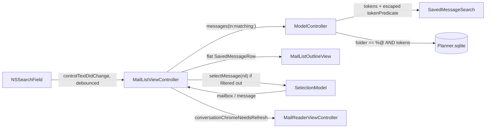

# Saved-Mail Search

| Field | Value |
| --- | --- |
| **Author** | TBD |
| **Date** | 2026-08-16 |
| **Status** | Draft |
| **Parent spec** | `DESIGN.md` (store rules, AppKit conventions); `MAIL_TRIAGE_PLAN.md` (mail mode) |
| **Platform** | macOS AppKit (Swift 6, macOS 15+) |

---

## Overview

Folder mode in Planner is a curated archive of `SavedMessage` rows, but the only way to find one today is to scroll a threaded `NSOutlineView`. This document adds an in-pane `NSSearchField` at the top of `MailListViewController` that filters the **currently selected `MailFolder`** with a Core Data `NSPredicate` over subject, sender, and plain-text body.

Recent Mail is out of scope. It is an in-memory `MailMessage` timeline (`MailCoordinator.messages`), not the store, and the product constraint is explicit: do not invent a second search path over Outlook. The field is hidden while `SelectionModel.mailbox == .recent`. There is no inverted index, no Spotlight, no model-version bump, and no write path.

---

## Background & Motivation

Mail triage shipped as M0–M10 (`MAIL_TRIAGE_PLAN.md`). Saving copies an Outlook envelope into Core Data via `ModelController.saveMessage(_:detail:into:)`; the list then threads that folder at display time with `MailThreading.threads` (`Planner/Support/MailThreading.swift`). That design is correct for *sweeping* a folder. It is the wrong shape for *finding* a known message once the folder has more than a sitting's worth of mail.

Current state:

- `MailListViewController.makeFolderRows()` loads `model.messages(in: folder)`, which walks `folder.messages` and sorts by `(receivedAt desc, uuid asc)`. There is no predicate.
- The only `SavedMessage` fetch helpers on `ModelController` are `savedMessage(uuid:)` (equality) and `foldersByOutlookID()` (full table, keyed by `outlookID` for Recent Mail chips).
- `Planner 2` indexes `SavedMessage.messageID` and `SavedMessage.receivedAt` only. Neither helps a substring search, and neither needs to change.
- Recent Mail cannot be searched from the store: bodies are lazy per-id Apple events (`MAIL_TRIAGE_PLAN.md` M0), and the list deliberately has no snippet for that reason.

Pain points this exists to avoid:

- Putting a Find field in the window toolbar. The mail toolbar already has to fit inside the list pane's own minimum (`MainSplitViewController.mailListMinimum`); M10 removed the window-range and refresh items for exactly this reason.
- Filtering `folder.messages` in memory and calling it search. That fires a body fault per row and ignores the "Core Data `NSPredicate` / fetch request" constraint.
- Searching `htmlBody`. Tags (`div`, `href`, `font`) become false positives, and the reader already prefers HTML only for *display* (`MailReaderViewController` → `MailBodyFormatting`).
- A Spotlight or inverted-index sidecar. The store is CloudKit-bound, `ModelController` is the only writer, and personal-archive scale does not justify a second corpus.

---

## Goals & Non-Goals

### Goals

- An `NSSearchField` pinned to the **top of the middle pane** (`MailListViewController`), Mail/Finder-shaped, not a panel and not a toolbar item.
- Search **only** `SavedMessage` rows in the **selected** `MailFolder`.
- Match **subject**, **sender** (`senderName` and `senderAddress`), and **plain-text `body`**, case- and diacritic-insensitive.
- Implement matching as an `NSPredicate` on an `NSFetchRequest` issued by `ModelController`.
- Hide the field (and ignore any retained query) while Recent Mail is selected.
- Keep search chrome and the current query across `NSManagedObjectContextDidSave` and `.plannerMailDidChange` reloads without losing the string or jumping scroll.
- Empty-state copy that distinguishes "this folder has no mail" from "this folder has mail but nothing matched."
- Keyboard path: ⌘F focuses the field when a folder is showing; Escape / the field's cancel button clears.

### Non-Goals

- Searching Recent Mail / `MailMessage` / Outlook.
- Searching `htmlBody`, `recipients`, attachment names, `messageID`, or folder names.
- Cross-folder / "all saved mail" results, a smart mailbox, or a saved-search entity.
- Spotlight, Core Spotlight, a custom inverted index, or SQLite FTS.
- A model-version bump, new attributes, or new indexes.
- Compose, reply, or any write to Outlook.
- Persisting the query in `UserDefaults` or CloudKit — including `NSSearchField` recents (`maximumRecents = 0`, no `recentsAutosaveName`).
- Highlighting hit passages in the reader or the list.
- A Find submenu that steals ⌘F from the reader's `NSTextView` when the body has focus.

---

## Key Decisions

| Decision | Choice | Rationale |
| --- | --- | --- |
| Scope | Current `MailFolder` only | The list is one mailbox. Mixing other folders' hits into it would need a virtual mailbox and a "Saved to X" chip the folder list does not have. Switching folders re-runs the same query, which is the cheap cross-folder path. |
| Recent Mail | Field **hidden**, query not applied | Recent Mail is not Core Data. Hidden, not disabled-and-visible: a greyed field would imply Outlook is searchable. The string is retained so returning to a folder restores it. |
| Matching | Token-AND, per-token OR across `subject` / `senderName` / `senderAddress` / `body`; `[cd]` | `"ada report"` finds Ada's expert-report thread. A single `CONTAINS` of the whole string would miss that. Phrase quotes are a non-goal. |
| Predicate construction | `NSComparisonPredicate` (`.contains` + `[cd]`) with a **LIKE-escaped** RHS; never `NSPredicate(format: "... CONTAINS %@")`; never a block predicate | Format-string `CONTAINS` interpolates the key path and compiles to `LIKE *value*`. A comparison predicate binds the token as a constant (no key-path injection) but is **still** a `LIKE *rhs*` wrapper: `*`, `?`, and `\` are wildcards unless escaped. `%` / `_` can survive as SQL wildcards after Core Data’s translation. Block predicates would force an in-memory scan and break the “real fetch” rule. |
| `htmlBody` | Not searched | HTML is a display artifact. Searching it matches tags. `body` is the plain-text snapshot `saveMessage` already stores (`detail?.body`). |
| Results layout | **Flatten.** No `MailThreadRow`, no date groups, `indentationPerLevel = 0` | Threading is a view of a *folder*. Threading a *hit set* either drops non-matching siblings (a conversation of one, with a heading that lies about the count) or keeps them (rows that did not match). Flattening shows exactly what matched. Date groups are Recent Mail's timeline chrome; folders have never used them. |
| Conversation label in the reader | Follows the **visible** list, and the reader is **told** when that list changes | `conversation(containing:)` already walks `folderRows`. During search there are no thread rows, so the line should hide. The reader only calls `updateConversationPosition` from `bindSaved` → `rebind()`, and `rebind()` runs only on `.message` / `.mailbox`. `applySearch` that keeps the same `.saved(uuid)` posts nothing (`selectMessage` is a no-op on an unchanged value). VCs must not retain each other, so MainSplit installs a callback next to `conversationProvider`. |
| Query ownership | `MailListViewController` instance state, not `SelectionModel` | The reader, sidebar, and calendar do not care. Mailbox change already clears `.message`; a search string is view state, like outline expansion. Not persisted. |
| Reload vs. query change | Same query + did-save → `reload(preservingScroll: true)`. Query edit → `reload(preservingScroll: false)` and drop `.message` if it no longer matches | Matches today's mailbox-change contract (`plannerSelectionDidChange` already passes `preservingScroll: false`) without inventing a `SelectionField.search`. |
| Fetch helper | `ModelController.messages(in:matching:) throws` ; empty query delegates to existing `messages(in:)` | Empty path stays a relationship walk, so existing callers do not change shape. The search path is a real fetch. It throws on store failure so the list can show `MailLabels.searchFailed` instead of lying with `emptySearch`. |
| Model version | **No bump** | `CONTAINS` cannot use a B-tree index. Adding `bySubject` / `bySender` would not help and would force `Planner 3` for no gain. |
| Toolbar | Do **not** put the field in `NSToolbar` | Post-M10 lesson: everything between the tracking separators must fit in the list's own width. An in-pane header does not compete with `mailTitle`. |
| Find key | Standard Edit → Find submenu targeting First Responder, `performFindPanelAction:` | When the reader body or inspector note is first responder, ⌘F / ⌘G stay “find in this text.” When the list or sidebar is first responder and a folder is selected, Find… focuses the search field. A dedicated ⌘F item would steal the reader’s find. The search field’s **field editor** (not the field) is first responder while typing, so a `MailSearchFieldEditor` must swallow `.showFindPanel` as select-all — otherwise ⌘F opens Find on a one-line field. |
| Debounce | 200 ms on `controlTextDidChange`; action only on Return / search button / cancel | `sendsWholeSearchString = true` and `sendsSearchStringImmediately = false`, so the action is **not** a keystroke. Immediate-action flags would fire `searchFieldAction` on every character, cancel the debounce, and reload per key. Clearing and Return still apply immediately. |
| Focus on mode switch | Change `focusPreferredResponder` to `mailListViewController.outlineView` **in the same PR that inserts the field** (S2) | Today it focuses `mailListViewController.view`. `focusPreferredResponder` runs on `.mode`. The unified sidebar path — Tasks, click a folder — is `selectMailbox` → adopt `.mail` → that method. Shipping the field without retargeting lands the caret in Search. |

---

## Proposed Design

### Architecture



The store, writer, and selection contracts do not change. Search is a **read** plus a **view** of `folderRows`. The reader is notified of that view changing through a MainSplit-installed callback — not a new `SelectionField`, and not a VC-to-VC retain.

### Layout

`MailListViewController.loadView()` currently pins the outline's `NSScrollView` to `root.safeAreaLayoutGuide.topAnchor`. Insert a header above it:

```
+--------------------------------------+
|  [ 🔍 Search                      × ] |   ← hidden when mailbox == .recent
+--------------------------------------+
|  Ada Lovelace              9:14 AM   |
|  Expert report                       |
|  ...                                 |
+--------------------------------------+
```

Implementation, matching the existing programmatic Auto Layout (no SwiftUI, no xib). **One** layout recipe — a stack, not constraint-swapping:

- `searchField = NSSearchField()` — `controlSize = .small`, `sendsWholeSearchString = true`, `sendsSearchStringImmediately = false`, `placeholderString = MailLabels.searchPlaceholder` (`"Search"`), `maximumRecents = 0`, and **do not** set `recentsAutosaveName`. The first pair makes the action fire on Return / the search button / cancel only, so it cannot defeat the debounce. The recents pair keeps the non-goal (“do not persist the query”) honest: a default recents menu would write the string to `UserDefaults`.
- Wrap the field in a thin header view (`searchHeader`) with 8 pt horizontal / 6 pt vertical insets and a 1 pt `NSBox` separator on the bottom, so the field does not sit on the first row.
- Root hosts a vertical `NSStackView` (`searchHeader`, `scrollView`) pinned to `root.safeAreaLayoutGuide`, `detachesHiddenViews = true` — the same trick `MessageRowView.lines` already uses (`MailListViewController` ~660). Hiding the header gives the outline the full pane back. Do **not** also swap `scrollView.top` between `searchHeader.bottom` and `root.safeArea.top`.
- `emptyStateLabel` stays a **sibling overlay on `root`**, not a stack arranged view. Center it on the **scroll view** (not the whole pane), so an empty folder does not sit under the header and a stack hide cannot take the label with it.
- Do **not** use `outlineView.headerView`. That is a table-column header; `headerView` is already `nil` and the outline has one untitled column.

`searchHeader.isHidden = selection.isRecentMailSelected`. Updated from `plannerSelectionDidChange` when `.mailbox` changes, and from `reload`.

### Query state

```swift
// MailListViewController
private let searchField = NSSearchField()
private var searchQuery = ""
private var searchDebounce: Task<Void, Never>?
/// Set when `messages(in:matching:)` throws. Distinct from “no matches.”
private var searchFetchFailed = false
/// Installed by MainSplit next to `conversationProvider`. VCs do not retain
/// each other; this is the only way the reader learns `folderRows` changed
/// without a `.message` / `.mailbox` post.
var conversationChromeNeedsRefresh: (() -> Void)?

private var isSearching: Bool {
    isShowingFolder && !SavedMessageSearch.tokens(in: searchQuery).isEmpty
}
```

- `searchQuery` is the last **applied** string, not the in-flight keystrokes.
- Reloads never assign `searchField.stringValue`. The one exception is `clearSearch(resigning:)` (Escape / cancel), which must write `""` into the field and then `applySearch("")` — otherwise the outline clears and the field still shows the query. Programmatic apply from tests goes through `applySearch` / `clearSearch`, not a raw `stringValue` set.
- Switching Recent Mail ↔ folder does not clear `searchQuery` or the field. The header simply hides, and `makeFolderRows` is not consulted in Recent Mail (`makeGroups` is).
- Switching folder A → folder B keeps the query and re-runs it against B (`reload(preservingScroll: false)` already runs on `.mailbox`).
- Quitting loses the query. Recents are off, so it also does not come back from defaults. That is the same bargain as Mail's search field.

### Fetch path

New pure helper, same shape as `MailThreading` — no managed objects, no AppKit. Tokenisation and LIKE-escaping are testable without a store; matching is tested *with* a store. The enum is `nonisolated` so those string helpers stay reachable from tests without hopping to the main actor. It must **not** take a `MailFolder`: the module is Swift 6 with `@MainActor` on model types, and a managed object cannot cross that boundary.

```swift
// Planner/Model/SavedMessageSearch.swift
nonisolated enum SavedMessageSearch {
    static let searchableKeys = ["subject", "senderName", "senderAddress", "body"]

    static func tokens(in raw: String) -> [String] {
        raw.split { $0.isWhitespace || $0.isNewline }
            .map(String.init)
            .filter { !$0.isEmpty }
    }

    /// NSPredicate `.contains` is `LIKE *rhs*`. Escape the LIKE
    /// metacharacters *before* binding the constant. Order matters: `\` first.
    /// `%` and `_` are escaped too — Core Data’s SQLite store translates
    /// `*`/`?` to `%`/`_`, and an unescaped user `%` would then be a SQL
    /// wildcard. S1 tests `"foo*bar"`, `"a?b"`, `"100%"`, and `"a_b"`; if a
    /// character still matches as a wildcard, tighten this, do not drop the test.
    static func escapedContainsToken(_ token: String) -> String {
        token
            .replacingOccurrences(of: "\\", with: "\\\\")
            .replacingOccurrences(of: "*", with: "\\*")
            .replacingOccurrences(of: "?", with: "\\?")
            .replacingOccurrences(of: "%", with: "\\%")
            .replacingOccurrences(of: "_", with: "\\_")
    }

    static func tokenPredicate(_ token: String) -> NSPredicate {
        let escaped = escapedContainsToken(token)
        return NSCompoundPredicate(orPredicateWithSubpredicates: searchableKeys.map { key in
            NSComparisonPredicate(
                leftExpression: NSExpression(forKeyPath: key),
                rightExpression: NSExpression(forConstantValue: escaped),
                modifier: .direct,
                type: .contains,
                options: [.caseInsensitive, .diacriticInsensitive]
            )
        })
    }
}
```

`ModelController` (the only place that issues mail fetches today) builds the `folder == %@` clause on the main actor, same shape as `fetchedSiblings(in:)` (`ModelController.swift` ~527–529):

```swift
/// Newest first, matching `messages(in:)`. An empty / whitespace query is
/// exactly `messages(in:)` — search is a fetch, browsing is still the
/// relationship walk every caller already depends on.
func messages(in folder: MailFolder, matching query: String) throws -> [SavedMessage] {
    let tokens = SavedMessageSearch.tokens(in: query)
    guard !tokens.isEmpty else { return messages(in: folder) }

    let request = SavedMessage.fetchRequest()
    let inFolder = NSPredicate(format: "folder == %@", folder)
    request.predicate = NSCompoundPredicate(andPredicateWithSubpredicates:
        [inFolder] + tokens.map(SavedMessageSearch.tokenPredicate)
    )
    request.sortDescriptors = [
        NSSortDescriptor(key: "receivedAt", ascending: false),
        NSSortDescriptor(key: "uuid", ascending: true),
    ]
    let started = Date()
    do {
        let results = try ctx.fetch(request)
        let ms = Int(Date().timeIntervalSince(started) * 1000)
        // Never log the query, subjects, senders, or bodies — PlannerLog.mail rule.
        // Timing matches OutlookMailSource.logSweep.
        PlannerLog.mail.debug("Saved-mail search tokens=\(tokens.count, privacy: .public) results=\(results.count, privacy: .public) ms=\(ms, privacy: .public)")
        return results
    } catch {
        PlannerLog.mail.error("Saved-mail search failed: \(error.localizedDescription, privacy: .public)")
        throw error
    }
}
```

The method **throws** on fetch failure. `(try? ctx.fetch) ?? []` is house style for `foldersByOutlookID` / `fetchedSiblings`, but for search that would become `MailLabels.emptySearch` — a lie. The list catches, keeps `folderRows` empty, and shows a distinct failure sentence. The empty-query path does not throw.

`messages(in:)` itself stays:

```204:208:Planner/Model/ModelController.swift
    func messages(in folder: MailFolder) -> [SavedMessage] {
        folder.messages.sorted {
            $0.receivedAt == $1.receivedAt ? $0.uuid < $1.uuid : $0.receivedAt > $1.receivedAt
        }
    }
```

Sort order of the fetch **must** match that comparator (`receivedAt` desc, `uuid` asc) so flattening a hit set and browsing the same folder cannot disagree about which of two same-timestamp rows comes first.

`folder == %@` is the same relationship predicate shape as `fetchedSiblings(in:)` (`project == %@`). The relationship is optional in the model (CloudKit); `ModelController` still enforces non-nil at write time, so a leaked null-folder row cannot appear in a folder's results.

### List projection

`makeFolderRows()` becomes:

```swift
private func makeFolderRows() -> [NSObject] {
    guard let uuid = selection.selectedFolderUUID,
          let folder = model.mailFolders().first(where: { $0.uuid == uuid })
    else { return [] }

    let messages: [SavedMessage]
    do {
        messages = try model.messages(in: folder, matching: searchQuery)
        searchFetchFailed = false
    } catch {
        searchFetchFailed = true
        return []
    }
    if isSearching {
        return messages.map(SavedMessageRow.init)
    }

    // Existing threading path, unchanged.
    let byUUID = Dictionary(uniqueKeysWithValues: messages.map { ($0.uuid, $0) })
    let threads = MailThreading.threads(messages.map(\.threadingMessage))
    return threads.compactMap { thread in
        // ... today's MailThreadRow / lone SavedMessageRow construction
    }
}
```

`reload(preservingScroll:)` already:

1. Snapshots expanded thread keys (first child UUID).
2. Rebuilds `groups` / `folderRows`.
3. `reloadData()`, re-expands days and remembered threads.
4. `revealSelection(scroll: false)`.
5. Restores `clipView` origin when `preservingScroll` is true.
6. If showing a folder, `conversationChromeNeedsRefresh?()` — after `folderRows` exist, so the reader sees the new projection.

Search plugs in without a new observer:

| Trigger | `preservingScroll` | Query | Expansion |
| --- | --- | --- | --- |
| `.NSManagedObjectContextDidSave` | `true` (default) | kept | remembered; empty during search because there are no `MailThreadRow`s |
| `.plannerMailDidChange` | `true` | kept | same |
| `.mailbox` change | `false` | kept; header shown/hidden | n/a (new list) |
| Query applied | `false` | new | n/a (flat) |
| Query cleared | `false` | empty | none — first visit to the threaded folder. Acceptable; expansion is not persisted for mail the way `outline.expandedUUIDs` is for tasks. |

After applying a new query, if `selection.message` is `.saved(uuid)` and `savedRow(uuid:)` is now nil, call `selection.selectMessage(nil)`. That is the same invariant `selectMailbox` already enforces: the reader must not show a message the list no longer contains. If the row is still present, `revealSelection(scroll: false)` keeps the highlight without fighting the "new result set → scroll to top" choice.

**The reader will not notice a flatten/unflatten on its own.** `MailReaderViewController.updateConversationPosition` runs only from `bindSaved` → `rebind()`, and `rebind()` is gated on `SelectionField.message` / `.mailbox` (`MailReaderViewController` ~239–244, 301–333). `selectMessage` is a no-op when the uuid is unchanged (`SelectionModel.selectMessage`). After a query that keeps the open message, the reader would otherwise keep “Message 1 of 2” above a flat one-row hit.

MainSplit already threads the list into the reader without a retain:

```92:94:Planner/Controllers/MainSplitViewController.swift
        mailReaderViewController.conversationProvider = { [weak self] uuid in
            self?.mailListViewController.conversation(containing: uuid) ?? []
        }
```

Install a sibling callback in the same `init`:

```swift
mailListViewController.conversationChromeNeedsRefresh = { [weak self] in
    self?.mailReaderViewController.refreshConversationPosition()
}
```

`MailReaderViewController.refreshConversationPosition()` re-runs `updateConversationPosition` for `displayedSavedUUID` (no-op if the reader is empty or showing Recent Mail). `MailListViewController.reload` invokes the callback **after** `folderRows` are rebuilt, whenever the list is showing a folder. That is cheap (hide/show one label) and also fixes the pre-existing stale-line case: remove the other message in a thread, did-save reloads the list, selection uuid is unchanged, today’s reader would still say “Message 1 of 2.”

`indentationPerLevel` today is `isShowingFolder ? conversationIndent : 0`. During search it must be 0:

```swift
outlineView.indentationPerLevel = (isShowingFolder && !isSearching) ? Self.conversationIndent : 0
```

`visibleMessageSelections()` already flattens `SavedMessageRow` and `MailThreadRow` children. A flat search list just produces a longer top-level `SavedMessageRow` array; Delete-walks-to-neighbour (`messageToSelectAfterRemoving`) keeps working.

Row context menus (`MailListOutlineView.menu(forRow:)`) already key off `SavedMessageRow` vs `MailListRow`. Search results are `SavedMessageRow`, so Move / New Task / Open in Outlook / Remove stay as they are. Conversation headings still have no menu.

### Empty state

`updateEmptyState()` today:

```336:351:Planner/Controllers/MailListViewController.swift
    private func updateEmptyState() {
        let isEmpty = isShowingFolder
            ? folderRows.isEmpty
            : groups.allSatisfy { $0.rows.isEmpty }
        emptyStateLabel.isHidden = !isEmpty
        guard isEmpty else { return }
        switch selection.mailbox {
        case .recent:
            emptyStateLabel.stringValue = MailLabels.emptyRecentMail(...)
        case .folder:
            emptyStateLabel.stringValue = MailLabels.emptyFolder(name: selectedFolderName ?? "")
        }
    }
```

Add two more sentences. “Nothing saved in “Celerity” yet.” is a lie when the folder has mail and the query missed; “No messages match this search.” is a lie when the fetch threw.

```swift
case .folder where searchFetchFailed:
    emptyStateLabel.stringValue = MailLabels.searchFailed
case .folder where isSearching:
    emptyStateLabel.stringValue = MailLabels.emptySearch
case .folder:
    emptyStateLabel.stringValue = MailLabels.emptyFolder(name: selectedFolderName ?? "")
```

```swift
// MailLabels
static let searchPlaceholder = "Search"
/// The field already shows what the user typed. Echoing it here turns a
/// pasted paragraph into a wrapping manifesto in a 300-pt pane.
static let emptySearch = "No messages match this search."
static let searchFailed = "Couldn’t search this folder."
```

### Debounce and the field

```swift
extension MailListViewController: NSSearchFieldDelegate {
    func controlTextDidChange(_ obj: Notification) {
        guard obj.object as? NSSearchField === searchField else { return }
        scheduleSearchApply(searchField.stringValue)
    }
}

@objc private func searchFieldAction(_ sender: NSSearchField) {
    // Return / search button / cancel only — sendsWholeSearchString is true,
    // so this is not a keystroke.
    searchDebounce?.cancel()
    applySearch(sender.stringValue)
}

private func scheduleSearchApply(_ raw: String) {
    searchDebounce?.cancel()
    if SavedMessageSearch.tokens(in: raw).isEmpty {
        applySearch(raw)
        return
    }
    searchDebounce = Task { @MainActor [weak self] in
        try? await Task.sleep(for: .milliseconds(200))
        guard !Task.isCancelled else { return }
        self?.applySearch(raw)
    }
}

private func applySearch(_ raw: String) {
    let nextTokens = SavedMessageSearch.tokens(in: raw)
    let currentTokens = SavedMessageSearch.tokens(in: searchQuery)
    // Raw `"ada"` → `"ada "` is the same predicate. Comparing strings would
    // still reload(preservingScroll: false) and jump the clip view
    // (MailSavingTests.testDismissingPreservesScrollPosition).
    guard nextTokens != currentTokens else {
        searchQuery = raw
        return
    }
    searchQuery = raw
    reload(preservingScroll: false)
    if isSearching, case let .saved(uuid)? = selection.message, savedRow(uuid: uuid) == nil {
        selection.selectMessage(nil)
    }
}

/// Single door for cancel, empty-token, and outline Escape.
/// Writes the field — the documented exception to “reloads never assign
/// stringValue” — then applies. `resigning` is true for field-empty Escape.
func clearSearch(resigning: Bool) {
    searchDebounce?.cancel()
    searchField.stringValue = ""
    applySearch("")
    if resigning {
        view.window?.makeFirstResponder(outlineView)
    }
}
```

Cancel the debounce in `deinit` (the VC already removes NotificationCenter observers there). The empty-token fast path in `scheduleSearchApply` calls `applySearch(raw)` (so a field the user has cleared still goes through token comparison) — not `clearSearch`, which would re-assign `stringValue` while they are typing spaces. Outline Escape and the cancel button call `clearSearch(resigning: false)`; field-empty Escape calls `clearSearch(resigning: true)`.

### Keyboard and Find

**Edit → Find submenu**

`MainMenu.xib` has no Find item today. Edit goes Select All → separator → Spelling (`MainMenu.xib` ~181–187). Insert a Find submenu **between** that separator and Spelling, matching the AppKit template. Every item targets First Responder, action `performFindPanelAction:`. Tags are `NSFindPanelAction` raw values — `MainSplitViewController.performFindPanelAction:` handles **only** `.showFindPanel` (tag 1) as `focusSearchField()`. Find Next must never focus the search field.

| Item | Key | `NSFindPanelAction` | Enabled when |
| --- | --- | --- | --- |
| Find… | ⌘F | `.showFindPanel` (1) | Folder selected, **or** an `NSTextView` (reader body / inspector note) is first responder. Disabled in Recent Mail unless the reader body has focus. |
| Find Next | ⌘G | `.next` (2) | An `NSTextView` that is **not** the search field editor is first responder. |
| Find Previous | ⇧⌘G | `.previous` (3) | Same as Find Next. |
| Use Selection for Find | ⌘E | `.setFindString` (7) | Same as Find Next. |

`MailStatusTests.testNoTwoMenuItemsShareAKeyEquivalent` will catch collisions. ⌘F / ⌘G / ⌘E are free today (Full Screen is ⌃⌘F).

**Why a custom field editor**

Desired Finder behavior: ⌘F over the search field re-selects its contents. While the field is editing, the first responder is the **field editor** — an `NSTextView` — which implements `performFindPanelAction:` itself. Validation that “excludes the mail search field so it is not classified as text already handling Find” only enables the menu item; it does not change dispatch. Result without a custom editor: a find bar on a one-line field.

```swift
// Planner/Views/MailSearchField.swift
final class MailSearchField: NSSearchField {
    let searchEditor = MailSearchFieldEditor(frame: .zero, textContainer: nil)
}

final class MailSearchFieldEditor: NSTextView {
    override init(frame frameRect: NSRect, textContainer container: NSTextContainer?) {
        super.init(frame: frameRect, textContainer: container)
        // The window’s default editor sets this. Without it, Return inserts a
        // newline instead of ending editing and firing the control action —
        // which undoes S2’s “action only on Return / cancel.” Tab and click-
        // away also fail to commit.
        isFieldEditor = true
        isRichText = false
    }

    @available(*, unavailable)
    required init?(coder: NSCoder) {
        fatalError("init(coder:) has not been implemented")
    }

    override func performFindPanelAction(_ sender: Any?) {
        let tag = (sender as? NSMenuItem)?.tag ?? NSFindPanelAction.showFindPanel.rawValue
        guard tag == NSFindPanelAction.showFindPanel.rawValue else { return }
        selectAll(sender)
    }
}
```

`AppDelegate` is already the window delegate and already implements `windowWillReturnUndoManager`. Add the matching field-editor hook — it does not learn search semantics, only the client type. Returning `nil` for every other client is required so `TitleTextField` and the inspector keep the window’s default editor:

```swift
func windowWillReturnFieldEditor(_ sender: NSWindow, to client: Any?) -> Any? {
    (client as? MailSearchField)?.searchEditor
}
```

S2 can ship a plain `NSSearchField` (mouse + debounce only). S3 introduces `MailSearchField` / `MailSearchFieldEditor` and the AppDelegate hook.

**Make the “system find bar” claim true**

Neither `MailReaderViewController.bodyView` nor `NoteTextView` sets `usesFindBar` / `isIncrementalSearchingEnabled` today (repo-wide grep is empty). Without that, “⌘F on the reader stays find-in-text” opens the Find panel, not an in-pane bar. In S3:

- `bodyView.usesFindBar = true`; `bodyView.isIncrementalSearchingEnabled = true` (the view is already `isSelectable = true`, `isEditable = false`).
- The same two properties on `NoteTextView` at construction. Inspector notes keep ⌘F.

**Dispatch**

```
performFindPanelAction:
  ├─ MailSearchFieldEditor + .showFindPanel → selectAll (does not open Find)
  ├─ MailSearchFieldEditor + next/previous/setFindString → no-op
  ├─ bodyView / NoteTextView → system find bar. Do not intercept.
  ├─ MailListViewController / MainSplitViewController + .showFindPanel
  │     → focusSearchField() if isShowingFolder
  └─ any other tag on the split → do not handle (do not treat Next as focus)
```

**Find validation is per-tag and lives on `validateMenuItem`, not in `isCommandEnabled`.**

Today `validateMenuItem` is only `isCommandEnabled(for: item.action)` (`MainSplitViewController` ~1384–1386, 1279). That helper is selector-only; its `default` is `false`. An implementer who adds `case #selector(performFindPanelAction(_:)): return isMailMode && folderSelected` will enable Find Next over the list — the exact bug the tag table exists to prevent. Do **not** put Find in `isCommandEnabled`. Toolbar validation has no Find item and stays selector-only.

```swift
func validateMenuItem(_ item: NSMenuItem) -> Bool {
    updateModeMenuItemState(item)
    // Same ObjC selector the xib wires (`performFindPanelAction:`). Do not
    // fold this into `isCommandEnabled` — that helper cannot see `item.tag`.
    if item.action == #selector(NSTextView.performFindPanelAction(_:)) {
        return isFindPanelActionEnabled(tag: item.tag)
    }
    return isCommandEnabled(for: item.action)
}

private func isFindPanelActionEnabled(tag: Int) -> Bool {
    if isEditingMailSearchField {
        return tag == NSFindPanelAction.showFindPanel.rawValue
    }
    if isFindBarTextViewFirstResponder {
        return true
    }
    if isMailMode, selection.selectedFolderUUID != nil {
        return tag == NSFindPanelAction.showFindPanel.rawValue
    }
    return false
}

/// The field editor, not the field, is first responder while typing.
/// Use the same `firstResponderForValidation` seam the other gates use so
/// tests can inject a responder without a window.
private var isEditingMailSearchField: Bool {
    let responder = firstResponderForValidation ?? view.window?.firstResponder
    return responder is MailSearchField || responder is MailSearchFieldEditor
}

/// Reader body / inspector note / any other real `NSTextView`. Checked
/// after `isEditingMailSearchField` so the search editor cannot pass.
private var isFindBarTextViewFirstResponder: Bool {
    guard !isEditingMailSearchField else { return false }
    let responder = firstResponderForValidation ?? view.window?.firstResponder
    return responder is NSTextView
}
```

`isFirstResponderTextInput` **includes** the search field (it is an editable `NSTextField` whose editor trips `isTextInputResponder`). That is the correct rule for Delete / Remove. Do **not** reuse that seam for Find.

`focusSearchField()`:

```swift
func focusSearchField() {
    guard isShowingFolder else { return }
    view.window?.makeFirstResponder(searchField)
    searchField.currentEditor()?.selectAll(nil)
}
```

**Escape**

One method, one contract — not an “or” between the field and the outline:

| State | Handler | Call |
| --- | --- | --- |
| Field focused, query non-empty, cancel button | `NSSearchField` cancel → `controlTextDidChange` / action | `applySearch("")` via the empty-token fast path |
| Field focused, query empty, Escape | `control(_:textView:doCommandBy:)` → `#selector(cancelOperation:)` | `clearSearch(resigning: true)` |
| Outline focused, query non-empty, Escape | `MailListOutlineView.keyDown` forwards to the list VC (same responder-chain pattern as Delete → `removeSelectedMessage:`) | `clearSearch(resigning: false)` |
| Outline focused, query empty, Escape | fall through | — |

Do **not** bind Escape to a menu item.

**Mode-switch focus (S2, not S3)**

```1145:1152:Planner/Controllers/MainSplitViewController.swift
    private func focusPreferredResponder() {
        guard let window = view.window else { return }
        switch selection.mode {
        case .tasks:
            window.makeFirstResponder(outlineViewController.outlineView)
        case .mail:
            window.makeFirstResponder(mailListViewController.view)
        }
    }
```

Change the mail branch to `mailListViewController.outlineView` **in S2**, the same PR that inserts the field. `focusPreferredResponder` runs only on `.mode`. The unified sidebar’s common path — Tasks mode, click a folder — is `selectMailbox` → adopt `.mail` → this method. After S2 the search field is the first descendant of `mailListViewController.view`; leaving the current `makeFirstResponder` lands the caret in Search. Launch-into-mail is safe (mailbox is not persisted, so it starts at `.recent` and the header is hidden), but folder-from-tasks is not. S3 must not be the PR that “fixes focus.”

**Remove / Delete while the field is editing**

`deleteSelected:` is already gated on `!isFirstResponderTextInput` (`MainSplitViewController` ~1344–1345). `removeSelectedMessage:` is **not** (~1299–1305): it stays enabled whenever `selectedSavedMessage != nil`. Bare ⌫ is safe — the field editor consumes it. The File-menu Remove item, the toolbar trash, and any test that validates that selector against a focused search field will still see `true`.

In S3, add `!isFirstResponderTextInput` to `removeSelectedMessage:` validation **and** an early return at the top of the action, using the same “include the mail search field” rule `isFirstResponderTextInput` already has. Then add the regression test. Do not claim the gate already exists.

### Sequence

```mermaid
sequenceDiagram
    actor User
    participant Field as NSSearchField
    participant List as MailListViewController
    participant Model as ModelController
    participant Store as viewContext
    participant Sel as SelectionModel

    participant Reader as MailReaderViewController

    User->>Field: types "ada report"
    Field->>List: controlTextDidChange
    Note over Field: action does not fire (sendsWholeSearchString)
    List->>List: debounce 200ms
    List->>Model: messages(in: folder, matching:)
    Model->>Store: folder == %@ AND escaped token predicates
    Store-->>Model: [SavedMessage]
    Model-->>List: newest-first hits
    List->>List: folderRows = map SavedMessageRow
    List->>List: reloadData, scroll to top
    List->>Reader: conversationChromeNeedsRefresh
    Note over Reader: hides “Message k of n”; selection uuid unchanged
    alt selected uuid not in hits
        List->>Sel: selectMessage(nil)
    else still present
        List->>List: revealSelection(scroll: false)
    end
```

### Scale

Personal archive, not the 34,881-message Inbox M0 measured. Expected working set: tens of folders, low hundreds to low thousands of `SavedMessage` rows, bodies of a few KB (plain text captured at save). A `CONTAINS` scan of 1,000 × 10 KB is a few milliseconds on SSD. There is no page, no batch fault, no background context.

If a log line ever shows `ms` in the hundreds, the answer is still not an index (substring) and not Spotlight. It is "this folder is no longer a triage pile" — out of scope here.

`byReceivedAt` continues to serve the sort. Do not add `bySubject` / `bySender` / `byBody`.

---

## API / Interface Changes

### New

| Symbol | Location | Role |
| --- | --- | --- |
| `SavedMessageSearch` | `Planner/Model/SavedMessageSearch.swift` | Tokenise, LIKE-escape, `tokenPredicate`. No `MailFolder`. |
| `ModelController.messages(in:matching:)` | `ModelController.swift` | Fetch helper; empty query → `messages(in:)`; **throws** on fetch failure |
| `MailLabels.searchPlaceholder` | `MailLabels.swift` | `"Search"` |
| `MailLabels.emptySearch` | `MailLabels.swift` | `"No messages match this search."` |
| `MailLabels.searchFailed` | `MailLabels.swift` | `"Couldn’t search this folder."` |
| `MailListViewController.focusSearchField()` | `MailListViewController.swift` | ⌘F / Find… target (S3) |
| `MailListViewController.clearSearch(resigning:)` | `MailListViewController.swift` | Cancel / Escape (S3) |
| `MailListViewController.conversationChromeNeedsRefresh` | `MailListViewController.swift` | Callback, installed by MainSplit (S2) |
| `MailReaderViewController.refreshConversationPosition()` | `MailReaderViewController.swift` | Re-reads `conversationProvider` without a full `rebind` (S2) |
| `MailSearchField` / `MailSearchFieldEditor` | `Planner/Views/MailSearchField.swift` | Field + editor that swallows Find… as select-all (S3) |
| Edit → Find submenu | `MainMenu.xib` | Find… / Next / Previous / Use Selection; First Responder; `performFindPanelAction:` (S3) |

### Changed

| Symbol | Change |
| --- | --- |
| `MailListViewController.loadView()` | Stack: `searchHeader` + scroll view; empty label overlays the scroll view |
| `MailListViewController.makeFolderRows()` | `try messages(in:matching:)`; skip `MailThreading` when `isSearching`; record `searchFetchFailed` |
| `MailListViewController.reload` | Indentation off while searching; do not touch `searchField.stringValue`; fire `conversationChromeNeedsRefresh` after folder rebuilds |
| `MailListViewController.updateEmptyState()` | `searchFailed` / `emptySearch` / `emptyFolder` |
| `MailListViewController.plannerSelectionDidChange` | Toggle header visibility on `.mailbox` |
| `MainSplitViewController.init` | Install `conversationChromeNeedsRefresh` next to `conversationProvider` |
| `MainSplitViewController.focusPreferredResponder()` | Focus `outlineView`, not the list VC's root view (**S2**) |
| `MainSplitViewController.validateMenuItem` | Find is validated **here** from `item.tag` via `isFindPanelActionEnabled`; **not** in `isCommandEnabled`. `removeSelectedMessage:` gains `!isFirstResponderTextInput` (**S3**) |
| `MainSplitViewController.removeSelectedMessage(_:)` | Early-return when `isFirstResponderTextInput` (**S3**) |
| `MailListOutlineView.keyDown` | Escape → `clearSearch(resigning: false)` when a query is active |
| `AppDelegate.windowWillReturnFieldEditor` | Returns `MailSearchField.searchEditor` |
| `MailReaderViewController.bodyView` / `NoteTextView` | `usesFindBar = true`, `isIncrementalSearchingEnabled = true` |

### Unchanged (deliberately)

- `SelectionModel` / `SelectionField` — no `.search`.
- `SavedMessage` attributes, `Planner 2` indexes, CloudKit rules.
- `ModelController` write methods (`saveMessage`, `moveMessage`, `removeMessage`).
- `MailCoordinator`, `MailMessage`, Outlook.
- `messages(in:)` signature and relationship-walk implementation.
- Save / move / remove *commands* (validation of Remove gains a gate; the action bodies stay).
- Task linkage. The reader gains only `refreshConversationPosition()` — no new selection fields, no rebind-on-search.

### Test seams (same style as `test_folderRows`, `test_emptyStateText`)

```swift
extension MailListViewController {
    var test_searchFieldIsHidden: Bool { searchHeader.isHidden }
    var test_searchQuery: String { searchQuery }
    var test_searchFetchFailed: Bool { searchFetchFailed }
    func test_applySearch(_ raw: String) { applySearch(raw) }
    func test_clearSearch(resigning: Bool) { clearSearch(resigning: resigning) }
}
```

---

## Data Model Changes

**None.** Current `Planner 2` `SavedMessage` attributes already cover the search corpus:

| Attribute | Role in search |
| --- | --- |
| `subject` | Searched |
| `senderName` | Searched |
| `senderAddress` | Searched |
| `body` | Searched (plain text at save time) |
| `htmlBody` | **Not** searched |
| `recipients` | **Not** searched |
| `folder` | Scope predicate (`folder == %@`) |
| `receivedAt`, `uuid` | Sort only; existing `byReceivedAt` index |

No uniqueness constraint, no new relationship, no `awakeFromInsert` / `willSave`, no derived `searchableBody`. Lightweight migration is not invoked.

HTML-only rows are not hypothetical. `MailMessageDetail.body` is a non-optional `String`. `OutlookMailDecoder.detail` does `body: body ?? ""` and only HTML is `nonempty(...)`. A message with empty `plain text content` and populated `content` is stored as `body == ""`, `htmlBody != nil`, and is invisible to this predicate. That is the normal UI save path (`MainSplitViewController.save` always loads a detail), not a rare `detail == nil`. See Q2. The S1 exclusion fixture must use `body: ""` plus a token that exists only in `html`, not `detail: nil`.

---

## Alternatives Considered

### 1. In-memory filter of `folder.messages`

`messages(in: folder).filter { $0.subject.localizedStandardContains(query) || … }`.

| | |
| --- | --- |
| **For** | No new fetch helper; trivial to write next to `makeFolderRows`. |
| **Against** | Violates the "NSPredicate / fetch request" constraint. Faults every `body` in the folder on first search. Duplicates matching rules in the view. |

Rejected.

### 2. Keep threading in the hit set (or promote a thread if any member matches)

Mail.app sometimes shows the whole conversation when one message hits.

| | |
| --- | --- |
| **For** | Folder mode stays one layout. The reader keeps "Message k of n". |
| **Against** | A heading that says "3 messages" when one matched is a lie. Showing the two non-hits pollutes a Find result. Threading a *subset* also joins two hits that only share a subject with a missing middle, which is a different conversation than the folder's. Flattening is the honest projection of a predicate. |

Rejected for v1. Revisit only if users miss the conversation chrome while searching.

### 3. Spotlight / Core Spotlight / FTS / inverted index

| | |
| --- | --- |
| **For** | Real ranking, tokenisation, scales past RAM. |
| **Against** | Explicitly out of scope. A second corpus has to be kept honest on every `saveMessage` / `moveMessage` / `removeMessage` / folder cascade — a second writer in all but name, against `DESIGN.md` §3. CloudKit import would have to reindex. Personal-archive `CONTAINS` does not need it. |

Rejected.

### 4. `NSFetchedResultsController` bound to the search predicate

| | |
| --- | --- |
| **For** | Live updates without a full `reloadData`. |
| **Against** | The list is a mixed outline (`MailDateGroup` / `MailThreadRow` / `SavedMessageRow` / `MailListRow`) that already rejects FRC for the same reasons the task outline does (`DESIGN.md` §4.2). Did-save + `reload(preservingScroll:)` is the house style. An FRC would be a second update path. |

Rejected.

### 5. Cross-folder search / virtual "All Saved Mail" mailbox

| | |
| --- | --- |
| **For** | The query is usually "where did I put that," not "inside this folder." |
| **Against** | Needs a place to show hits that names the folder (the Recent Mail chip, or a new row line), a selection that can jump mailboxes, and a sidebar row that is not a `MailFolder`. Product, not a predicate. Switching folders with the query retained is the 80% path and costs nothing. |

Deferred. The fetch helper is folder-scoped on purpose so this can be added later as `messages(matching:)` without a folder clause, plus a virtual mailbox, without retconning the field.

### 6. Search field in the window toolbar

| | |
| --- | --- |
| **For** | Classic Mail 1.x / Finder placement. |
| **Against** | The mail toolbar section is width-capped by the list pane (`mailToolbarSectionMinimum` is measured from the "Recent Mail" title). A search field there reopens the overflow bug that forced the post-M10 toolbar trim. The user requirement is also explicit: top of the *list*. |

Rejected.

---

## Security & Privacy Considerations

| Threat | Severity | Mitigation |
| --- | --- | --- |
| Query string logged | Medium | `PlannerLog.mail` already forbids subjects, senders, recipients, bodies. Log **token count, hit count, milliseconds only** on success; `localizedDescription` only on failure. The empty state does **not** echo the query. |
| Predicate injection / `LIKE` wildcards | Medium | Comparison predicate binds a constant (no key-path injection). Escape `\`, `*`, `?`, `%`, `_` in that constant before building the RHS. Do not interpolate the query into a format string. Do not use a block predicate. |
| HTML / script in `body` evaluated at search time | None | Search is a SQLite `LIKE`, not an HTML parse. Display stays on `MailBodyFormatting.stripUnsafe`. |
| Searching Recent Mail leaking Outlook content into the store | N/A | Recent Mail is not searched. No new Outlook read. |
| CloudKit | N/A | Read-only feature. No new attributes, no uniqueness, no ordered relationship. A future import of `SavedMessage` rows is searchable by the same predicate with no backfill. |
| TCC / Apple events | N/A | No new entitlement. Search never calls `MailCoordinator` / `OutlookMailSource`. |

Auth is local-only, same as the rest of the app. There is no network.

---

## Observability

| Signal | Where | Notes |
| --- | --- | --- |
| `PlannerLog.mail.debug("Saved-mail search tokens=… results=… ms=…")` | `messages(in:matching:)` success path | Fires on the fetch path only (non-empty tokens). `ms` via `Int(Date().timeIntervalSince(started) * 1000)`, matching `OutlookMailSource.logSweep`. Never the query text. |
| `PlannerLog.mail.error("Saved-mail search failed: …")` | `messages(in:matching:)` catch | Error object / `localizedDescription` only. The list shows `MailLabels.searchFailed`, not `emptySearch`. |
| Empty-state transitions | Existing `updateEmptyState` + new tests | “folder empty” vs “no matches” vs “search failed.” |
| Metrics / alerting | None | Single-user local app; no telemetry (DESIGN.md non-goal). |

A fetch that regularly logs `ms` in the high hundreds is the cue to reopen Open Question 2, not to add a dashboard.

---

## Rollout Plan

No feature flag. Planner has none, and this is a local read path with a hide-in-Recent-Mail guard.

**Stage 1 — model helper (PR S1).** Ships dark: `messages(in:matching:)` exists, tests pass, no UI. `makeFolderRows` still calls `messages(in:)`. Rollback = revert the helper; no store migration.

**Stage 2 — list chrome + filter (PR S2).** Field visible on folders, hidden on Recent Mail, flatten + empty state, conversation-chrome callback, **and** `focusPreferredResponder` → `outlineView`. Rollback = revert the VCs; the helper can stay. S2 is not independently mergeable without the focus retarget.

**Stage 3 — keyboard / Find menu (PR S3).** ⌘F submenu, field editor, Escape → `clearSearch`, `removeSelectedMessage:` gate, `usesFindBar`. Rollback = revert menu + key handling; search-by-mouse still works.

**Verification, each PR:** existing `MailListTests` / `MailSavingTests` / `MailStoreTests` stay green (folder threading, Recent Mail grouping, save/move/remove, conversation label). New tests listed per PR below.

**Rollback of the whole feature:** revert S3–S1 in reverse. No store file to migrate back. A query sitting in a running `NSSearchField` dies with the process.

---

## Risks

| Risk | Severity | Mitigation |
| --- | --- | --- |
| `CONTAINS` table scan on large bodies | Low at stated scale | 200 ms debounce; log duration; no model change. Revisit only with evidence. |
| HTML-only saved rows invisible to search | Medium | UI-saved rows always have a `body` string (`MailMessageDetail.body` is non-optional; the decoder stores `body ?? ""`). That string may be empty while `htmlBody` is not. Document the exclusion. S1 fixture is `body: ""` + a token only in `html`. Optional later denormalise (Q2). |
| `*` / `?` / `%` / `_` in the query treated as `LIKE` / SQL wildcards | Medium | Escape them in `SavedMessageSearch.escapedContainsToken` before binding. Comparison predicates alone do **not** make them literal. Tests: `"foo*bar"`, `"a?b"`, `"100%"`, `"a_b"`. |
| Mode switch / mailbox select lands caret in Search | Medium | Retarget `focusPreferredResponder` in **S2**, the PR that inserts the field. Test in `ModeSwitchTests`. |
| Did-save reload wipes the query or jumps scroll | Medium | Query is VC state, not rebuilt from the field; `preservingScroll: true` on did-save is already the default. Test: apply query, `saveMessage` another row, assert field string + `test_scrollOrigin`. |
| Flattening then clearing search collapses every thread | Low | Folder expansion is already ephemeral (not in `UserDefaults`). Acceptable. |
| ⌘F stolen from the reader | Medium | Menu targets First Responder. Reader / inspector `NSTextView`s keep the action; they get `usesFindBar`. The search field’s custom editor swallows `.showFindPanel` as select-all. |
| File-menu Remove enabled while Search is focused | Medium | `removeSelectedMessage:` is **not** gated today. S3 adds `!isFirstResponderTextInput` to validation and an early return on the action. Bare ⌫ is already consumed by the field editor. |
| Fetch error presented as “no matches” | Low | Throw, log `PlannerLog.mail.error`, show `MailLabels.searchFailed`. |
| `NSSearchField` recents persist the query | Low | `maximumRecents = 0`; no `recentsAutosaveName`. |
| Trailing space reloads and jumps scroll | Low | `applySearch` no-ops when token arrays are equal. |
| Cross-folder miss ("it's in the other folder") | Accepted | Query retained across folder switches. No virtual mailbox (Q1). |

---

## Open Questions

1. **Q1 — Cross-folder search.** Keep as a later virtual mailbox (`messages(matching:)` without a folder clause + a folder chip on the row), or never? This design leaves the fetch helper easy to extend and does not pretend the current field is global.
2. **Q2 — HTML-only bodies.** UI-saved rows can already have `body == ""` and a populated `htmlBody` (`OutlookMailDecoder` stores `body ?? ""`). Should `saveMessage` strip tags into `body` (write-path, no model bump if we reuse `body`) rather than searching HTML? Default: wait for evidence; do not search `htmlBody` in this feature.
3. **Q3 — Recipients.** The requirement is senders, not `To:`. Adding `recipients` to `searchableKeys` is a one-line change. Default: no.
4. **Q4 — Persist the query across launches.** Mail does not. Default: no.

---

## Test Plan

### `PlannerTests/MailStoreTests.swift` (extend)

Insert a folder with **six** messages whose fields are disjoint: subject-only hit, sender-name hit, sender-address hit, body hit, a recipients-only row, and an htmlBody-only row (`body: ""`, token present only in `html` — not `detail: nil`).

- Subject / senderName / senderAddress / body each match in isolation (`[cd]`: `"ADA"` hits `"Ada Lovelace"`).
- Token AND: `"ada report"` hits only the row that has both; `"ada"` alone hits every Ada row.
- Recipients-only and htmlBody-only rows do **not** match.
- Another folder's matching subject does not appear (`folder == %@`).
- Empty / whitespace query returns the same objectIDs, in the same order, as `messages(in:)`.
- Tokens `"foo*bar"`, `"a?b"`, `"100%"`, `"a_b"` match the **literal** substring, not every body. If a comparison predicate without escaping fails this, that is expected — escape, don’t drop the test.
- `body == ""` does not crash the fetch and does not match a body token.
- `SavedMessageSearch.tokens("ada  report")` and `tokens("ada report")` are equal (applySearch no-op case).

### `PlannerTests/MailListTests.swift` / `MailSavingTests.swift`

- Field hidden on Recent Mail; visible after `selectMailbox(.folder)`.
- Applying a query in a two-message thread flattens to `SavedMessageRow`s, `test_threadSubjects` is empty, `indentationPerLevel == 0`.
- Clearing the query restores one `MailThreadRow` (reuse `saveThread` from `MailSavingTests`).
- Apply search on that thread with the newest still selected → `reader.test_conversationPosition` is `nil`; clear → `"Message 1 of 2 in this conversation"` restored. (This is the missing rebind path.)
- Empty folder → `emptyFolder`; folder with mail + miss → `emptySearch`; hit → no empty state. Do not assert the query interpolated into the sentence.
- `test_applySearch` then `contextDidSave` (save another message) keeps `test_searchQuery` and does not require the field to be re-typed.
- Selected `.saved` that drops out of the hit set clears `selection.message`; a still-matching selection stays.
- Query change resets scroll; did-save with the same query preserves `test_scrollOrigin`.
- `test_applySearch("ada")` then `test_applySearch("ada ")` does **not** change `test_scrollOrigin`.
- `maximumRecents == 0`.

### `PlannerTests/MailStatusTests.swift`

- ⌘F, ⌘G, ⇧⌘G, and ⌘E are unique among menu key equivalents.

### `PlannerTests/MainSplitViewControllerTests.swift` / `ModeSwitchTests.swift`

- `focusPreferredResponder` after Tasks → folder lands on `outlineView`, not `searchField` (**S2**).
- `performFindPanelAction:` `.showFindPanel` focuses the field in folder mode; is disabled (or a no-op) in Recent Mail unless the reader body is first responder (**S3**).
- Find Next / Previous / Use Selection validate false over the list and over the search field / `MailSearchFieldEditor`; true over `bodyView`. Validation goes through `validateMenuItem` (tag), not `isCommandEnabled`.
- Focused search field ⇒ `removeSelectedMessage:` / `deleteSelected:` validate false; the Remove action early-returns (**S3**).
- ⌘F while the search field’s editor is first responder selects all in the field and does not open a find bar.
- Return in `MailSearchField` fires the control action (applies search) and does **not** insert a newline (`isFieldEditor == true`).

---

## References

- `DESIGN.md` — CloudKit-safe store rules (§3), `ModelController` as sole writer, AppKit outline conventions, no-SwiftUI UI.
- `MAIL_TRIAGE_PLAN.md` — Recent Mail is in-memory; saved mail is `MailFolder` + `SavedMessage`; threading is a view; non-goal "full-text search" referred to *Outlook-scale* search, which this is not.
- `Planner/Controllers/MailListViewController.swift` — list, reload, threading projection, empty state, selection reveal.
- `Planner/Views/MailListOutlineView.swift` — row menus, ⌫ → `removeSelectedMessage:`.
- `Planner/Model/ModelController.swift` — `messages(in:)`, `saveMessage`, `savedMessage(uuid:)`, `fetchedSiblings(in:)` (the `folder == %@` precedent).
- `Planner/Model/SavedMessage+CoreData.swift` — searchable attributes; `htmlBody` is display-only.
- `Planner/Model/SelectionModel.swift` — `MailboxSelection`, `MessageSelection`; mailbox change clears `.message`.
- `Planner/Controllers/MainSplitViewController.swift` — mail commands, toolbar width bargain, `focusPreferredResponder`, `isFirstResponderTextInput`, `conversationProvider` install site.
- `Planner/Controllers/MailReaderViewController.swift` — `rebind` gated on `.message` / `.mailbox`; `updateConversationPosition`.
- `Planner/App/AppDelegate.swift` — window delegate; `windowWillReturnUndoManager` is the precedent for `windowWillReturnFieldEditor`.
- `Planner/Support/MailThreading.swift` — folder-only view function; unused while `isSearching`.
- `Planner/Support/MailLabels.swift` — user-visible strings.
- `Planner/Support/Outlook/OutlookMailDecoder.swift` — `body: body ?? ""`; HTML via `nonempty`.
- `Planner/Model/Mail/MailMessage.swift` — `MailMessageDetail.body` is `String`, not `String?`.
- `Planner/Model/Planner.xcdatamodeld/Planner 2.xcdatamodel/contents` — current indexes (`byMessageID`, `byReceivedAt`).
- `PlannerTests/MailSavingTests.swift` — folder threading fixtures (`saveThread`) to reuse for flatten/restore tests.
- `PlannerTests/MailStoreTests.swift` — save/move/remove/order fixtures for the new fetch helper.

---

## PR Plan

Incremental, each PR reviewable and mergeable on its own. After every PR the app is unchanged in Tasks mode and Recent Mail still does not search. Suggested order is S1 → S2 → S3.

### PR S1 — Saved-mail fetch helper

- **Title:** Search saved mail: Core Data predicate and `messages(in:matching:)`
- **Files / components:**
  - `Planner/Model/SavedMessageSearch.swift` *(new)*
  - `Planner.xcodeproj/project.pbxproj` *(explicit `PBXFileReference` / `PBXBuildFile`; the project is not a synchronized root group — the new file will not compile until it is added)*
  - `Planner/Model/ModelController.swift`
  - `PlannerTests/MailStoreTests.swift`
- **Depends on:** none
- **Changes:** Add `SavedMessageSearch` (`tokens`, `escapedContainsToken`, `tokenPredicate` — **no** `MailFolder` parameter). Add throwing `ModelController.messages(in:matching:)`; empty / whitespace queries delegate to existing `messages(in:)`; the `folder == %@` clause is built here on the main actor. LIKE-escape `\`, `*`, `?`, `%`, `_` before binding. Tests cover field isolation, `[cd]`, token AND, folder scoping, literal `*` / `?` / `%` / `_`, six disjoint fixtures including `body: ""` + html-only token, and order-equivalence with `messages(in:)`. No UI. No model version. Success log is counts + ms (`Date().timeIntervalSince`); failure logs `PlannerLog.mail.error` and throws.

### PR S2 — Search field and filtered list

- **Title:** Search saved mail: in-pane field, flatten hits, survive reload
- **Files / components:**
  - `Planner/Controllers/MailListViewController.swift`
  - `Planner/Controllers/MailReaderViewController.swift` (`refreshConversationPosition()`)
  - `Planner/Controllers/MainSplitViewController.swift` (`conversationChromeNeedsRefresh` install; `focusPreferredResponder` → `outlineView`)
  - `Planner/Support/MailLabels.swift`
  - `PlannerTests/MailListTests.swift`
  - `PlannerTests/MailSavingTests.swift`
  - `PlannerTests/ModeSwitchTests.swift` *(folder-from-tasks lands on the outline, not Search)*
- **Depends on:** S1
- **Changes:** Pin an `NSSearchField` in a stack above the outline (`sendsWholeSearchString = true`, `sendsSearchStringImmediately = false`, `maximumRecents = 0`); hide the header when `selection.isRecentMailSelected`; keep `emptyStateLabel` as a root overlay centered on the scroll view. Debounced `controlTextDidChange` (200 ms) + immediate action on Return / cancel. `applySearch` no-ops when token arrays are equal. `makeFolderRows` uses `try messages(in:matching:)`, records `searchFetchFailed`, and skips `MailThreading` while `isSearching`. Empty state: `searchFailed` / `emptySearch` / `emptyFolder`. Did-save / mail-did-change keep the query and scroll; a query that filters out the open message calls `selectMessage(nil)`. After every folder `reload`, fire `conversationChromeNeedsRefresh` so a kept `.saved` selection hides/restores “Message k of n.” **Retarget `focusPreferredResponder` to `mailListViewController.outlineView` in this PR** — S2 is not mergeable without it. No Find menu yet; the field is usable with the mouse.

### PR S3 — Keyboard, Find menu, Remove gate

- **Title:** Search saved mail: ⌘F, Escape, and list focus
- **Files / components:**
  - `Planner/App/MainMenu.xib`
  - `Planner/App/AppDelegate.swift` (`windowWillReturnFieldEditor`)
  - `Planner/Views/MailSearchField.swift` *(new; add to `project.pbxproj`)*
  - `Planner/Controllers/MailListViewController.swift` (`MailSearchField`, `clearSearch`, `focusSearchField`, `doCommandBy:`)
  - `Planner/Controllers/MainSplitViewController.swift` (Find validation; `removeSelectedMessage:` gate)
  - `Planner/Controllers/MailReaderViewController.swift` (`bodyView.usesFindBar`)
  - `Planner/Views/NoteTextView.swift` (`usesFindBar`)
  - `Planner/Views/MailListOutlineView.swift` (Escape → `clearSearch`)
  - `PlannerTests/MailStatusTests.swift`
  - `PlannerTests/MainSplitViewControllerTests.swift`
- **Depends on:** S2
- **Changes:** Edit → Find submenu (Find… ⌘F / Next ⌘G / Previous ⇧⌘G / Use Selection ⌘E), inserted between Select All’s separator and Spelling. `performFindPanelAction:` on the split handles **only** `.showFindPanel`. `MailSearchFieldEditor` is created with `init(frame:textContainer:)`, sets `isFieldEditor = true` and `isRichText = false`, and swallows Find… as select-all. `windowWillReturnFieldEditor` returns that editor only for a `MailSearchField` client (`nil` otherwise). Find validation is in `validateMenuItem` via `item.tag` / `isFindPanelActionEnabled` — **do not** add a selector case to `isCommandEnabled`. `isEditingMailSearchField` is `firstResponderForValidation ?? window.firstResponder` is `MailSearchField` or `MailSearchFieldEditor`. `usesFindBar` + incremental search on the reader body and `NoteTextView`. Escape: `clearSearch(resigning:)` from `doCommandBy: cancelOperation:` (field empty) and from `MailListOutlineView.keyDown` (outline + active query). `removeSelectedMessage:` validation and action gain `!isFirstResponderTextInput`. Key-equivalent uniqueness test covers the new keys. Focus retarget is **already in S2**; do not leave it for this PR.
